# 🏆 Duothan 6.0 — Complete Competition Overview

> **The National Inter-University DevOps Combat Hackathon**
> *Organized by IEEE Student Branch of NSBM Green University*

---

## 📌 What is Duothan 6.0?

**Duothan 6.0** is a **National Inter-University DevOps Combat Hackathon** organized by the **IEEE Student Branch of NSBM Green University**, in collaboration with:

- 🖥️ IEEE Computer Society Chapter (NSBM)
- 👩‍💻 IEEE Women in Engineering (WIE) Affinity Group (NSBM)
- 🌍 IEEE SIGHT Affinity Group (NSBM)

This is the **6th edition** of the competition. Unlike traditional hackathons that focus only on coding, Duothan 6.0 pushes participants into **real-world DevOps** — covering the **full software lifecycle**: planning → developing → deploying.

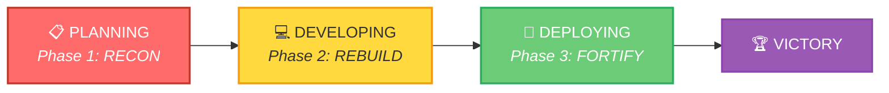

> **Tagline:** `RECON > REBUILD > FORTIFY`

---

## 🎯 Competition Theme & Story

### The Scenario (Year 2065)

A **massive global cyber disaster** caused by a **"Super Malware Agent"** has destroyed digital systems across all sectors worldwide — governments, healthcare, transportation, businesses, and **most critically, the financial sector**.

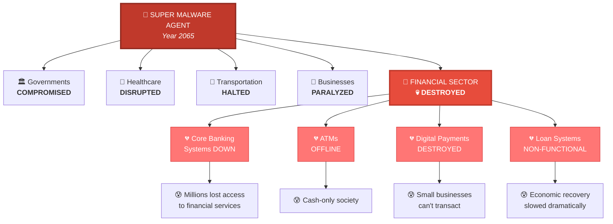

#### What survived:

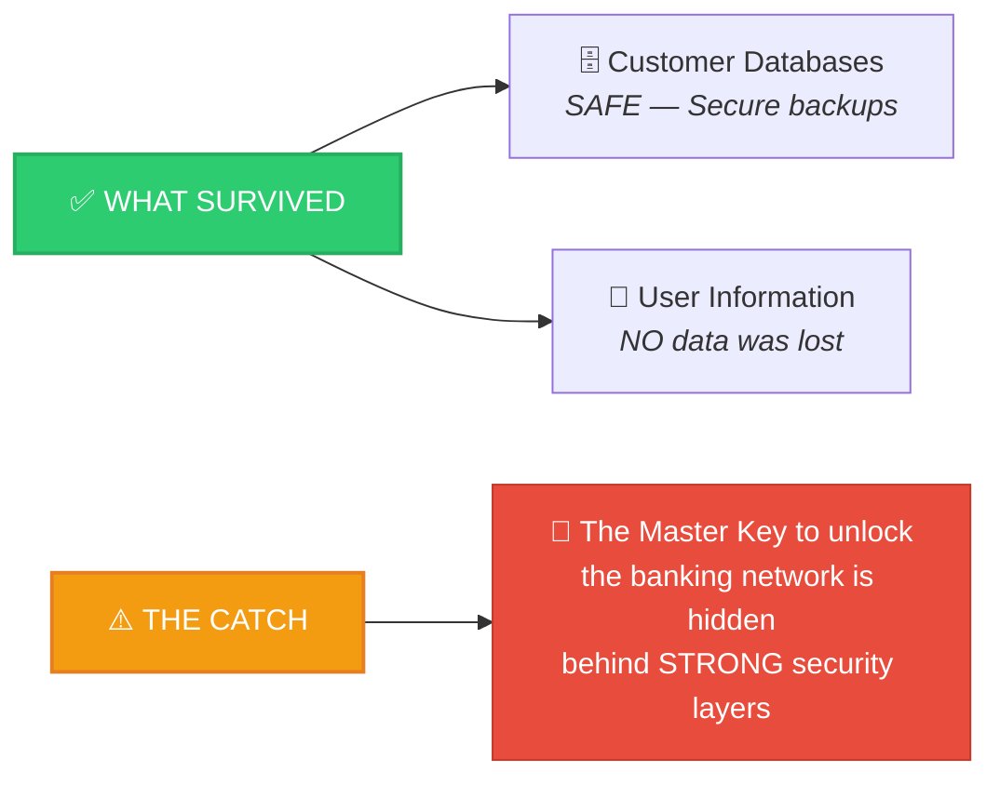

### Your Mission

> **Save the digital banking system** — Design, build, and deploy a **secure, reliable, and inclusive financial platform** from the ground up.

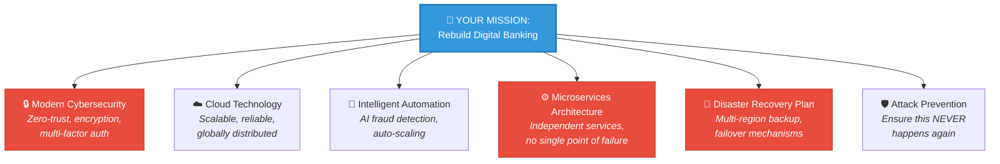

---

## 🗺️ Competition Structure — 3 Phases

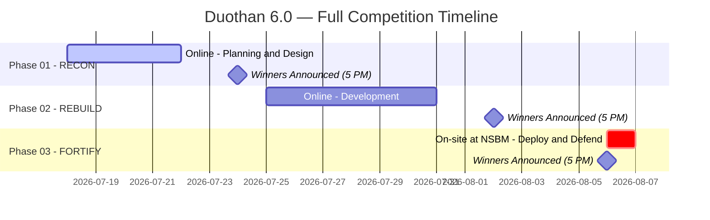

| Phase  | Name        | Type              | Date                 | Time                | Description                                                          |
| ------ | ----------- | ----------------- | -------------------- | ------------------- | -------------------------------------------------------------------- |
| **01** | **RECON**   | 🌐 Online         | 18 Jul – 22 Jul 2026 | 6:00 AM – 11:59 PM  | Assess the damage. Design the recovery. Create the blueprint.        |
| **02** | **REBUILD** | 🌐 Online         | 25 Jul – 31 Jul 2026 | 12:00 AM – 11:59 PM | Develop secure solutions. Restore systems. Apply security practices. |
| **03** | **FORTIFY** | 🏛️ On-site (NSBM) | 06 Aug 2026          | 8:30 AM – 3:30 PM   | Deploy, integrate, and defend infrastructure. Live judging.          |

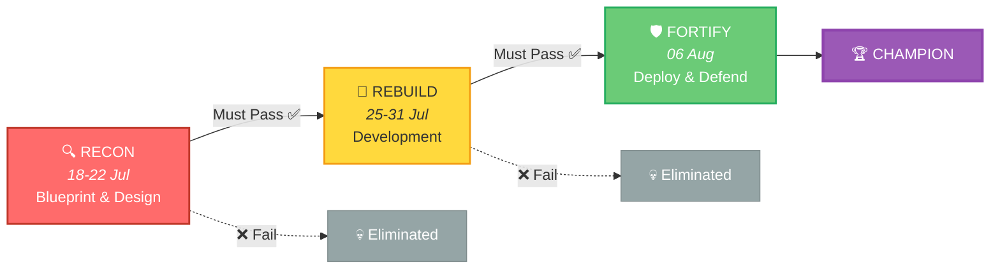

> ⚠️ **Teams must pass each phase to qualify for the next!**

---

## 👥 Team Rules

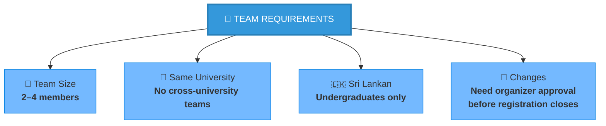

| Rule            | Details                                                                              |
| --------------- | ------------------------------------------------------------------------------------ |
| **Team Size**   | 2–4 members                                                                          |
| **University**  | All members must be from the **same university** (no cross-university teams)         |
| **Eligibility** | Open to all **Sri Lankan undergraduates**                                            |
| **Changes**     | Team changes require organizer approval before registration closes; no changes after |

---

## 🏅 Prizes

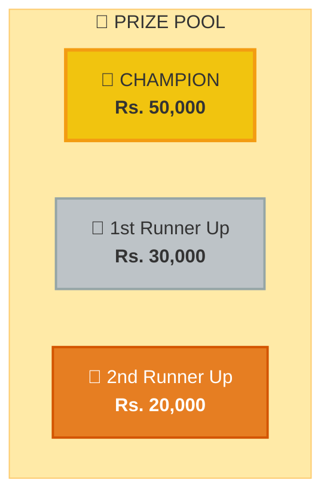

| Position             | Prize (LKR)    |
| -------------------- | -------------- |
| 🥇 **Champion**      | **Rs. 50,000** |
| 🥈 **1st Runner Up** | **Rs. 30,000** |
| 🥉 **2nd Runner Up** | **Rs. 20,000** |

---

## ⚖️ Survival Rules (Important!)

```mermaid
graph TD
    RULES["⚖️ SURVIVAL RULES"] --> R1["1️⃣ Original Work Only<br/><i>All work must be original<br/>and developed during competition</i>"]
    RULES --> R2["2️⃣ No Pre-built Solutions<br/><i>Cannot use code not developed<br/>during the competition</i>"]
    RULES --> R3["3️⃣ Strict Deadlines<br/><i>Late submissions are<br/>NOT accepted</i>"]
    RULES --> R4["4️⃣ Zero Plagiarism Tolerance<br/><i>Copying = Immediate<br/>disqualification</i>"]
    RULES --> R5["5️⃣ Don't Share<br/><i>Never share materials or<br/>solutions with other teams</i>"]
    RULES --> R6["6️⃣ Data Backup<br/><i>YOU are responsible for<br/>backing up your files</i>"]
    RULES --> R7["7️⃣ Follow Guidelines<br/><i>Solutions must align with<br/>context docs & criteria</i>"]
    RULES --> R8["8️⃣ Code of Conduct<br/><i>Respect judges, mentors,<br/>organizers & participants</i>"]
    
    style RULES fill:#e74c3c,stroke:#c0392b,color:#fff,stroke-width:3px
    style R1 fill:#fab1a0,stroke:#e17055,color:#333
    style R2 fill:#fab1a0,stroke:#e17055,color:#333
    style R3 fill:#fab1a0,stroke:#e17055,color:#333
    style R4 fill:#ff7675,stroke:#d63031,color:#fff
    style R5 fill:#fab1a0,stroke:#e17055,color:#333
    style R6 fill:#fab1a0,stroke:#e17055,color:#333
    style R7 fill:#fab1a0,stroke:#e17055,color:#333
    style R8 fill:#fab1a0,stroke:#e17055,color:#333
```

---

## 📋 Delegate Checklist (What to Bring)

### Must-Have Items:

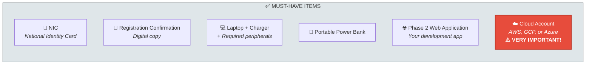

### For On-site Phase (Phase 3):

- [ ] Arrive at NSBM Green University with time to spare for check-in
- [ ] Digital copy of team roster
- [ ] Organizing committee's contact details on hand

---

## 📞 Contact & Support

| Role                           | Name                 | Email                        |
| ------------------------------ | -------------------- | ---------------------------- |
| **Chairperson - Duothan 6.0**  | Janith Wathsala      | wathsala@ieeensbm.org        |
| **Chairwomen - Duothan 6.0**   | Dinithi Dias         | dinithi@ieeensbm.org         |
| **Chairperson - IEEE SB NSBM** | Dasun Sri Nethmal    | nethmalds@ieee.org           |
| **Chairperson - IEEE CS NSBM** | Kumuditha Ranasinghe | kumuditharanasinghe@ieee.org |
| **General Queries**            | —                    | duothan@ieeensbm.org         |

---

## 🔑 Key Takeaways

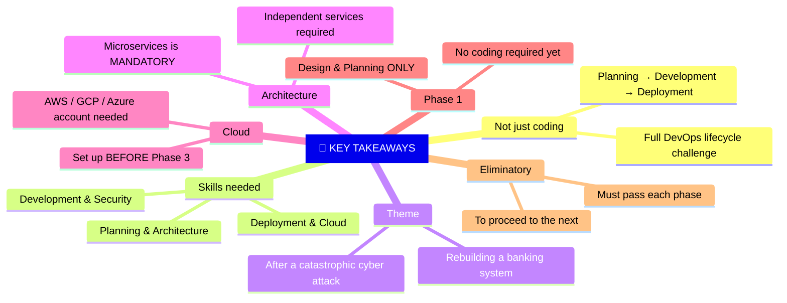
