# 🔍 Phase 01 — RECON: Complete Guide & How-To

## 📌 Phase Overview

**Phase Name:** RECON (Reconnaissance)  
**Tagline:** *"Assess the damage. Design the recovery. Prepare the blueprint for rebuilding the future."*  
**Type:** Online  
**Start:** 18 July 2026, 6:00 AM  
**Deadline:** 22 July 2026, 11:59 PM  
**Winners Announced:** 24 July 2026, 5:00 PM  

> [!IMPORTANT]
> **This is a PLANNING and DESIGN phase — NO CODING is required!**
> You are creating a complete project blueprint for a digital banking platform.

---

## 🎯 What You Need To Do

You must submit **ONE single Microsoft Word document (.docx)** containing **7 deliverables** in order. Let's break each one down:

### Deliverables Flow

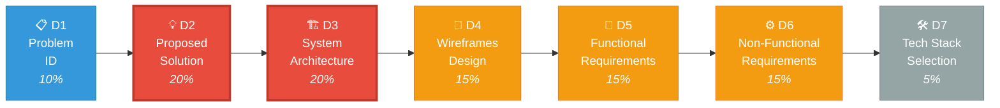

---

### 📋 Deliverable 01: Problem Identification (10% — 10 Marks)

#### What is it?
Analyze and clearly define **what went wrong** in the banking sector after the Super Malware Agent attack.

#### The Problem Analysis Framework

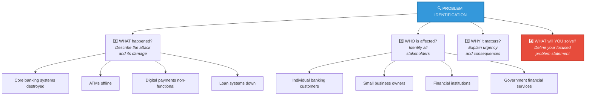

#### How to do it:
1. **Describe the attack's impact** on the financial sector:
   - Core banking systems destroyed
   - ATMs offline
   - Digital payments non-functional
   - Loan systems down
   - People forced to cash-only
   - Economic recovery slowed
   - Financial inequality increased

2. **Identify the SPECIFIC banking problem** your solution will solve. Pick a focused problem, for example:
   - "Restoring secure digital transactions for small businesses and individuals"
   - "Rebuilding a resilient core banking platform that prevents single-point-of-failure attacks"

3. **Define affected users:**
   - Individual banking customers
   - Small business owners
   - Financial institutions
   - Government financial services
   - Vulnerable populations (elderly, rural communities)

4. **Explain WHY this matters:**
   - Why restoring secure banking is essential for economic recovery
   - What happens if the problem isn't solved
   - The humanitarian dimension (welfare, pensions, remittances)

#### Tips for high marks:
- Be **specific**, not vague
- Show you understand the **real-world impact**
- Connect the problem to **real banking challenges**
- Use data/statistics if possible (even hypothetical ones for the 2065 scenario)
- Explain the **root cause** (monolithic architecture = cascading failure)

---

### 📋 Deliverable 02: Proposed Solution (20% — 20 Marks) ⭐ HIGH WEIGHT

#### What is it?
Your technology-based solution to the problem you identified.

#### Solution Design Framework

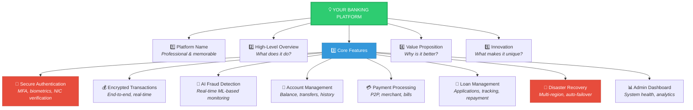

#### How to do it:
1. **Name your platform** — Give it a catchy, professional name (e.g., NexusBank, VaultPay, FinShield, AegisFinance)

2. **Describe the solution** at a high level:
   - What does it do?
   - How does it restore financial services?
   - What makes it secure against future attacks?

3. **Key features to include:**
   - Secure user authentication (multi-factor, biometric)
   - Encrypted transactions (TLS 1.3 in transit, AES-256 at rest)
   - Real-time fraud detection (AI/ML-based)
   - Account management (balance, transfers, history)
   - Payment processing (P2P, merchant, bills)
   - Loan management system
   - Disaster recovery mechanisms
   - Admin dashboard for monitoring

4. **Explain the VALUE:**
   - How does this help users?
   - Why is this better than the old system?
   - How does it prevent future attacks?

5. **Innovation angle:**
   - AI-powered fraud detection with behavioral analytics
   - Blockchain for transaction transparency and audit trails
   - Zero-trust security model at every layer
   - Automated failover and self-healing infrastructure
   - Financial inclusion features for underserved populations

#### Security Architecture of Your Solution

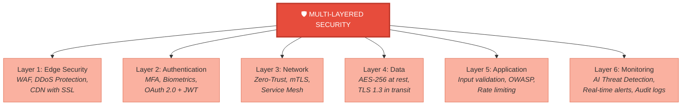

#### Tips for high marks:
- Make the solution **directly address** your identified problem
- Show **practical value** — not just theoretical
- Demonstrate **modern technology** understanding
- Explain HOW it prevents future attacks (not just "it's secure")
- Include a **threat model** showing attack vectors and how your system defends against each

---

### 📋 Deliverable 03: System Architecture Diagram (20% — 20 Marks) ⭐ HIGH WEIGHT

#### What is it?
A visual diagram showing how your entire system is structured using **independent services (microservices)**.

#### Complete System Architecture

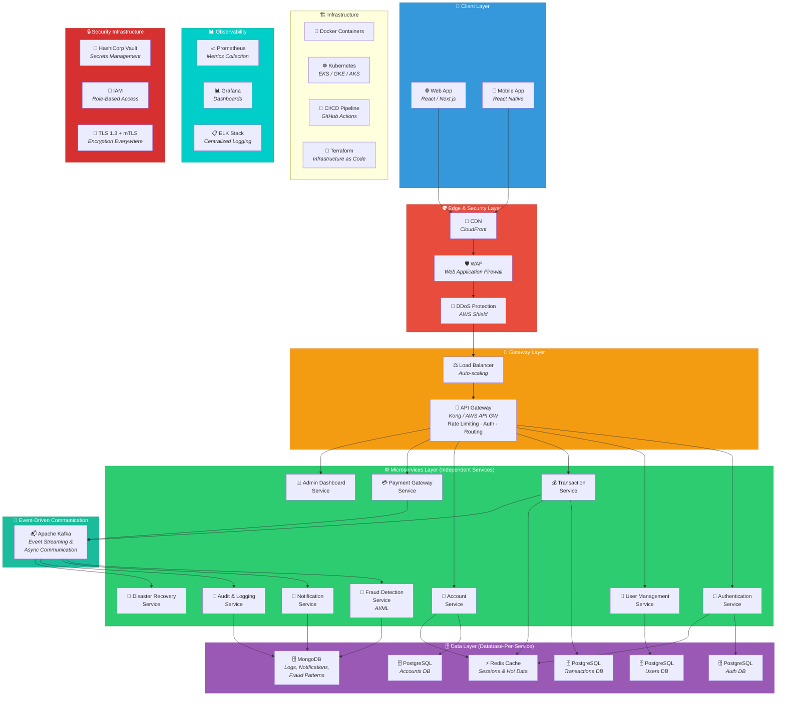

#### How services communicate:

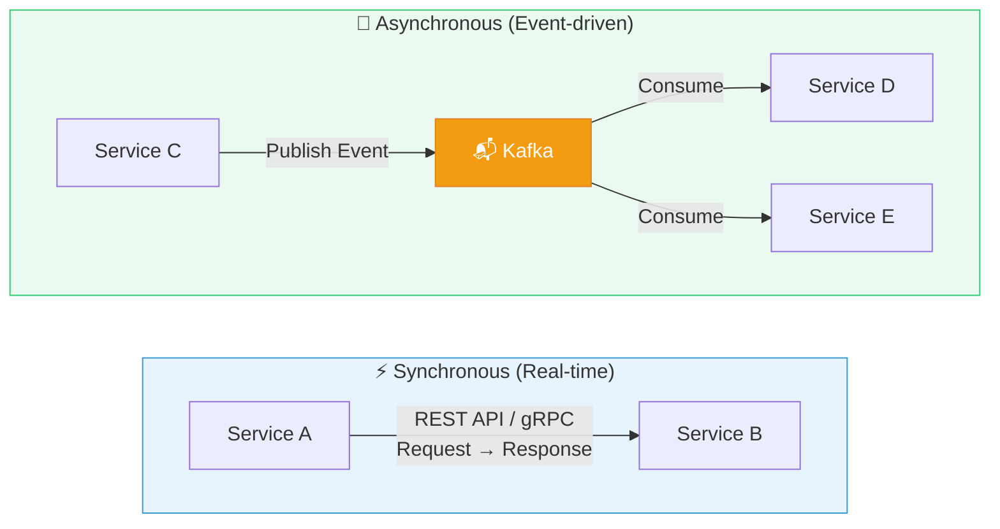

| Communication Type | How It Works | When to Use | Example |
|--------------------|-------------|-------------|---------|
| **REST APIs** | Synchronous HTTP request/response | When immediate response needed | User login → Auth verifies credentials |
| **gRPC** | High-performance RPC, binary protocol | High-throughput service-to-service | Account service ↔ Transaction service |
| **Message Queue (Kafka)** | Async publish/subscribe events | When response not immediately needed | Transaction completed → Trigger notification |
| **Service Mesh** | Sidecar proxy for inter-service security | All service-to-service communication | mTLS between all microservices |

#### Tools to create the diagram:
- **Draw.io / Diagrams.net** (free, recommended)
- **Lucidchart**
- **Figma** (for more visual diagrams)
- **Miro**
- **Excalidraw**

#### Tips for high marks:
- **MUST be microservices** — monolithic = low marks
- Show **clear data flow** with arrows
- Label **every component**
- Show **security at every layer**
- Include **disaster recovery** in the architecture
- Show **database-per-service** pattern clearly
- Include all layers: Client → Edge → Gateway → Services → Data → Messaging → Monitoring

---

### 📋 Deliverable 04: Wireframes Design (15% — 15 Marks)

#### What is it?
Visual interface designs showing how users will interact with the banking platform.

#### User Flow Diagram

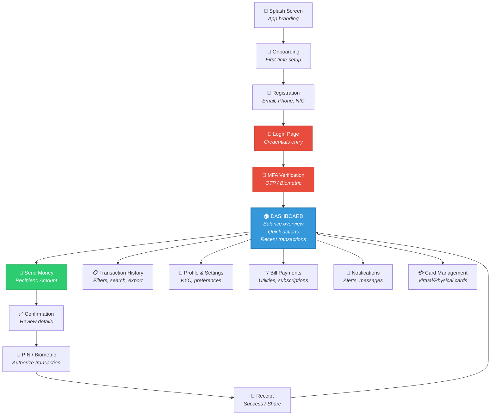

#### Required screens (minimum):

| # | Screen | Purpose | Priority |
|---|--------|---------|----------|
| 1 | 🔐 Login / Registration | Entry point, first impression | **Must-have** |
| 2 | 📱 MFA Verification | Security verification step | **Must-have** |
| 3 | 🏠 Dashboard / Home | Balance, quick actions, recent transactions | **Must-have** |
| 4 | 💸 Send Money / Transfer | Core banking function | **Must-have** |
| 5 | 📋 Transaction History | View past transactions with filters | **Must-have** |
| 6 | 👤 Profile / Settings | User preferences, KYC, security | **Must-have** |
| 7 | 🔔 Notifications | Alerts and messages | **Should-have** |
| 8 | 📊 Admin Dashboard | System health and analytics | **Nice-to-have** (impressive!) |

#### Fidelity levels:

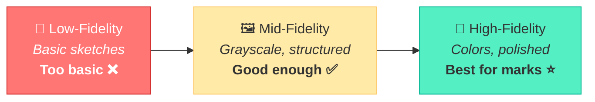

#### Tools to use:
- **Figma** (free, highly recommended)
- **Adobe XD**
- **Canva** (simpler option)
- **Sketch** (macOS only)

#### Important UX considerations for a banking app:

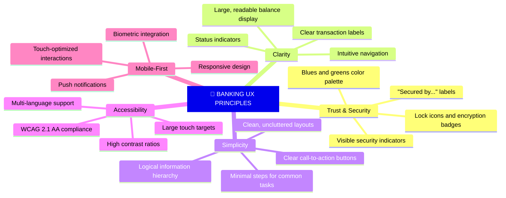

#### Submission format:
- **Embed clear screenshots** in the Word document
- **Include a working link** to the original design file (Figma/Canva/XD)

#### Tips for high marks:
- Go for **high-fidelity** if possible
- Show **multiple screens** that tell a story
- Include **user flows** (login → dashboard → transfer → confirmation)
- Make it look **professional and trustworthy** — it's a banking app!
- Show **error states** and **loading states** for extra polish

---

### 📋 Deliverable 05: Functional Requirements (15% — 15 Marks)

#### What is it?
A list of what the system **should DO** from the user's perspective.

#### How to write them:

Use the format: *"The system shall..."* or *"As a [user], I can..."*

#### Functional Requirements Mind Map

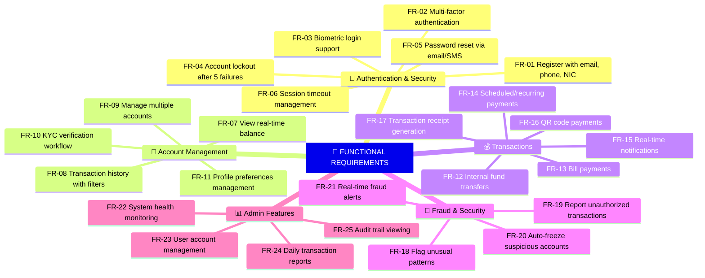

#### Example Functional Requirements:

**User Authentication & Security:**
- FR-01: The system shall allow users to register with email, phone number, and NIC verification
- FR-02: The system shall support multi-factor authentication (MFA)
- FR-03: The system shall lock accounts after 5 failed login attempts
- FR-04: The system shall support biometric authentication (fingerprint/face)

**Account Management:**
- FR-05: Users shall be able to view their account balance in real-time
- FR-06: Users shall be able to view transaction history with filters (date, type, amount)
- FR-07: Users shall be able to manage multiple bank accounts from a single profile

**Transactions:**
- FR-08: Users shall be able to transfer money to other accounts within the platform
- FR-09: Users shall be able to make bill payments
- FR-10: Users shall receive real-time notifications for all transactions
- FR-11: The system shall support recurring/scheduled payments

**Fraud Detection:**
- FR-12: The system shall flag unusual transaction patterns for review
- FR-13: The system shall allow users to report unauthorized transactions
- FR-14: The system shall temporarily freeze accounts upon detecting suspicious activity

**Admin Features:**
- FR-15: Admins shall be able to monitor system health in real-time
- FR-16: Admins shall be able to manage user accounts (suspend, verify, restore)
- FR-17: The system shall generate daily transaction reports

#### Tips for high marks:
- Be **comprehensive** — cover ALL aspects of the system
- Group them logically (Auth, Accounts, Transactions, Admin, etc.)
- Number them for easy reference
- Each requirement should be **testable** and **specific**
- Aim for **20-30 requirements** across all categories

---

### 📋 Deliverable 06: Non-Functional Requirements (15% — 15 Marks)

#### What is it?
The **quality standards** of the system — HOW it performs, not what it does.

> [!WARNING]
> The competition document says this **heavily weighs security, disaster recovery, cloud performance, and reliability**. Focus on these!

#### NFR Categories & Focus

```mermaid
graph TD
    NFR["⚙️ NON-FUNCTIONAL<br/>REQUIREMENTS"] --> SEC["🔒 SECURITY<br/><b>CRITICAL ⭐</b>"]
    NFR --> DR["🔄 DISASTER RECOVERY<br/><b>CRITICAL ⭐</b>"]
    NFR --> PERF["⚡ PERFORMANCE"]
    NFR --> CLOUD["☁️ CLOUD & SCALABILITY"]
    NFR --> MON["📊 MONITORING"]
    NFR --> ACC["♿ ACCESSIBILITY"]
    
    SEC --> S1["TLS 1.3 in transit"]
    SEC --> S2["AES-256 at rest"]
    SEC --> S3["Zero-trust architecture"]
    SEC --> S4["PCI DSS compliance"]
    SEC --> S5["bcrypt password hashing"]
    SEC --> S6["Rate-limited APIs"]
    
    DR --> D1["Auto backups every 6hr"]
    DR --> D2["RPO < 1 hour"]
    DR --> D3["RTO < 30 minutes"]
    DR --> D4["Multi-region failover"]
    DR --> D5["99.99% uptime SLA"]
    
    PERF --> P1["API response < 200ms"]
    PERF --> P2["10,000+ concurrent users"]
    PERF --> P3["Page load < 3 seconds"]
    
    style NFR fill:#2c3e50,stroke:#1a252f,color:#fff,stroke-width:3px
    style SEC fill:#e74c3c,stroke:#c0392b,color:#fff,stroke-width:2px
    style DR fill:#e74c3c,stroke:#c0392b,color:#fff,stroke-width:2px
    style PERF fill:#f39c12,stroke:#e67e22,color:#fff
    style CLOUD fill:#3498db,stroke:#2980b9,color:#fff
    style MON fill:#1abc9c,stroke:#16a085,color:#fff
    style ACC fill:#9b59b6,stroke:#8e44ad,color:#fff
```

#### Example Non-Functional Requirements:

**🔒 Security (CRITICAL for this competition):**
- NFR-01: All data in transit must be encrypted using TLS 1.3
- NFR-02: All data at rest must be encrypted using AES-256
- NFR-03: The system must implement zero-trust security architecture
- NFR-04: All API endpoints must be authenticated and rate-limited
- NFR-05: Passwords must be hashed using bcrypt with salt
- NFR-06: The system must comply with banking security standards (PCI DSS)

**⚡ Performance:**
- NFR-07: API response time must be < 200ms for 95% of requests
- NFR-08: The system must handle 10,000+ concurrent users
- NFR-09: Database queries must complete within 100ms
- NFR-10: Page load time must be < 3 seconds

**🔄 Disaster Recovery (CRITICAL):**
- NFR-11: The system must have automated backups every 6 hours
- NFR-12: Recovery Point Objective (RPO) must be < 1 hour
- NFR-13: Recovery Time Objective (RTO) must be < 30 minutes
- NFR-14: The system must support multi-region failover
- NFR-15: The system must maintain 99.99% uptime (SLA)

**☁️ Cloud & Scalability:**
- NFR-16: The system must auto-scale based on traffic load
- NFR-17: Services must be containerized using Docker
- NFR-18: Infrastructure must be managed as code (Terraform/CloudFormation)
- NFR-19: The system must support horizontal scaling

**📊 Monitoring & Observability:**
- NFR-20: All services must have health check endpoints
- NFR-21: System must provide centralized logging
- NFR-22: Real-time monitoring dashboards must be available
- NFR-23: Alerting must be configured for critical system metrics

**♿ Accessibility & Usability:**
- NFR-24: The application must support WCAG 2.1 AA standards
- NFR-25: The system must support multiple languages (Sinhala, Tamil, English)

#### Disaster Recovery Visualization

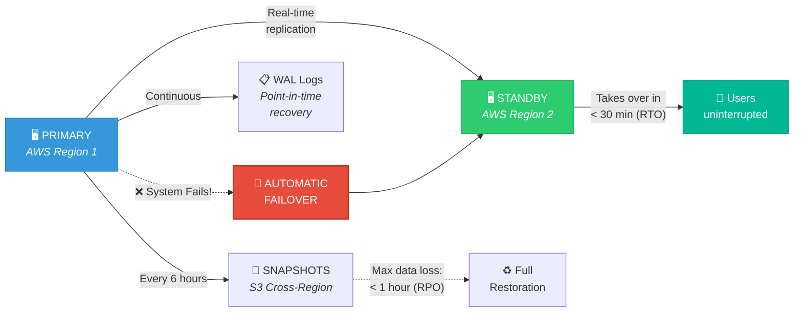

#### Tips for high marks:
- **Security and Disaster Recovery** are the MOST important — spend time here
- Use **measurable values** (not "the system should be fast" but "response time < 200ms")
- Show understanding of **cloud-native** practices
- Include **compliance requirements** (PCI DSS for banking)
- Aim for **20-25 requirements** across all categories

---

### 📋 Deliverable 07: Technology Stack Selection (5% — 5 Marks)

#### What is it?
The tools, languages, frameworks, and cloud services you plan to use — with **justification**.

#### Technology Stack Overview

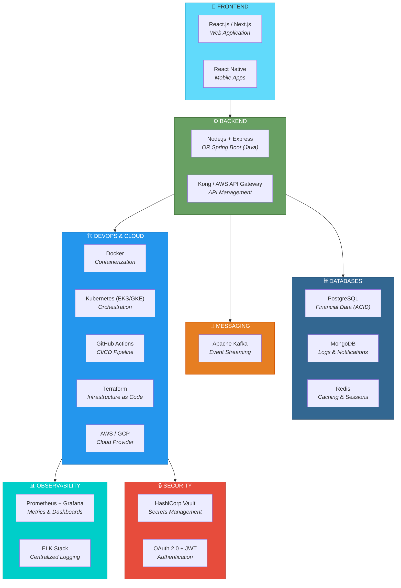

#### Recommended Stack (Example):

| Layer | Technology | Justification |
|-------|-----------|---------------|
| **Frontend** | React.js / Next.js | Component-based, large ecosystem, SSR for performance, ideal for complex UIs |
| **Mobile** | React Native / Flutter | Cross-platform development, code reuse with web frontend |
| **Backend** | Node.js (Express) / Spring Boot (Java) | High performance, scalability, enterprise-grade, extensive ecosystem |
| **API Gateway** | Kong / AWS API Gateway | Built-in rate limiting, authentication, request routing, DDoS protection |
| **Database (SQL)** | PostgreSQL | ACID compliance critical for financial transactions, strong data integrity |
| **Database (NoSQL)** | MongoDB | Flexible schema for logs, notifications, fraud patterns |
| **Cache** | Redis | Sub-millisecond reads, session management, reduces database load |
| **Message Queue** | Apache Kafka / RabbitMQ | High-throughput async communication, guaranteed delivery between services |
| **Containerization** | Docker | Consistent deployment environments, service isolation |
| **Orchestration** | Kubernetes (EKS/GKE/AKS) | Auto-scaling, self-healing containers, rolling updates |
| **CI/CD** | GitHub Actions / Jenkins | Automated build, test, deploy pipeline |
| **Cloud Provider** | AWS / GCP / Azure | Global infrastructure, compliance certifications, managed services |
| **Monitoring** | Prometheus + Grafana | Real-time metrics collection and beautiful visualization |
| **Logging** | ELK Stack (Elasticsearch, Logstash, Kibana) | Centralized log management across all microservices |
| **Security** | HashiCorp Vault, OAuth 2.0, JWT | Secrets management, industry-standard secure authentication |
| **IaC** | Terraform | Cloud-agnostic, version-controlled infrastructure, reproducible |

#### Tips for high marks:
- **Justify EVERY choice** — don't just list technologies
- Show how the stack supports **microservices**
- Show how it supports **security** and **disaster recovery**
- Make sure your stack is **consistent** (don't mix conflicting technologies)
- Explain WHY each technology is the best fit for a **banking platform**

---

## 📤 Submission Details

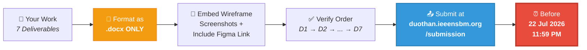

| Item | Requirement |
|------|------------|
| **Format** | Single **Microsoft Word document (.docx)** |
| **Content** | All 7 deliverables in order |
| **Wireframes** | Embed screenshots + include link to design file (Figma/Canva/XD) |
| **Deadline** | **22 July 2026, 11:59 PM** |
| **Submission Link** | **duothan.ieeensbm.org/submission** |

> [!CAUTION]
> ❌ **PDFs, Google Docs links, or other formats will NOT be accepted** — Only .docx!

---

## 📊 Mark Allocation Summary

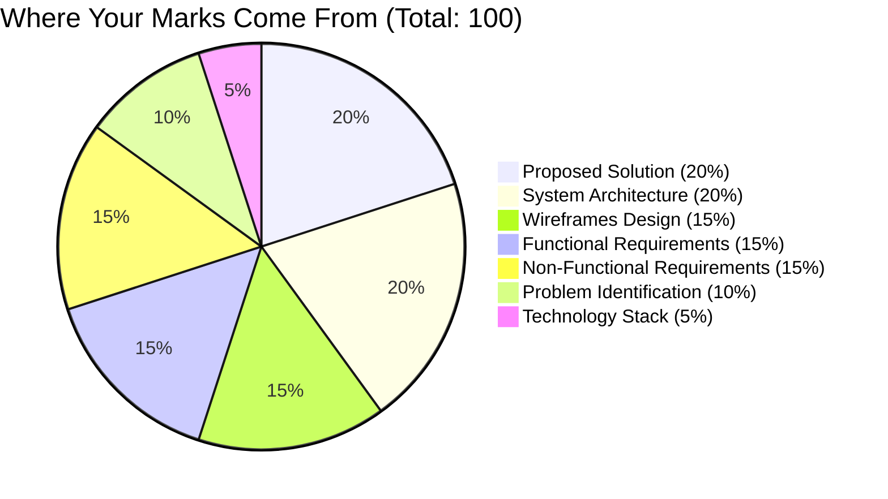

| # | Criteria | Weight | Marks |
|---|----------|--------|-------|
| 01 | Problem Identification | 10% | /10 |
| 02 | Proposed Solution | **20%** | /20 |
| 03 | System Architecture | **20%** | /20 |
| 04 | Wireframes Design | 15% | /15 |
| 05 | Functional Requirements | 15% | /15 |
| 06 | Non-Functional Requirements | 15% | /15 |
| 07 | Technology Stack Selection | 5% | /05 |
| **Total** | | **100%** | **/100** |

> **Focus your energy on:** Proposed Solution (20%) + System Architecture (20%) + Non-Functional Requirements (15%) — these carry the most weight.

---

## ⏰ Timeline & Priority

Given the deadline is **22 July 2026 at 11:59 PM**, here's a suggested work schedule:

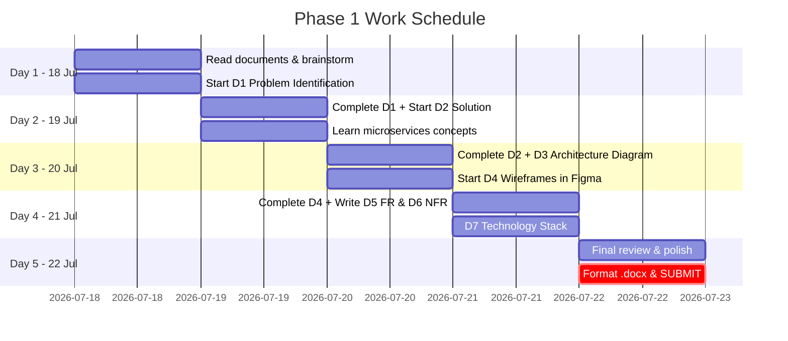

| Day | Date | Focus |
|-----|------|-------|
| **Day 1** | 18 Jul (Today!) | Read documents, brainstorm, start Problem Identification & Proposed Solution |
| **Day 2** | 19 Jul | Complete Proposed Solution, start System Architecture |
| **Day 3** | 20 Jul | Complete Architecture Diagram, start Wireframes |
| **Day 4** | 21 Jul | Complete Wireframes, Functional & Non-Functional Requirements |
| **Day 5** | 22 Jul | Technology Stack, final review, polish, **SUBMIT before 11:59 PM** |
