# 📚 What You Need To Learn for Duothan 6.0

This document outlines **every skill and concept** you need to learn to compete effectively across all 3 phases of Duothan 6.0.

---

## 🎯 Learning Roadmap Overview

```mermaid
graph TD
    START["🎯 YOUR LEARNING<br/>JOURNEY"] --> P1["🔍 Phase 01 — RECON<br/><b>Learn NOW</b><br/><i>Planning & Design Skills</i>"]
    START --> P2["🔨 Phase 02 — REBUILD<br/><b>Learn Next</b><br/><i>Development Skills</i>"]
    START --> P3["🛡️ Phase 03 — FORTIFY<br/><b>Learn Later</b><br/><i>DevOps & Cloud Skills</i>"]
    
    P1 --> S1["Microservices Architecture"]
    P1 --> S2["System Design Fundamentals"]
    P1 --> S3["UX/UI & Wireframing"]
    P1 --> S4["Requirements Engineering"]
    P1 --> S5["Technical Documentation"]
    
    P2 --> S6["Backend Development"]
    P2 --> S7["Frontend Development"]
    P2 --> S8["Database Management"]
    P2 --> S9["Security Practices"]
    
    P3 --> S10["Docker & Containers"]
    P3 --> S11["Kubernetes"]
    P3 --> S12["Cloud Platforms"]
    P3 --> S13["CI/CD Pipelines"]
    P3 --> S14["IaC (Terraform)"]
    P3 --> S15["Monitoring & Logging"]
    P3 --> S16["Disaster Recovery"]
    
    style START fill:#2c3e50,stroke:#1a252f,color:#fff,stroke-width:3px
    style P1 fill:#e74c3c,stroke:#c0392b,color:#fff,stroke-width:3px
    style P2 fill:#f39c12,stroke:#e67e22,color:#fff,stroke-width:2px
    style P3 fill:#2ecc71,stroke:#27ae60,color:#fff,stroke-width:2px
```

---

## 🔍 Phase 01 — RECON (Planning & Design) — What to Learn NOW

### 1. Software Architecture & System Design

#### Microservices Architecture (CRITICAL ⭐)

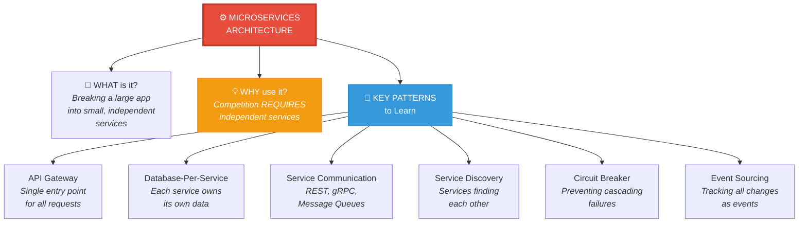

- **What:** Breaking a large application into small, independent services
- **Why:** The competition REQUIRES "independent services" architecture
- **Learn:**
  - What are microservices and why use them
  - Microservices vs Monolithic architecture
  - Database-per-service pattern
  - Inter-service communication (REST, gRPC, message queues)
  - API Gateway pattern
  - Service discovery
  - Circuit breaker pattern

#### Monolithic vs Microservices Comparison

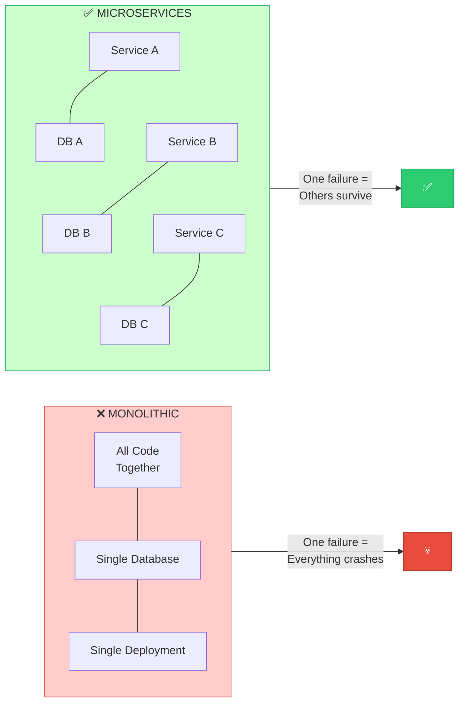

#### Resources to study:
- 🎥 YouTube: "Microservices Explained" by TechWorld with Nana
- 🎥 YouTube: "Microservices Architecture" by freeCodeCamp
- 📖 Martin Fowler's Microservices guide (martinfowler.com)
- 📖 Microservices.io (patterns and best practices)

---

### 2. System Design Fundamentals

#### Key Concepts Explained

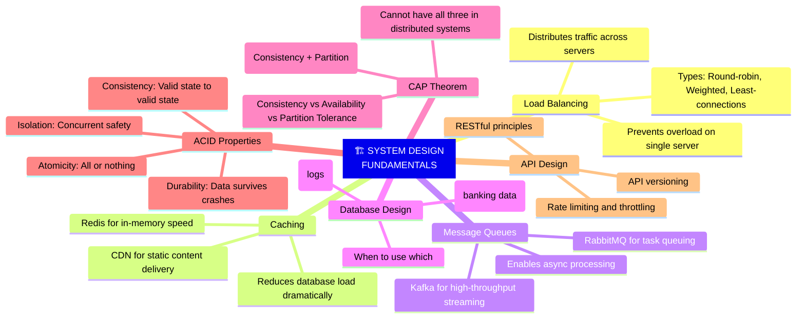

#### How Data Flows Through a System

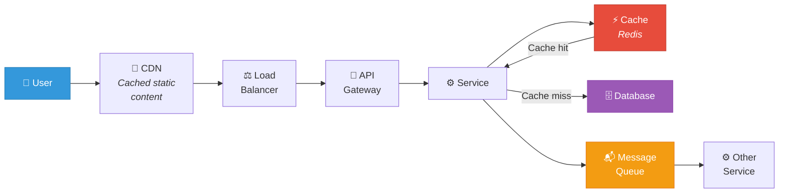

#### Resources:
- 🎥 YouTube: "System Design for Beginners" by Gaurav Sen
- 🎥 YouTube: "System Design Interview" by ByteByteGo
- 📖 system-design-primer on GitHub

---

### 3. UX/UI Design for Banking Applications

#### What to learn:

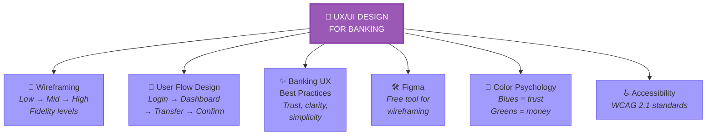

#### Banking App Color Guide

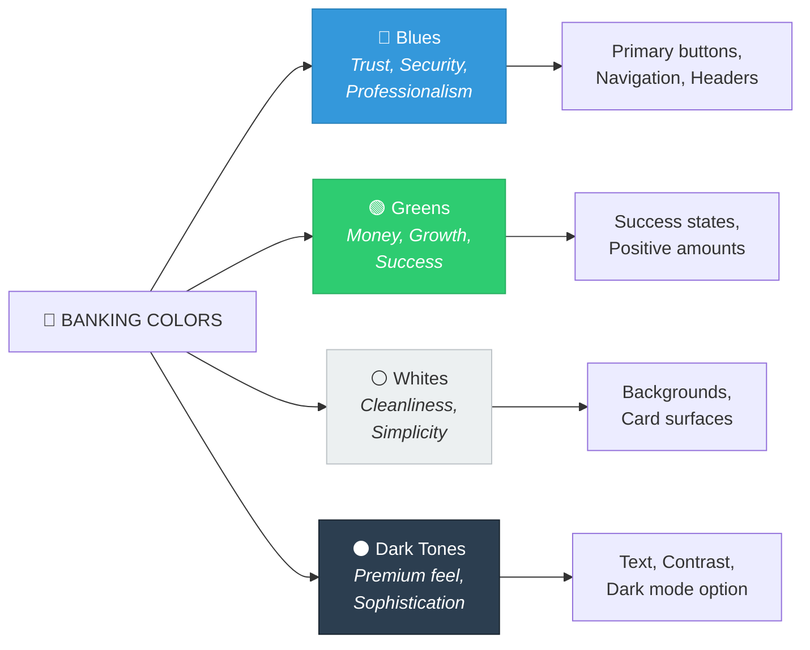

#### Resources:
- 🎥 YouTube: "Figma Tutorial for Beginners" by DesignCourse
- 📖 Figma.com free tutorials
- 📖 Study existing banking apps: Revolut, Wise, Monzo for inspiration

---

### 4. Requirements Engineering

#### Functional vs Non-Functional Requirements

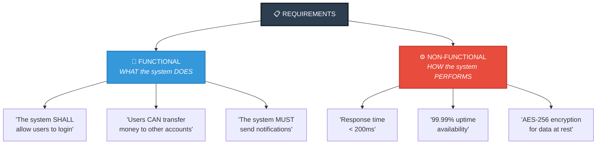

#### What to learn:
- How to write Functional Requirements (what the system DOES)
- How to write Non-Functional Requirements (how the system PERFORMS)
- User stories format ("As a ___, I want to ___, so that ___")
- Acceptance criteria
- Requirements prioritization (MoSCoW method: Must, Should, Could, Won't)

#### MoSCoW Prioritization

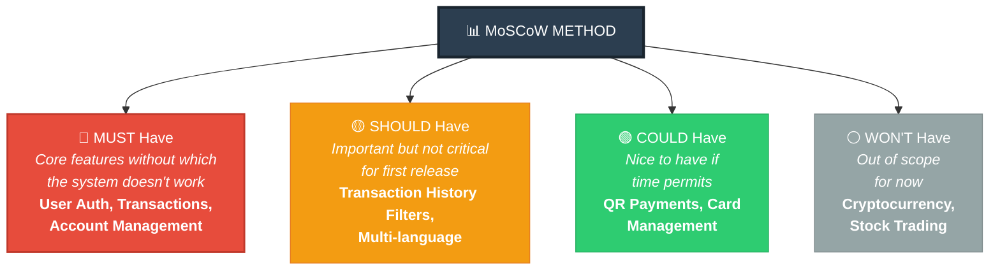

---

### 5. Documentation & Technical Writing

#### What to learn:
- How to write clear technical documentation
- How to create professional system architecture diagrams
- Tools: Draw.io, Lucidchart, Mermaid diagrams
- How to format a professional Word document

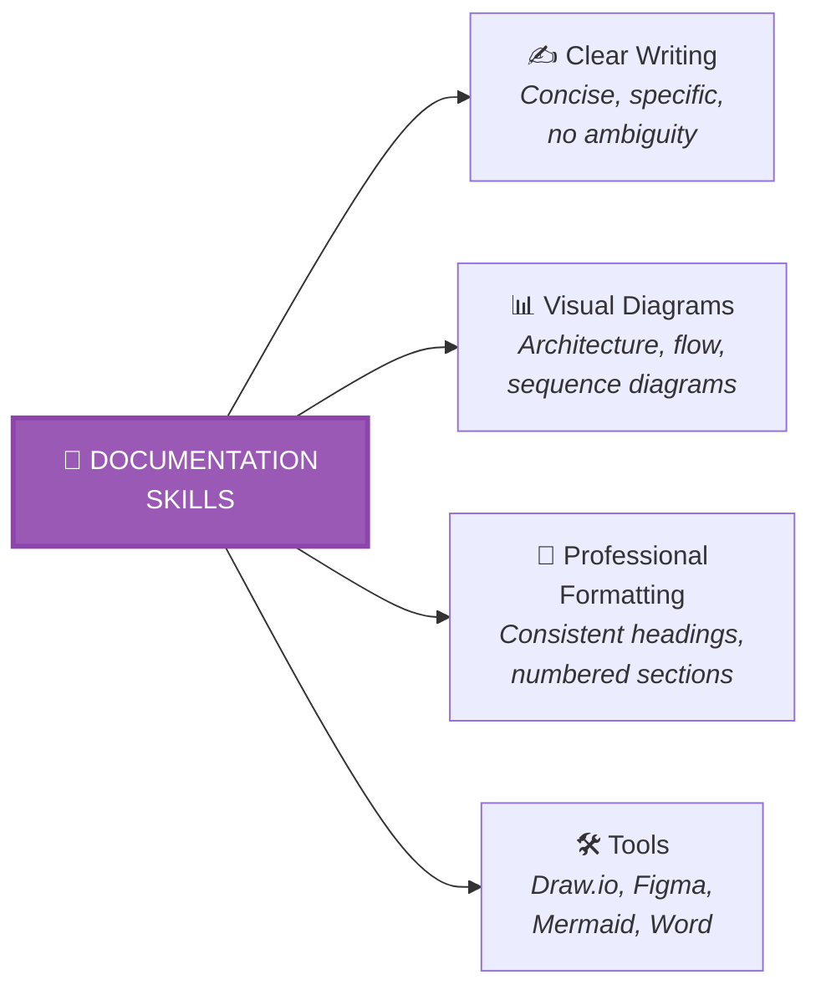

---

## 🔨 Phase 02 — REBUILD (Development) — What to Learn Next

### 6. Backend Development

#### Pick ONE of these stacks:

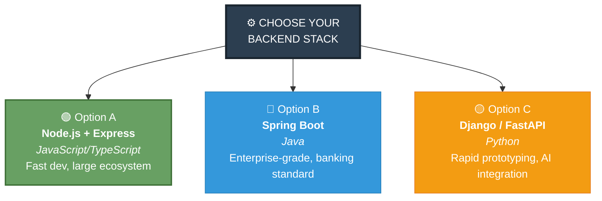

| Option | Language | Framework | Best For |
|--------|----------|-----------|----------|
| **A** | JavaScript/TypeScript | Node.js + Express | Fast development, large ecosystem |
| **B** | Java | Spring Boot | Enterprise-grade, banking standard |
| **C** | Python | Django / FastAPI | Rapid prototyping, AI integration |

#### Key backend skills:

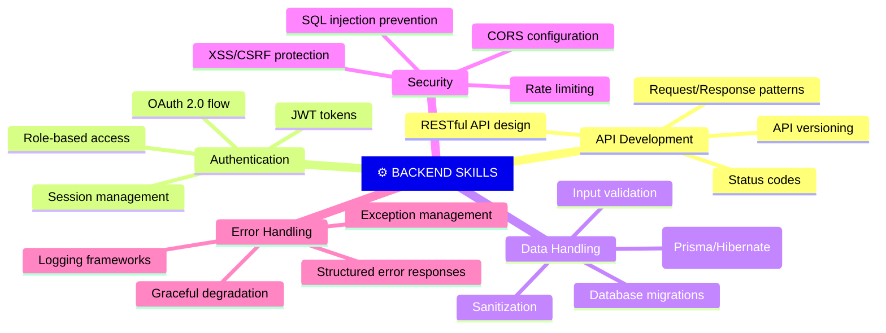

---

### 7. Frontend Development

#### Pick ONE:

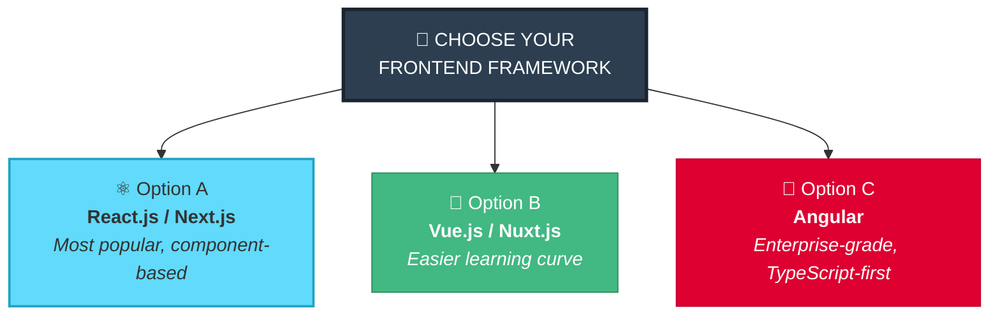

| Option | Framework | Best For |
|--------|-----------|----------|
| **A** | React.js / Next.js | Most popular, component-based |
| **B** | Vue.js / Nuxt.js | Easier learning curve |
| **C** | Angular | Enterprise-grade, TypeScript-first |

#### Key frontend skills:
- Component-based architecture
- State management (Redux, Zustand, Pinia)
- Responsive design (CSS Grid, Flexbox)
- Form handling and validation
- API integration (Axios, Fetch)
- Authentication flow (login, logout, session management)

---

### 8. Database Management

#### Database Selection Guide

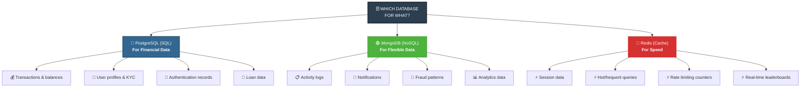

#### Key concepts:
- Database schema design
- Indexing for performance
- Transactions and ACID compliance
- Database migrations
- Connection pooling

---

### 9. Security Practices (CRITICAL ⭐)

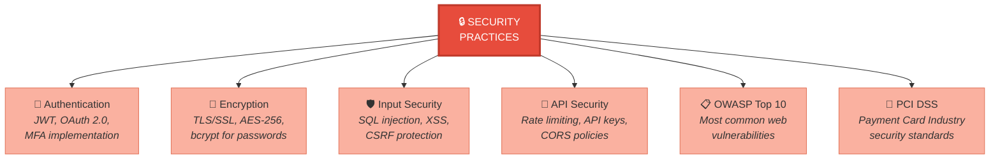

#### OWASP Top 10 (Know These!)

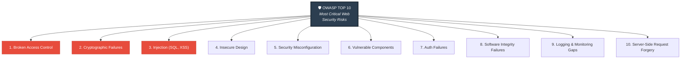

#### Resources:
- 📖 OWASP.org — Top 10 Web Security Risks
- 🎥 YouTube: "Web Security" by Computerphile
- 📖 PCI DSS Quick Reference Guide

---

## 🛡️ Phase 03 — FORTIFY (Deployment & Defense) — What to Learn

### 10. Docker & Containerization (CRITICAL ⭐)

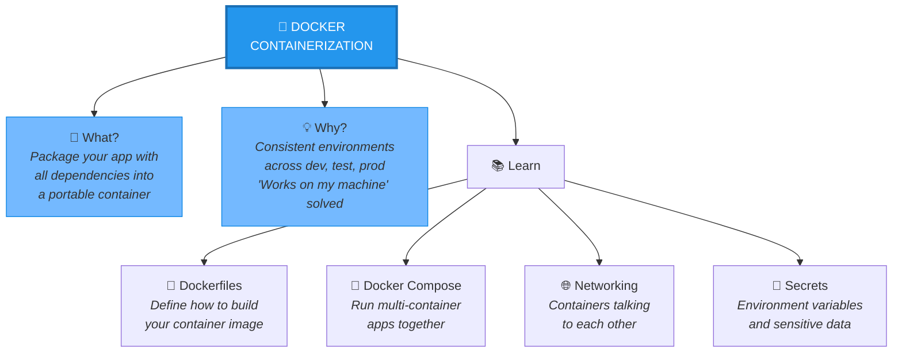

#### Container vs Virtual Machine

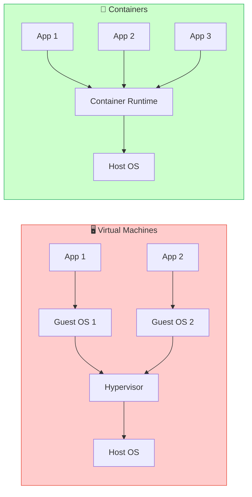

#### Resources:
- 🎥 YouTube: "Docker Tutorial for Beginners" by TechWorld with Nana
- 🎥 YouTube: "Docker Crash Course" by Traversy Media
- 📖 Docker official documentation (docs.docker.com)

---

### 11. Kubernetes Basics

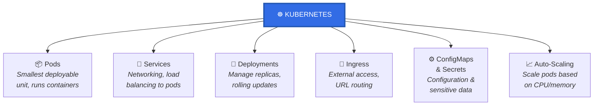

#### What to learn:
- Pods, Services, Deployments, Ingress
- Scaling applications (HPA - Horizontal Pod Autoscaler)
- ConfigMaps and Secrets
- Managed Kubernetes: EKS (AWS), GKE (GCP), AKS (Azure)
- Helm charts basics

#### Resources:
- 🎥 YouTube: "Kubernetes Tutorial for Beginners" by TechWorld with Nana
- 📖 Kubernetes.io interactive tutorials

---

### 12. Cloud Platforms (CRITICAL ⭐)

#### Pick ONE and learn it well:

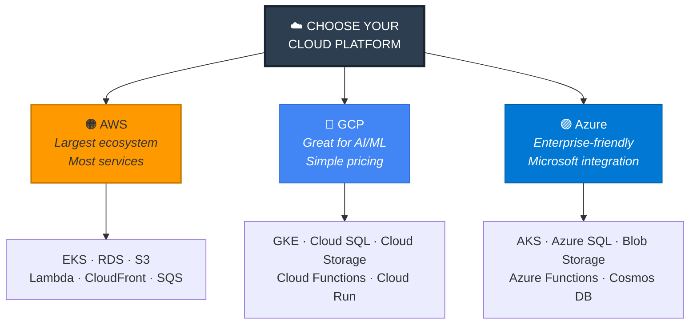

| Cloud | Managed K8s | Database | Storage | Other |
|-------|-------------|----------|---------|-------|
| **AWS** | EKS | RDS, DynamoDB | S3 | Lambda, CloudFront, SQS |
| **GCP** | GKE | Cloud SQL, Firestore | Cloud Storage | Cloud Functions, Cloud Run |
| **Azure** | AKS | Azure SQL, Cosmos DB | Blob Storage | Azure Functions |

#### Key cloud skills:
- Setting up cloud accounts and billing alerts
- Virtual networks (VPC/VNet)
- Managed databases
- Container registries (ECR, GCR, ACR)
- Load balancers
- IAM (Identity and Access Management)
- Cloud monitoring services

#### Resources:
- 📖 AWS Free Tier tutorials (aws.amazon.com/free)
- 📖 GCP free tier (cloud.google.com/free)
- 🎥 YouTube: "AWS Tutorial for Beginners" by freeCodeCamp

---

### 13. CI/CD Pipelines

```mermaid
graph LR
    CODE["💻 Code Push"] --> BUILD["🔨 Build<br/><i>Compile &<br/>package</i>"]
    BUILD --> TEST["🧪 Test<br/><i>Unit & Integration<br/>tests</i>"]
    TEST --> SCAN["🔍 Security<br/>Scan<br/><i>Vulnerability<br/>check</i>"]
    SCAN --> STAGE["🎭 Deploy to<br/>Staging<br/><i>Test environment</i>"]
    STAGE --> APPROVE["✅ Approval<br/><i>Manual or<br/>automated</i>"]
    APPROVE --> PROD["🚀 Deploy to<br/>Production<br/><i>Live environment</i>"]
    
    style CODE fill:#3498db,stroke:#2980b9,color:#fff
    style TEST fill:#f39c12,stroke:#e67e22,color:#fff
    style SCAN fill:#e74c3c,stroke:#c0392b,color:#fff
    style PROD fill:#2ecc71,stroke:#27ae60,color:#fff,stroke-width:2px
```

#### What to learn:
- GitHub Actions (recommended — free and simple)
- Building automated pipelines: Build → Test → Deploy
- Automated testing integration
- Deployment strategies (blue-green, canary, rolling)

#### Deployment Strategies

```mermaid
graph TD
    STRAT["🚀 DEPLOYMENT<br/>STRATEGIES"] --> BG["🔵🟢 Blue-Green<br/><i>Two identical environments<br/>Switch traffic instantly<br/>Easy rollback</i>"]
    STRAT --> CAN["🐤 Canary<br/><i>Route small % of traffic<br/>to new version first<br/>Gradually increase</i>"]
    STRAT --> ROLL["🔄 Rolling<br/><i>Update instances one<br/>by one, no downtime<br/>Gradual replacement</i>"]
    
    style STRAT fill:#2c3e50,stroke:#1a252f,color:#fff,stroke-width:3px
    style BG fill:#3498db,stroke:#2980b9,color:#fff
    style CAN fill:#f39c12,stroke:#e67e22,color:#fff
    style ROLL fill:#2ecc71,stroke:#27ae60,color:#fff
```

#### Resources:
- 📖 GitHub Actions documentation
- 🎥 YouTube: "GitHub Actions Tutorial" by TechWorld with Nana

---

### 14. Infrastructure as Code (IaC)

```mermaid
graph LR
    IAC["📐 INFRASTRUCTURE<br/>AS CODE"] --> TF3["🟣 Terraform<br/><i>Cloud-agnostic<br/>Most popular</i>"]
    IAC --> CF["🟠 CloudFormation<br/><i>AWS-specific<br/>Native integration</i>"]
    IAC --> DM["🔵 Deployment Manager<br/><i>GCP-specific</i>"]
    
    TF3 --> TF_WHY["✅ Version-controlled infra<br/>✅ Reproducible environments<br/>✅ Works with ANY cloud<br/>✅ State management"]
    
    style IAC fill:#2c3e50,stroke:#1a252f,color:#fff,stroke-width:3px
    style TF3 fill:#7b42bc,stroke:#5a2d91,color:#fff,stroke-width:2px
```

#### What to learn:
- **Terraform** (cloud-agnostic, most popular)
- OR **AWS CloudFormation** / **GCP Deployment Manager**
- Defining infrastructure in code files
- Managing state
- Version controlling infrastructure

---

### 15. Monitoring, Logging & Observability

```mermaid
graph TD
    OBSERVE2["📊 OBSERVABILITY<br/>STACK"] --> METRICS["📈 METRICS<br/><b>Prometheus</b><br/><i>CPU, Memory, Request<br/>rates, Error rates</i>"]
    OBSERVE2 --> DASH2["📊 DASHBOARDS<br/><b>Grafana</b><br/><i>Visual representation<br/>of metrics</i>"]
    OBSERVE2 --> LOGS2["📋 LOGGING<br/><b>ELK Stack</b><br/><i>Centralized logs from<br/>all microservices</i>"]
    OBSERVE2 --> TRACE["🔍 TRACING<br/><b>Jaeger / Zipkin</b><br/><i>Track requests across<br/>multiple services</i>"]
    OBSERVE2 --> ALERT["🔔 ALERTING<br/><i>PagerDuty, Slack<br/>notifications</i>"]
    
    METRICS --> GRAF2["📊 Grafana<br/>Dashboards"]
    LOGS2 --> KIBANA["📊 Kibana<br/>Log Visualization"]
    
    style OBSERVE2 fill:#00cec9,stroke:#00b894,color:#fff,stroke-width:3px
    style METRICS fill:#fdcb6e,stroke:#f39c12,color:#333
    style DASH2 fill:#fdcb6e,stroke:#f39c12,color:#333
    style LOGS2 fill:#74b9ff,stroke:#0984e3,color:#333
    style TRACE fill:#a29bfe,stroke:#6c5ce7,color:#333
    style ALERT fill:#ff7675,stroke:#d63031,color:#fff
```

---

### 16. Disaster Recovery

```mermaid
graph TD
    DR2["🔄 DISASTER<br/>RECOVERY"] --> BACKUP2["💾 Backup Strategies<br/><i>Full, incremental,<br/>differential</i>"]
    DR2 --> RPO["⏱️ RPO<br/><i>Recovery Point Objective<br/>How much data can<br/>you afford to lose?</i>"]
    DR2 --> RTO["⏰ RTO<br/><i>Recovery Time Objective<br/>How fast must you<br/>recover?</i>"]
    DR2 --> MULTI["🌍 Multi-Region<br/><i>Run in multiple<br/>geographic locations</i>"]
    DR2 --> FAILOVER2["🔄 Failover Mechanisms<br/><i>Active-Passive<br/>Active-Active</i>"]
    DR2 --> REPL["📡 Database Replication<br/><i>Synchronous or<br/>asynchronous</i>"]
    
    RPO --> RPOEX["Example: RPO = 1 hour<br/>= max 1 hour of data lost"]
    RTO --> RTOEX["Example: RTO = 30 min<br/>= system back in 30 min"]
    
    style DR2 fill:#e74c3c,stroke:#c0392b,color:#fff,stroke-width:3px
    style RPO fill:#fab1a0,stroke:#e17055,color:#333
    style RTO fill:#fab1a0,stroke:#e17055,color:#333
    style MULTI fill:#fab1a0,stroke:#e17055,color:#333
```

#### Failover Types

```mermaid
graph LR
    subgraph AP["🔄 Active-Passive"]
        direction TB
        AP_A["🟢 Primary<br/><i>Handles ALL traffic</i>"]
        AP_B["🟡 Standby<br/><i>Idle, ready to<br/>take over</i>"]
        AP_A -->|"Fails"| AP_B
    end
    
    subgraph AA["🔄 Active-Active"]
        direction TB
        AA_A["🟢 Region A<br/><i>Handles 50% traffic</i>"]
        AA_B["🟢 Region B<br/><i>Handles 50% traffic</i>"]
        AA_A -->|"Fails"| AA_B2["🟢 Region B<br/><i>Handles 100% traffic</i>"]
    end
    
    style AP fill:#fff3cd,stroke:#f39c12
    style AA fill:#d4edda,stroke:#27ae60
```

---

## 📊 Priority Learning Matrix

Here's what to prioritize based on the competition phases:

### 🔴 MUST LEARN (Phase 01 — NOW):

```mermaid
graph TD
    NOW["🔴 LEARN NOW<br/><i>Phase 01 Skills</i>"] --> T1["⚙️ Microservices Architecture<br/><i>Required by competition</i>"]
    NOW --> T2["🏗️ System Design Basics<br/><i>For architecture diagram (20%)</i>"]
    NOW --> T3["🎨 Figma / Wireframing<br/><i>For wireframes (15%)</i>"]
    NOW --> T4["📋 Requirements Engineering<br/><i>For FR & NFR (30% combined)</i>"]
    NOW --> T5["🔒 Security Concepts (theory)<br/><i>For NFR section</i>"]
    NOW --> T6["🔄 Disaster Recovery (theory)<br/><i>For NFR section</i>"]
    
    style NOW fill:#e74c3c,stroke:#c0392b,color:#fff,stroke-width:3px
    style T1 fill:#ff7675,stroke:#d63031,color:#fff
    style T2 fill:#ff7675,stroke:#d63031,color:#fff
    style T3 fill:#ff7675,stroke:#d63031,color:#fff
    style T4 fill:#ff7675,stroke:#d63031,color:#fff
    style T5 fill:#ff7675,stroke:#d63031,color:#fff
    style T6 fill:#ff7675,stroke:#d63031,color:#fff
```

| Topic | Why |
|-------|-----|
| Microservices Architecture | Required by competition |
| System Design Basics | For architecture diagram (20% marks) |
| Figma / Wireframing | For wireframes (15% marks) |
| Requirements Engineering | For FR & NFR (30% combined marks) |
| Security Concepts (theory) | For NFR section |
| Disaster Recovery (theory) | For NFR section |

### 🟡 SHOULD LEARN (Before Phase 02):

| Topic | Why |
|-------|-----|
| Backend Framework (Node.js/Spring Boot) | To build the app |
| Frontend Framework (React/Next.js) | To build the UI |
| PostgreSQL + MongoDB | For data management |
| JWT / OAuth 2.0 | For authentication |
| Git & GitHub | For version control |
| REST API design | For backend services |

### 🟢 LEARN NEXT (Before Phase 03):

| Topic | Why |
|-------|-----|
| Docker | To containerize services |
| Kubernetes basics | To orchestrate containers |
| Cloud platform (AWS/GCP/Azure) | To deploy the application |
| CI/CD (GitHub Actions) | To automate deployment |
| Monitoring (Prometheus/Grafana) | To monitor the system |
| Terraform (IaC) | To manage infrastructure |

---

## 🛠️ Recommended Free Learning Resources

### Learning Path Visualization

```mermaid
graph LR
    WATCH["🎥 WATCH<br/>YouTube"] --> READ["📖 READ<br/>Documentation"]
    READ --> PRACTICE["🛠️ PRACTICE<br/>Hands-on Tools"]
    PRACTICE --> BUILD["🏗️ BUILD<br/>Your Submission"]
    
    WATCH --> YT1["TechWorld with Nana"]
    WATCH --> YT2["freeCodeCamp"]
    WATCH --> YT3["Fireship"]
    WATCH --> YT4["ByteByteGo"]
    WATCH --> YT5["Traversy Media"]
    
    READ --> D1X["Microservices.io"]
    READ --> D2X["Docker Docs"]
    READ --> D3X["Kubernetes.io"]
    READ --> D4X["OWASP.org"]
    READ --> D5X["12factor.net"]
    
    PRACTICE --> P1X["Draw.io - Diagrams"]
    PRACTICE --> P2X["Figma - Wireframes"]
    PRACTICE --> P3X["GitHub - Version Control"]
    PRACTICE --> P4X["Cloud Free Tier"]
    
    style WATCH fill:#e74c3c,stroke:#c0392b,color:#fff,stroke-width:2px
    style READ fill:#f39c12,stroke:#e67e22,color:#fff,stroke-width:2px
    style PRACTICE fill:#2ecc71,stroke:#27ae60,color:#fff,stroke-width:2px
    style BUILD fill:#3498db,stroke:#2980b9,color:#fff,stroke-width:2px
```

### Video Courses:
1. **TechWorld with Nana** (YouTube) — Docker, Kubernetes, DevOps
2. **freeCodeCamp** (YouTube) — Full stack development, AWS
3. **Fireship** (YouTube) — Quick concept explanations
4. **ByteByteGo** (YouTube) — System design
5. **Traversy Media** (YouTube) — Web development

### Documentation:
1. **Microservices.io** — Microservices patterns
2. **Docker Docs** — Container documentation
3. **Kubernetes.io** — K8s tutorials
4. **OWASP.org** — Security best practices
5. **12factor.net** — Cloud-native app methodology

### Practice:
1. **Draw.io** — Practice architecture diagrams
2. **Figma** — Practice wireframing
3. **GitHub** — Set up repositories, practice Git
4. **AWS/GCP Free Tier** — Practice cloud deployment

---

## 💡 Pro Tips for Success

```mermaid
mindmap
  root["💡 PRO TIPS"]
    Focus
      Don't try to learn everything
      Focus on current phase skills
      Depth over breadth
    Teamwork
      Divide work among members
      Each person specializes
      Regular sync-ups
    Architecture First
      It's the foundation for everything
      20% of marks
      Get this right early
    Security is King
      Theme is about a cyber attack
      Emphasized throughout all phases
      Make it your differentiator
    Be Realistic
      Judges value practical solutions
      Over fantasy features
      What can you actually build?
    Document Everything
      Clear documentation = higher marks
      Be specific and measurable
      Professional formatting
    Practice Tools Early
      Set up Docker, cloud accounts
      Before Phase 2 & 3
      Don't waste competition time
    Time Management
      Phase 01 deadline: 22 July
      Plan your days wisely
      Buffer time for review
```

1. **Don't try to learn everything** — Focus on what's needed for the CURRENT phase
2. **Divide work among team members** — Each person can specialize
3. **Start with architecture** — It's the foundation for everything
4. **Security is king** — The scenario is about a cyber attack, so security is emphasized throughout
5. **Keep it realistic** — Judges value practical, implementable solutions over fantasy features
6. **Document everything** — Clear documentation = higher marks
7. **Practice with real tools** — Set up Docker, cloud accounts, etc. BEFORE Phase 2 & 3
8. **Time management** — Phase 01 deadline is 22 July. Plan your days wisely!
