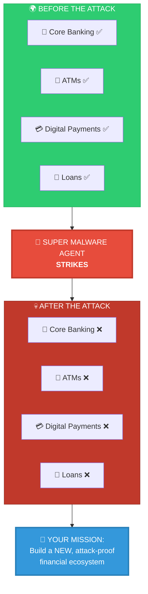
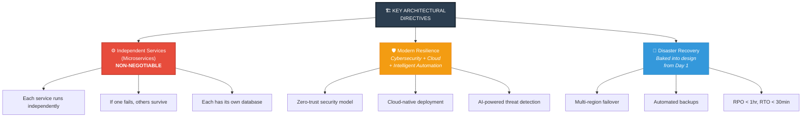
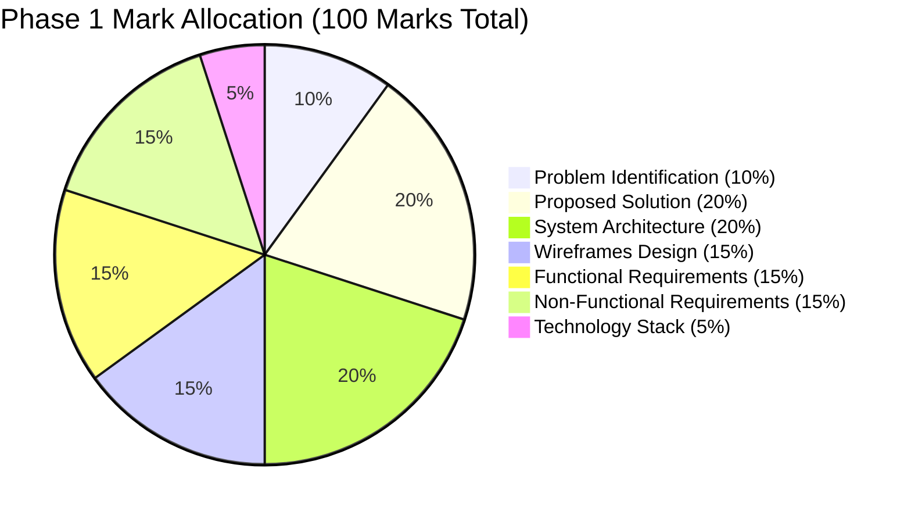
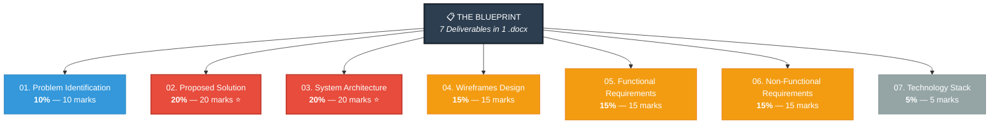
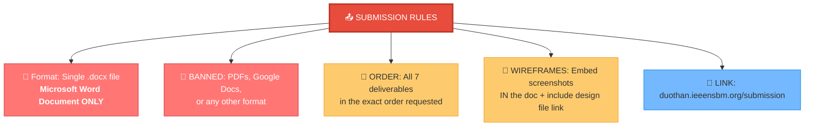
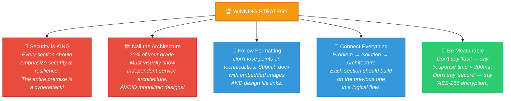

# Duothan 6.0 Phase 01: RECON — In-Depth Walkthrough

This document provides a detailed breakdown and analysis of the **Duothan 6.0 Phase 01 - RECON** requirements. It serves as your strategic guide to understanding the scenario, the expected deliverables, and how to maximize your score.

---

## 1. The Scenario & Core Mission

### The Crisis

It is the year 2065. A "Super Malware Agent" has devastated global digital infrastructure. The financial sector is completely paralyzed—core banking, ATMs, digital payments, and loan systems are offline. People are forced back into a cash-only society, crippling small businesses and causing massive economic inequality.

### The Silver Lining
Customer databases were safely backed up. No user data was lost, but the network is heavily guarded by the malware, rendering the data inaccessible.

### Your Mission
You are not just fixing the old system; you are building a **brand new, attack-proof financial ecosystem** from the ground up. Your goal is to design a secure, reliable, and inclusive digital banking platform that restores trust and essential financial services to millions.

---

## 2. Key Architectural Directives

To succeed in this phase, your design must explicitly address these technical constraints:

*   **Independent Services Architecture:** This is mentioned multiple times and is non-negotiable. You must design a system using isolated, independent services (microservices). This ensures that if one component is compromised in the future, the rest of the system remains secure and operational.
*   **Modern Resilience:** Your solution must incorporate modern cybersecurity practices, cloud technologies, and intelligent automation.
*   **Disaster Recovery:** A robust disaster recovery plan must be baked into your design from day one.

---

## 3. The 7 Deliverables (The Blueprint)

Phase 01 requires **zero coding**. Instead, you are tasked with creating a comprehensive project blueprint. Here are the 7 required sections and how they are weighted:

### Mark Distribution

### Deliverables Overview

### **01. Problem Identification (10%)**
*   **What to do:** Analyze the fallout of the 2065 cyber disaster on banking. Define the precise problems your platform will solve.
*   **Focus on:** The real-world impact on users, the economy, and the specific banking challenges caused by the outage.

### **02. Proposed Solution (20%) ⭐**
*   **What to do:** Describe your technology-based remedy.
*   **Focus on:** How your application securely restores financial services, the specific value it brings to the affected users, and how it directly solves the problems identified in section 01.

### **03. System Architecture Diagram (20%) ⭐**
*   **What to do:** Create a visual diagram of your system.
*   **Focus on:** Showing **independent services (microservices)**, databases, secure communication pathways, and data flow. This diagram must prove that a single point of failure won't take down the whole system.

### **04. Wireframes Design (15%)**
*   **What to do:** Design the user interface (mid or high-fidelity).
*   **Focus on:** Showing the user flow and visual layout of the new banking system. You must embed clear screenshots into your final document **AND** provide a working link to your design file (Figma, Canva, etc.).

### **05. Functional Requirements (15%)**
*   **What to do:** List what the system actually does.
*   **Focus on:** User-facing features (e.g., "A user must be able to securely transfer funds to another account", "The system must authenticate users via biometrics").

### **06. Non-Functional Requirements (15%)**
*   **What to do:** Define the system's quality standards.
*   **Focus on:** Given the hackathon's theme, this section should heavily emphasize **Security, Disaster Recovery, Cloud Performance, High Availability, and Reliability**.

### **07. Technology Stack Selection (5%)**
*   **What to do:** List your programming languages, databases, and cloud tools.
*   **Focus on:** Justifying *why* these tools were chosen. Explain how they support an attack-proof, independent-services architecture (e.g., choosing Kubernetes for container orchestration to ensure high availability).

---

## 4. Submission Guidelines (Critical Rules)

Failure to follow these rules will likely result in disqualification or severe point deductions:

1.  **Format:** You must submit a single **Microsoft Word Document (.docx)**.
2.  **Banned Formats:** Do NOT submit PDFs, Google Docs links, or any other format.
3.  **Order:** Ensure all 7 deliverables are in the exact order requested.
4.  **Wireframes:** You **must** embed screenshots directly in the Word document AND provide a working link to the original design file.
5.  **Submission Link:** `duothan.ieeensbm.org/submission`

---

## 5. Strategic Advice for Winning Phase 01

*   **Security is King:** The entire premise revolves around a massive cyberattack. Every section of your document (especially Architecture, Solution, and Non-Functional Requirements) should scream "Security and Resilience."
*   **Nail the Architecture:** The architecture diagram is worth 20% of your grade. Ensure it visually represents the mandated "independent-service architecture" clearly. Avoid monolithic designs.
*   **Follow the Formatting:** Don't lose points on technicalities. Submit a `.docx` file and include both images and links for your wireframes.
*   **Connect Everything:** Each deliverable should logically flow from the previous one. Problem → Solution → Architecture → Wireframes → Requirements → Tech Stack.
*   **Be Measurable:** Use specific, quantifiable values in your NFRs. "Fast" is vague. "API response < 200ms for 95% of requests" is winning.
