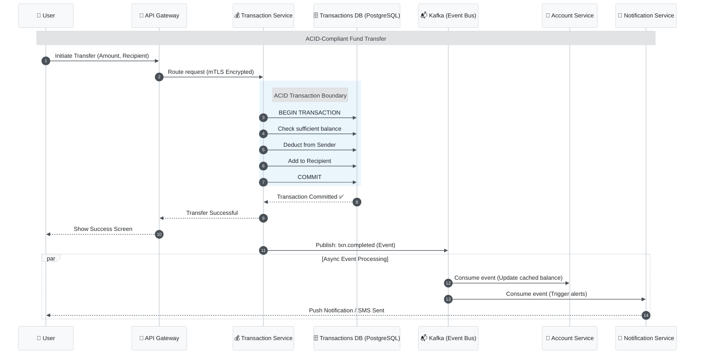

```mermaid
%%{init: {'theme': 'base', 'themeVariables': { 'actorBkg': '#f8f9fa', 'actorBorder': '#ced4da', 'actorTextColor': '#212529', 'signalColor': '#495057', 'signalTextColor': '#212529', 'noteBkgColor': '#e2e3e5', 'noteBorderColor': '#d3d6d8', 'noteTextColor': '#383d41' }}}%%
sequenceDiagram
    autonumber
    participant U as 👤 User
    participant GW as 🚪 API Gateway
    participant TXN as 💰 Transaction Service
    participant DB as 🗄️ Transactions DB (PostgreSQL)
    participant KF as 📬 Kafka (Event Bus)
    participant ACC as 🏦 Account Service
    participant NOTIF as 🔔 Notification Service

    Note over U,NOTIF: ACID-Compliant Fund Transfer
    U->>GW: Initiate Transfer (Amount, Recipient)
    GW->>TXN: Route request (mTLS Encrypted)
    
    rect rgba(52, 152, 219, 0.1)
    Note right of TXN: ACID Transaction Boundary
    TXN->>DB: BEGIN TRANSACTION
    TXN->>DB: Check sufficient balance
    TXN->>DB: Deduct from Sender
    TXN->>DB: Add to Recipient
    TXN->>DB: COMMIT
    end
    
    DB-->>TXN: Transaction Committed ✅
    TXN-->>GW: Transfer Successful
    GW-->>U: Show Success Screen
    
    TXN->>KF: Publish: txn.completed (Event)
    
    par Async Event Processing
        KF->>ACC: Consume event (Update cached balance)
        KF->>NOTIF: Consume event (Trigger alerts)
        NOTIF-->>U: Push Notification / SMS Sent
    end
```
