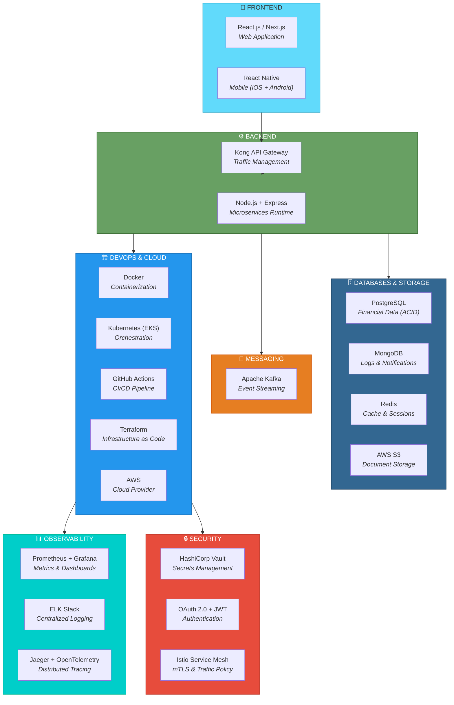

```mermaid
graph TD
    subgraph FE["🎨 FRONTEND"]
        REACT["React.js / Next.js<br/><i>Web Application</i>"]
        RN["React Native<br/><i>Mobile (iOS + Android)</i>"]
    end
    
    subgraph BE["⚙️ BACKEND"]
        NODE["Node.js + Express<br/><i>Microservices Runtime</i>"]
        KONG["Kong API Gateway<br/><i>Traffic Management</i>"]
    end
    
    subgraph DB["🗄️ DATABASES & STORAGE"]
        PG["PostgreSQL<br/><i>Financial Data (ACID)</i>"]
        MG["MongoDB<br/><i>Logs & Notifications</i>"]
        RD["Redis<br/><i>Cache & Sessions</i>"]
        S3["AWS S3<br/><i>Document Storage</i>"]
    end
    
    subgraph MSG["📨 MESSAGING"]
        KF["Apache Kafka<br/><i>Event Streaming</i>"]
    end
    
    subgraph DEVOPS["🏗️ DEVOPS & CLOUD"]
        DCK["Docker<br/><i>Containerization</i>"]
        K8["Kubernetes (EKS)<br/><i>Orchestration</i>"]
        GHA["GitHub Actions<br/><i>CI/CD Pipeline</i>"]
        TF["Terraform<br/><i>Infrastructure as Code</i>"]
        AWS["AWS<br/><i>Cloud Provider</i>"]
    end
    
    subgraph OBS["📊 OBSERVABILITY"]
        PROME["Prometheus + Grafana<br/><i>Metrics & Dashboards</i>"]
        ELKS["ELK Stack<br/><i>Centralized Logging</i>"]
        JAEG["Jaeger + OpenTelemetry<br/><i>Distributed Tracing</i>"]
    end
    
    subgraph SEC["🔒 SECURITY"]
        HCV["HashiCorp Vault<br/><i>Secrets Management</i>"]
        OA["OAuth 2.0 + JWT<br/><i>Authentication</i>"]
        ISTIO["Istio Service Mesh<br/><i>mTLS & Traffic Policy</i>"]
    end
    
    FE --> KONG
    KONG --> BE
    BE --> DB
    BE --> MSG
    BE --> DEVOPS
    DEVOPS --> OBS
    DEVOPS --> SEC
    
    style FE fill:#61dafb,stroke:#21a1c4,color:#333
    style BE fill:#68a063,stroke:#3c6e35,color:#fff
    style DB fill:#336791,stroke:#1a3d5c,color:#fff
    style MSG fill:#e67e22,stroke:#d35400,color:#fff
    style DEVOPS fill:#2496ed,stroke:#1a6fb5,color:#fff
    style OBS fill:#00cec9,stroke:#00b894,color:#fff
    style SEC fill:#e74c3c,stroke:#c0392b,color:#fff
```
