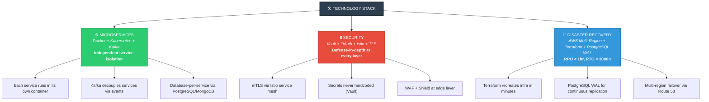

```mermaid
graph TD
    STACK["🛠️ TECHNOLOGY STACK"] --> MS["⚙️ MICROSERVICES<br/><i>Docker + Kubernetes + Kafka</i><br/><b>Independent service isolation</b>"]
    STACK --> SEC2["🔒 SECURITY<br/><i>Vault + OAuth + Istio + TLS</i><br/><b>Defense-in-depth at every layer</b>"]
    STACK --> DR2["🔄 DISASTER RECOVERY<br/><i>AWS Multi-Region + Terraform + PostgreSQL WAL</i><br/><b>RPO < 1hr, RTO < 30min</b>"]
    
    MS --> MS1["Each service runs in its own container"]
    MS --> MS2["Kafka decouples services via events"]
    MS --> MS3["Database-per-service via PostgreSQL/MongoDB"]
    
    SEC2 --> SEC3["mTLS via Istio service mesh"]
    SEC2 --> SEC4["Secrets never hardcoded (Vault)"]
    SEC2 --> SEC5["WAF + Shield at edge layer"]
    
    DR2 --> DR3["Terraform recreates infra in minutes"]
    DR2 --> DR4["PostgreSQL WAL for continuous replication"]
    DR2 --> DR5["Multi-region failover via Route 53"]
    
    style STACK fill:#2c3e50,stroke:#1a252f,color:#fff,stroke-width:3px
    style MS fill:#2ecc71,stroke:#27ae60,color:#fff,stroke-width:2px
    style SEC2 fill:#e74c3c,stroke:#c0392b,color:#fff,stroke-width:2px
    style DR2 fill:#3498db,stroke:#2980b9,color:#fff,stroke-width:2px
```
