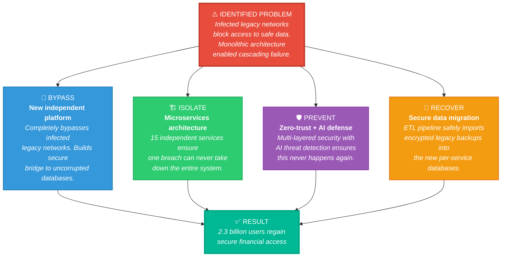

```mermaid
graph TD
    PROBLEM["⚠️ IDENTIFIED PROBLEM<br/><i>Infected legacy networks<br/>block access to safe data.<br/>Monolithic architecture<br/>enabled cascading failure.</i>"] --> S1["🔐 BYPASS<br/><b>New independent platform</b><br/><i>Completely bypasses infected<br/>legacy networks. Builds secure<br/>bridge to uncorrupted databases.</i>"]
    PROBLEM --> S2["🏗️ ISOLATE<br/><b>Microservices architecture</b><br/><i>15 independent services ensure<br/>one breach can never take<br/>down the entire system.</i>"]
    PROBLEM --> S3["🛡️ PREVENT<br/><b>Zero-trust + AI defense</b><br/><i>Multi-layered security with<br/>AI threat detection ensures<br/>this never happens again.</i>"]
    PROBLEM --> S4["🔀 RECOVER<br/><b>Secure data migration</b><br/><i>ETL pipeline safely imports<br/>encrypted legacy backups into<br/>the new per-service databases.</i>"]
    
    S1 --> RESULT["✅ RESULT<br/><i>2.3 billion users regain<br/>secure financial access</i>"]
    S2 --> RESULT
    S3 --> RESULT
    S4 --> RESULT
    
    style PROBLEM fill:#e74c3c,stroke:#c0392b,color:#fff,stroke-width:3px
    style S1 fill:#3498db,stroke:#2980b9,color:#fff,stroke-width:2px
    style S2 fill:#2ecc71,stroke:#27ae60,color:#fff,stroke-width:2px
    style S3 fill:#9b59b6,stroke:#8e44ad,color:#fff,stroke-width:2px
    style S4 fill:#f39c12,stroke:#e67e22,color:#fff,stroke-width:2px
    style RESULT fill:#00b894,stroke:#00a381,color:#fff,stroke-width:3px
```
