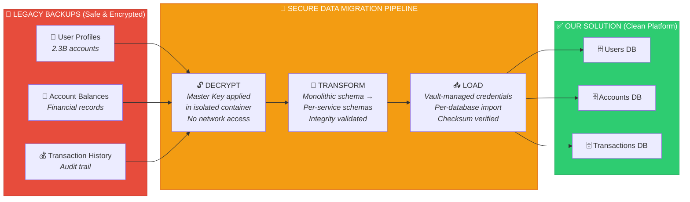

```mermaid
graph LR
    subgraph LEGACY["💾 LEGACY BACKUPS (Safe & Encrypted)"]
        L1["👤 User Profiles<br/><i>2.3B accounts</i>"]
        L2["🏦 Account Balances<br/><i>Financial records</i>"]
        L3["💰 Transaction History<br/><i>Audit trail</i>"]
    end
    
    subgraph MIGRATION["🔀 SECURE DATA MIGRATION PIPELINE"]
        M1["🔓 DECRYPT<br/><i>Master Key applied<br/>in isolated container<br/>No network access</i>"]
        M2["🔄 TRANSFORM<br/><i>Monolithic schema →<br/>Per-service schemas<br/>Integrity validated</i>"]
        M3["📥 LOAD<br/><i>Vault-managed credentials<br/>Per-database import<br/>Checksum verified</i>"]
    end
    
    subgraph NEW["✅ OUR SOLUTION (Clean Platform)"]
        N1["🗄️ Users DB"]
        N2["🗄️ Accounts DB"]
        N3["🗄️ Transactions DB"]
    end
    
    L1 --> M1
    L2 --> M1
    L3 --> M1
    M1 --> M2
    M2 --> M3
    M3 --> N1
    M3 --> N2
    M3 --> N3
    
    style LEGACY fill:#e74c3c,stroke:#c0392b,color:#fff
    style MIGRATION fill:#f39c12,stroke:#e67e22,color:#fff,stroke-width:2px
    style NEW fill:#2ecc71,stroke:#27ae60,color:#fff
```
