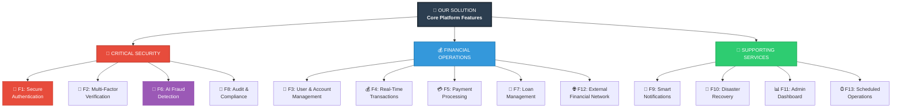

```mermaid
graph TD
    OURSOLUTION["🏦 OUR SOLUTION<br/><b>Core Platform Features</b>"] --> CRITICAL["🔴 CRITICAL SECURITY"]
    OURSOLUTION --> FINANCE["💰 FINANCIAL OPERATIONS"]
    OURSOLUTION --> SUPPORT["🔧 SUPPORTING SERVICES"]
    
    CRITICAL --> F1["🔐 F1: Secure<br/>Authentication"]
    CRITICAL --> F2["📲 F2: Multi-Factor<br/>Verification"]
    CRITICAL --> F6["🤖 F6: AI Fraud<br/>Detection"]
    CRITICAL --> F8["📝 F8: Audit &<br/>Compliance"]
    
    FINANCE --> F3["👤 F3: User & Account<br/>Management"]
    FINANCE --> F4["💰 F4: Real-Time<br/>Transactions"]
    FINANCE --> F5["💳 F5: Payment<br/>Processing"]
    FINANCE --> F7["📄 F7: Loan<br/>Management"]
    FINANCE --> F12["🌐 F12: External<br/>Financial Network"]
    
    SUPPORT --> F9["🔔 F9: Smart<br/>Notifications"]
    SUPPORT --> F10["🔄 F10: Disaster<br/>Recovery"]
    SUPPORT --> F11["📊 F11: Admin<br/>Dashboard"]
    SUPPORT --> F13["⏰ F13: Scheduled<br/>Operations"]
    
    style OURSOLUTION fill:#2c3e50,stroke:#1a252f,color:#fff,stroke-width:3px
    style CRITICAL fill:#e74c3c,stroke:#c0392b,color:#fff,stroke-width:2px
    style FINANCE fill:#3498db,stroke:#2980b9,color:#fff,stroke-width:2px
    style SUPPORT fill:#2ecc71,stroke:#27ae60,color:#fff,stroke-width:2px
    style F1 fill:#e74c3c,stroke:#c0392b,color:#fff
    style F6 fill:#9b59b6,stroke:#8e44ad,color:#fff
```
