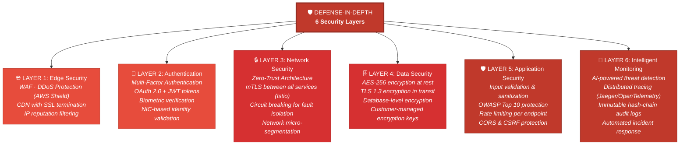

```mermaid
graph TD
    SEC["🛡️ DEFENSE-IN-DEPTH<br/><b>6 Security Layers</b>"] --> L1["🌐 LAYER 1: Edge Security<br/><i>WAF · DDoS Protection (AWS Shield)<br/>CDN with SSL termination<br/>IP reputation filtering</i>"]
    SEC --> L2["🔐 LAYER 2: Authentication<br/><i>Multi-Factor Authentication<br/>OAuth 2.0 + JWT tokens<br/>Biometric verification<br/>NIC-based identity validation</i>"]
    SEC --> L3["🔒 LAYER 3: Network Security<br/><i>Zero-Trust Architecture<br/>mTLS between all services (Istio)<br/>Circuit breaking for fault isolation<br/>Network micro-segmentation</i>"]
    SEC --> L4["🗄️ LAYER 4: Data Security<br/><i>AES-256 encryption at rest<br/>TLS 1.3 encryption in transit<br/>Database-level encryption<br/>Customer-managed encryption keys</i>"]
    SEC --> L5["🛡️ LAYER 5: Application Security<br/><i>Input validation & sanitization<br/>OWASP Top 10 protection<br/>Rate limiting per endpoint<br/>CORS & CSRF protection</i>"]
    SEC --> L6["🤖 LAYER 6: Intelligent Monitoring<br/><i>AI-powered threat detection<br/>Distributed tracing (Jaeger/OpenTelemetry)<br/>Immutable hash-chain audit logs<br/>Automated incident response</i>"]
    
    style SEC fill:#c0392b,stroke:#922b21,color:#fff,stroke-width:3px
    style L1 fill:#e74c3c,stroke:#c0392b,color:#fff
    style L2 fill:#e74c3c,stroke:#c0392b,color:#fff
    style L3 fill:#d63031,stroke:#b71c1c,color:#fff
    style L4 fill:#d63031,stroke:#b71c1c,color:#fff
    style L5 fill:#c0392b,stroke:#922b21,color:#fff
    style L6 fill:#c0392b,stroke:#922b21,color:#fff
```
