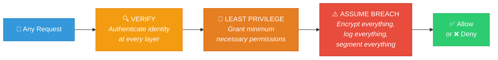

```mermaid
graph LR
    REQ["📨 Any Request"] --> VERIFY["🔍 VERIFY<br/><i>Authenticate identity<br/>at every layer</i>"]
    VERIFY --> LEAST["🔑 LEAST PRIVILEGE<br/><i>Grant minimum<br/>necessary permissions</i>"]
    LEAST --> ASSUME["⚠️ ASSUME BREACH<br/><i>Encrypt everything,<br/>log everything,<br/>segment everything</i>"]
    ASSUME --> ALLOW["✅ Allow<br/>or ❌ Deny"]
    
    style REQ fill:#3498db,stroke:#2980b9,color:#fff
    style VERIFY fill:#f39c12,stroke:#e67e22,color:#fff
    style LEAST fill:#e67e22,stroke:#d35400,color:#fff
    style ASSUME fill:#e74c3c,stroke:#c0392b,color:#fff
    style ALLOW fill:#2ecc71,stroke:#27ae60,color:#fff
```
