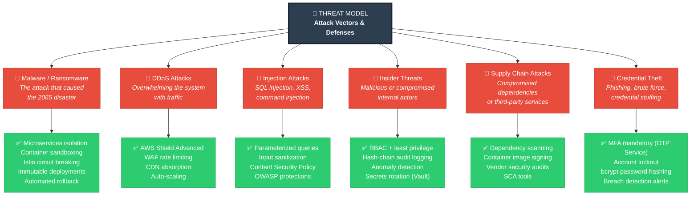

```mermaid
graph TD
    THREAT["🎯 THREAT MODEL<br/><b>Attack Vectors & Defenses</b>"] --> T1["🦠 Malware / Ransomware<br/><i>The attack that caused<br/>the 2065 disaster</i>"]
    THREAT --> T2["🌊 DDoS Attacks<br/><i>Overwhelming the system<br/>with traffic</i>"]
    THREAT --> T3["💉 Injection Attacks<br/><i>SQL injection, XSS,<br/>command injection</i>"]
    THREAT --> T4["👤 Insider Threats<br/><i>Malicious or compromised<br/>internal actors</i>"]
    THREAT --> T5["🔗 Supply Chain Attacks<br/><i>Compromised dependencies<br/>or third-party services</i>"]
    THREAT --> T6["🔑 Credential Theft<br/><i>Phishing, brute force,<br/>credential stuffing</i>"]
    
    T1 --> D1["✅ Microservices isolation<br/>Container sandboxing<br/>Istio circuit breaking<br/>Immutable deployments<br/>Automated rollback"]
    T2 --> D2["✅ AWS Shield Advanced<br/>WAF rate limiting<br/>CDN absorption<br/>Auto-scaling"]
    T3 --> D3["✅ Parameterized queries<br/>Input sanitization<br/>Content Security Policy<br/>OWASP protections"]
    T4 --> D4["✅ RBAC + least privilege<br/>Hash-chain audit logging<br/>Anomaly detection<br/>Secrets rotation (Vault)"]
    T5 --> D5["✅ Dependency scanning<br/>Container image signing<br/>Vendor security audits<br/>SCA tools"]
    T6 --> D6["✅ MFA mandatory (OTP Service)<br/>Account lockout<br/>bcrypt password hashing<br/>Breach detection alerts"]
    
    style THREAT fill:#2c3e50,stroke:#1a252f,color:#fff,stroke-width:3px
    style T1 fill:#e74c3c,stroke:#c0392b,color:#fff
    style T2 fill:#e74c3c,stroke:#c0392b,color:#fff
    style T3 fill:#e74c3c,stroke:#c0392b,color:#fff
    style T4 fill:#e74c3c,stroke:#c0392b,color:#fff
    style T5 fill:#e74c3c,stroke:#c0392b,color:#fff
    style T6 fill:#e74c3c,stroke:#c0392b,color:#fff
    style D1 fill:#2ecc71,stroke:#27ae60,color:#fff
    style D2 fill:#2ecc71,stroke:#27ae60,color:#fff
    style D3 fill:#2ecc71,stroke:#27ae60,color:#fff
    style D4 fill:#2ecc71,stroke:#27ae60,color:#fff
    style D5 fill:#2ecc71,stroke:#27ae60,color:#fff
    style D6 fill:#2ecc71,stroke:#27ae60,color:#fff
```
