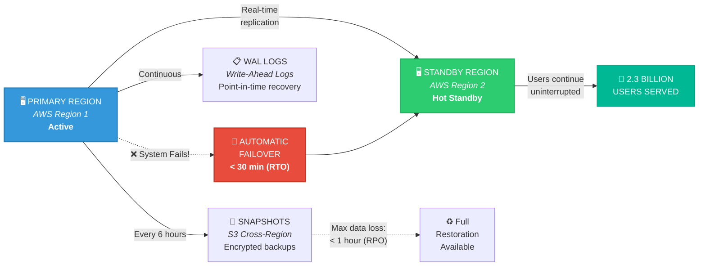

```mermaid
graph LR
    PRIMARY["🖥️ PRIMARY REGION<br/><i>AWS Region 1</i><br/><b>Active</b>"] -->|"Real-time<br/>replication"| STANDBY["🖥️ STANDBY REGION<br/><i>AWS Region 2</i><br/><b>Hot Standby</b>"]
    PRIMARY -->|"Every 6 hours"| SNAPSHOT["💾 SNAPSHOTS<br/><i>S3 Cross-Region</i><br/>Encrypted backups"]
    PRIMARY -->|"Continuous"| WAL["📋 WAL LOGS<br/><i>Write-Ahead Logs</i><br/>Point-in-time recovery"]
    
    PRIMARY -.->|"❌ System Fails!"| FAILOVER["🔄 AUTOMATIC<br/>FAILOVER<br/><b>< 30 min (RTO)</b>"]
    FAILOVER --> STANDBY
    STANDBY -->|"Users continue<br/>uninterrupted"| USERS["👥 2.3 BILLION<br/>USERS SERVED"]
    
    SNAPSHOT -.->|"Max data loss:<br/>< 1 hour (RPO)"| RESTORE["♻️ Full<br/>Restoration<br/>Available"]
    
    style PRIMARY fill:#3498db,stroke:#2980b9,color:#fff,stroke-width:2px
    style STANDBY fill:#2ecc71,stroke:#27ae60,color:#fff,stroke-width:2px
    style FAILOVER fill:#e74c3c,stroke:#c0392b,color:#fff,stroke-width:2px
    style USERS fill:#00b894,stroke:#00a381,color:#fff
```
