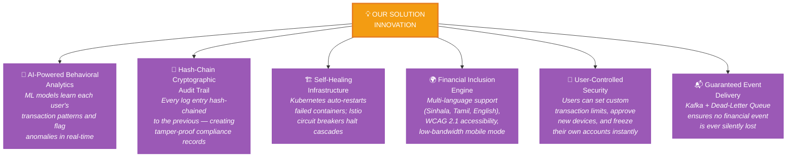

```mermaid
graph TD
    INNOV["💡 OUR SOLUTION<br/>INNOVATION"] --> I1["🤖 AI-Powered Behavioral<br/>Analytics<br/><i>ML models learn each user's<br/>transaction patterns and flag<br/>anomalies in real-time</i>"]
    INNOV --> I2["🔗 Hash-Chain Cryptographic<br/>Audit Trail<br/><i>Every log entry hash-chained<br/>to the previous — creating<br/>tamper-proof compliance records</i>"]
    INNOV --> I3["🏗️ Self-Healing<br/>Infrastructure<br/><i>Kubernetes auto-restarts<br/>failed containers; Istio<br/>circuit breakers halt cascades</i>"]
    INNOV --> I4["🌍 Financial Inclusion<br/>Engine<br/><i>Multi-language support<br/>(Sinhala, Tamil, English),<br/>WCAG 2.1 accessibility,<br/>low-bandwidth mobile mode</i>"]
    INNOV --> I5["🔐 User-Controlled<br/>Security<br/><i>Users can set custom<br/>transaction limits, approve<br/>new devices, and freeze<br/>their own accounts instantly</i>"]
    INNOV --> I6["📬 Guaranteed Event<br/>Delivery<br/><i>Kafka + Dead-Letter Queue<br/>ensures no financial event<br/>is ever silently lost</i>"]
    
    style INNOV fill:#f39c12,stroke:#e67e22,color:#fff,stroke-width:3px
    style I1 fill:#9b59b6,stroke:#8e44ad,color:#fff
    style I2 fill:#9b59b6,stroke:#8e44ad,color:#fff
    style I3 fill:#9b59b6,stroke:#8e44ad,color:#fff
    style I4 fill:#9b59b6,stroke:#8e44ad,color:#fff
    style I5 fill:#9b59b6,stroke:#8e44ad,color:#fff
    style I6 fill:#9b59b6,stroke:#8e44ad,color:#fff
```
