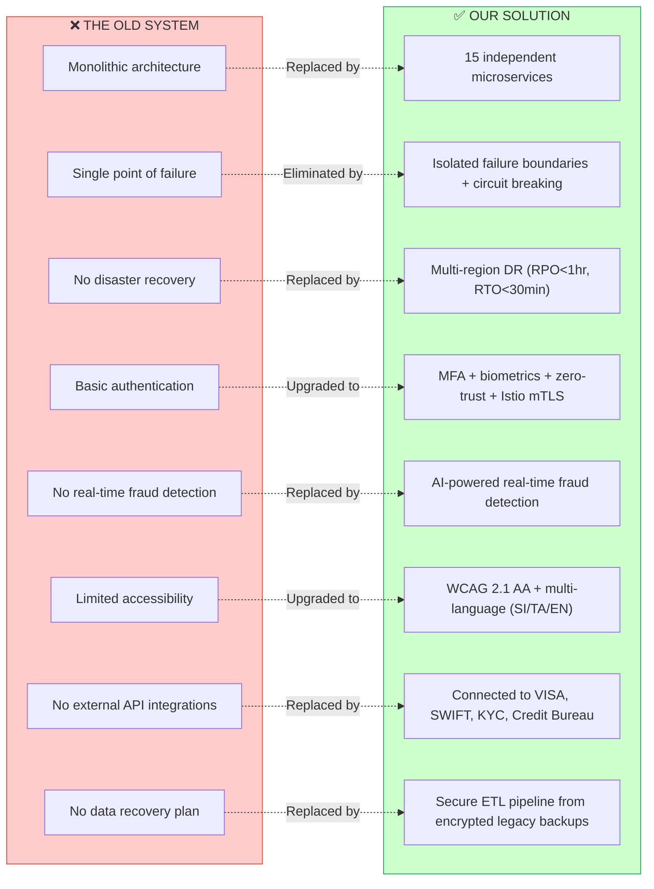

```mermaid
graph LR
    subgraph OLD["❌ THE OLD SYSTEM"]
        direction TB
        O1["Monolithic architecture"]
        O2["Single point of failure"]
        O3["No disaster recovery"]
        O4["Basic authentication"]
        O5["No real-time fraud detection"]
        O6["Limited accessibility"]
        O7["No external API integrations"]
        O8["No data recovery plan"]
    end
    
    subgraph NEW["✅ OUR SOLUTION"]
        direction TB
        N1["15 independent microservices"]
        N2["Isolated failure boundaries + circuit breaking"]
        N3["Multi-region DR (RPO<1hr, RTO<30min)"]
        N4["MFA + biometrics + zero-trust + Istio mTLS"]
        N5["AI-powered real-time fraud detection"]
        N6["WCAG 2.1 AA + multi-language (SI/TA/EN)"]
        N7["Connected to VISA, SWIFT, KYC, Credit Bureau"]
        N8["Secure ETL pipeline from encrypted legacy backups"]
    end
    
    O1 -.->|"Replaced by"| N1
    O2 -.->|"Eliminated by"| N2
    O3 -.->|"Replaced by"| N3
    O4 -.->|"Upgraded to"| N4
    O5 -.->|"Replaced by"| N5
    O6 -.->|"Upgraded to"| N6
    O7 -.->|"Replaced by"| N7
    O8 -.->|"Replaced by"| N8
    
    style OLD fill:#ffcccc,stroke:#e74c3c
    style NEW fill:#ccffcc,stroke:#27ae60
```
