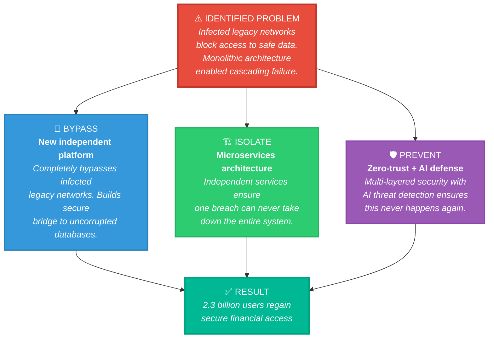
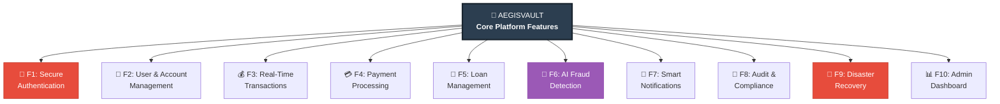
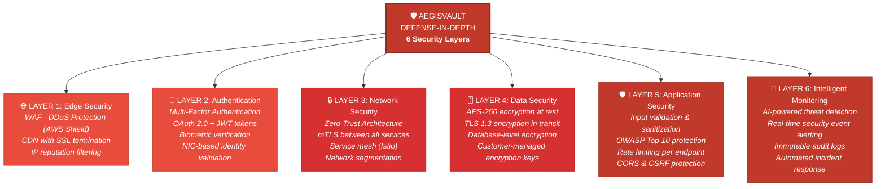
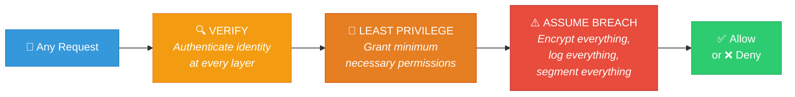
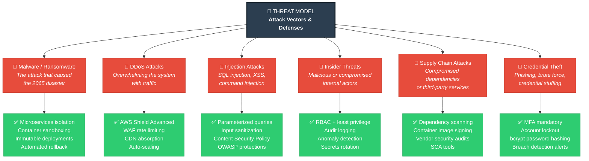
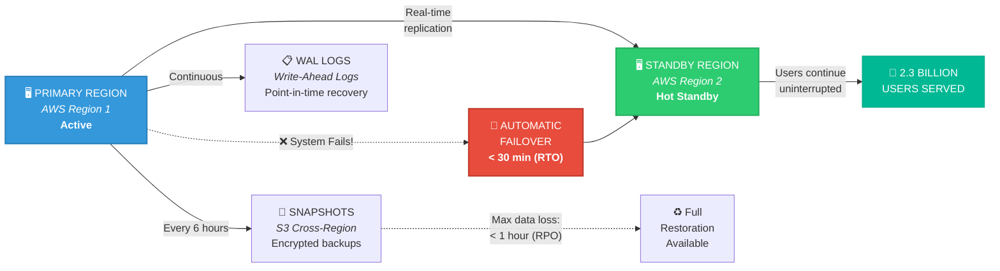
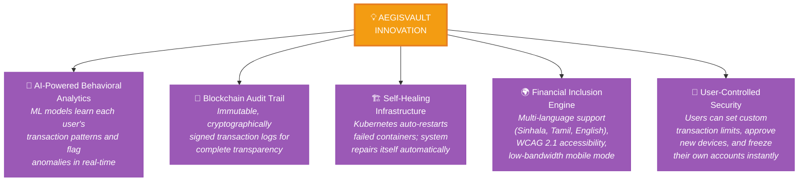
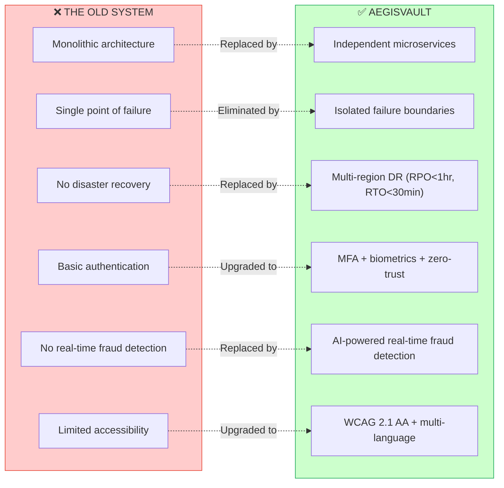

# 02. Proposed Solution

---

## 2.1 Platform Overview: AegisVault

**AegisVault** is a next-generation, cloud-native digital banking platform engineered from the ground up to replace the compromised legacy financial infrastructure destroyed by the 2065 Super Malware Agent. Named after the mythological shield of protection (*Aegis*) and the security of an impenetrable stronghold (*Vault*), AegisVault embodies our core design philosophy: **unbreakable security through architectural isolation.**

Unlike the monolithic systems that fell to a single cascading breach, AegisVault is built on a **microservices-first, zero-trust architecture** where every service operates independently with its own database, authentication layer, and failure boundaries. A compromise of any individual service cannot propagate to the rest of the platform — the architectural flaw that enabled the 2065 disaster is eliminated by design.

AegisVault restores the full spectrum of digital financial services — secure authentication, real-time fund transfers, payment processing, loan management, and fraud detection — while simultaneously establishing a new standard of resilience through AI-driven threat detection, multi-region disaster recovery, and cryptographic transparency that rebuilds the public trust shattered by the attack.

---

## 2.2 How AegisVault Directly Solves the Identified Problem

The problem identified in Section 01 centers on the inability to reboot infected legacy networks and the urgent need to bypass them entirely. AegisVault addresses this through a three-pronged approach:

| Identified Problem | AegisVault Solution |
|--------------------|---------------------|
| Legacy networks infected and unusable | Brand-new platform that bypasses infected infrastructure entirely |
| Monolithic architecture caused cascading failure | Independent microservices with isolated databases — one failure cannot cascade |
| 2.3 billion users locked out of financial services | Immediate restoration of core banking: auth, transfers, payments, loans |
| Public trust in digital finance shattered | Transparent audit trails, user-controlled security, demonstrable resilience |
| Vulnerable populations without welfare/pensions | Inclusive mobile-first design with multi-language support and accessibility features |
| No disaster recovery in old system | Multi-region failover with RPO < 1 hour and RTO < 30 minutes |

---

## 2.3 Core Features

AegisVault delivers 10 core capabilities, each implemented as an independent microservice to ensure isolation, scalability, and fault tolerance:

### Feature Details

| # | Feature | Description | Key Capabilities |
|---|---------|-------------|-----------------|
| **F1** | **Secure Authentication** | Multi-factor authentication with biometric support, built on OAuth 2.0 and JWT | MFA (SMS/email OTP + biometrics), NIC verification, account lockout after 5 failures, session timeout management, passwordless login option |
| **F2** | **User & Account Management** | Complete KYC-verified user profiles with multi-account support | Real-time balance display, multiple account types (savings, current, business), profile preferences, KYC document upload and verification workflow |
| **F3** | **Real-Time Transactions** | Instant fund transfers with ACID-compliant processing | Internal transfers, balance inquiries, transaction history with advanced filters (date, type, amount, recipient), downloadable statements, receipt generation |
| **F4** | **Payment Processing** | Comprehensive payment gateway supporting P2P, merchant, and utility payments | Peer-to-peer transfers, merchant QR code payments, utility bill payments, scheduled/recurring payments, payment request functionality |
| **F5** | **Loan Management** | End-to-end digital loan lifecycle management | Loan application submission, eligibility assessment, approval workflow, repayment tracking, interest calculation, early settlement options |
| **F6** | **AI Fraud Detection** | Machine learning-powered real-time behavioral analysis and threat detection | Behavioral pattern learning, anomaly detection (unusual amounts, locations, times), automatic account freeze on suspicious activity, user notification and manual review workflow |
| **F7** | **Smart Notifications** | Multi-channel real-time alerting system | Push notifications, SMS, email alerts for all transactions, security events (login from new device, failed attempts), customizable alert preferences |
| **F8** | **Audit & Compliance** | Immutable audit trail with regulatory reporting capabilities | Every action logged with timestamp, user, and IP; compliance report generation; regulatory audit support; tamper-proof log storage |
| **F9** | **Disaster Recovery** | Automated multi-region backup and failover system | Real-time data replication across regions, automated failover in < 30 minutes, point-in-time recovery, automated backup every 6 hours, 99.99% uptime SLA |
| **F10** | **Admin Dashboard** | Centralized operations and monitoring console for system administrators | Real-time system health monitoring, user account management (suspend/restore/verify), transaction analytics, daily reports, alert configuration |

---

## 2.4 Multi-Layered Security Architecture

Given that the entire crisis stems from a cyberattack, security is not merely a feature of AegisVault — it is the **foundational design principle** woven into every layer of the platform. AegisVault implements a **defense-in-depth strategy** with six distinct security layers:

### Zero-Trust Implementation

AegisVault's zero-trust model operates on the principle of **"never trust, always verify"** — every request is treated as potentially hostile regardless of its origin:

| Zero-Trust Principle | AegisVault Implementation |
|---------------------|---------------------------|
| **Verify Explicitly** | Every service-to-service call requires mutual TLS authentication; user sessions validated with JWT tokens on every request |
| **Least Privilege Access** | Role-Based Access Control (RBAC) with granular permissions; a teller can view transactions but cannot modify system settings |
| **Assume Breach** | All internal communications encrypted; every action logged to immutable audit trail; network micro-segmented so compromise of one service is contained |

---

## 2.5 Threat Model

To ensure AegisVault is resilient against the types of attacks that caused the 2065 disaster and beyond, we have identified the primary threat vectors and designed specific countermeasures for each:

| Threat Vector | Risk Level | AegisVault Defense | Why It Works |
|--------------|------------|-------------------|--------------|
| **Malware/Ransomware** | 🔴 Critical | Microservices isolation, container sandboxing, immutable deployments, automated rollback | Unlike the monolithic old system, a compromised container is destroyed and replaced — malware cannot spread across service boundaries |
| **DDoS Attacks** | 🔴 Critical | AWS Shield Advanced, WAF rate limiting, CDN traffic absorption, horizontal auto-scaling | Traffic floods are absorbed at the edge before reaching application servers |
| **Injection Attacks** | 🟡 High | Parameterized queries, input sanitization, Content Security Policy, OWASP Top 10 protections | No user input ever reaches the database unsanitized |
| **Insider Threats** | 🟡 High | RBAC with least privilege, comprehensive audit logging, behavioral anomaly detection, automatic secrets rotation | Every action is logged immutably; anomalous admin behavior triggers alerts |
| **Supply Chain Attacks** | 🟡 High | Automated dependency vulnerability scanning (Snyk/Dependabot), container image signing, Software Composition Analysis | Compromised libraries are detected before deployment |
| **Credential Theft** | 🟡 High | Mandatory MFA, account lockout after 5 failures, bcrypt password hashing with salt, breach detection alerts | Even stolen passwords are useless without the second authentication factor |

---

## 2.6 Disaster Recovery Strategy

AegisVault treats disaster recovery as a **first-class architectural concern**, not an afterthought. The platform is designed to survive regional outages, infrastructure failures, and even targeted attacks on individual data centers:

| DR Metric | Target | How Achieved |
|-----------|--------|-------------|
| **RPO** (Recovery Point Objective) | < 1 hour | Continuous WAL streaming + 6-hourly encrypted snapshots to cross-region S3 |
| **RTO** (Recovery Time Objective) | < 30 minutes | Hot standby region with real-time replication; automatic DNS failover via Route 53 |
| **Uptime SLA** | 99.99% | Multi-region active-passive with automated health checks and failover triggers |
| **Backup Frequency** | Every 6 hours (full) + continuous WAL | Automated via infrastructure-as-code; no manual intervention required |
| **Backup Retention** | 90 days | Encrypted snapshots in geographically separate S3 buckets with lifecycle policies |

---

## 2.7 Innovation & Differentiators

AegisVault goes beyond simply restoring the old system's functionality. It introduces innovations that make the platform fundamentally superior to what existed before the attack:

| Innovation | What It Does | Why It Matters |
|-----------|-------------|----------------|
| **AI Behavioral Analytics** | ML models learn each user's normal transaction patterns (amounts, times, locations, recipients) and flag deviations in real-time | Detects sophisticated fraud that rule-based systems miss; adapts to evolving attack patterns without manual updates |
| **Blockchain Audit Trail** | Every transaction is logged with a cryptographic hash chained to the previous entry, creating a tamper-proof ledger | Provides undeniable proof of transaction integrity; enables regulatory audits with complete confidence; directly addresses the trust deficit identified in Section 01 |
| **Self-Healing Infrastructure** | Kubernetes monitors all containers and automatically restarts, reschedules, or replaces failed instances without human intervention | The system literally repairs itself — a malware-damaged container is destroyed and replaced with a clean image within seconds |
| **Financial Inclusion Engine** | Multi-language UI (Sinhala, Tamil, English), WCAG 2.1 AA accessibility compliance, optimized for low-bandwidth connections, large touch targets for elderly users | Directly addresses the 420 million vulnerable individuals identified in Section 01 who depend on digital disbursements; ensures no one is left behind |
| **User-Controlled Security** | Users can set personal transaction limits, approve or reject new device logins, instantly freeze their own accounts, and configure custom notification rules | Empowers users to protect themselves; rebuilds trust by giving users visible control over their own security — directly addressing the 67% trust deficit identified in Section 01 |

---

## 2.8 Value Proposition Summary

**AegisVault does not merely restore the old system's capabilities — it delivers a platform that is architecturally incapable of suffering the same catastrophic, system-wide failure.** Every design decision, from microservices isolation to zero-trust networking to AI-driven threat detection, is a direct response to the specific vulnerabilities that the Super Malware Agent exploited in 2065. The result is a banking platform that is not just functional, but fundamentally *trustworthy* — the critical prerequisite for bringing 2.3 billion users back to digital finance.
