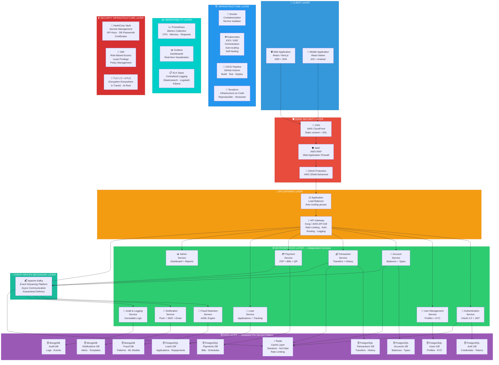
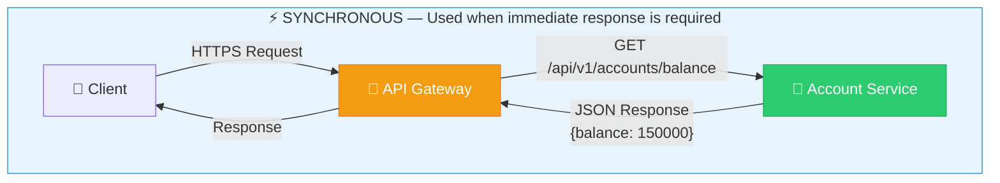
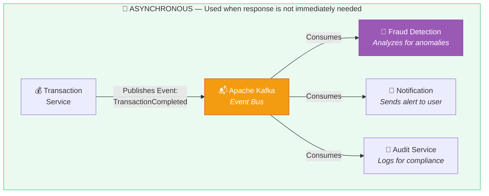
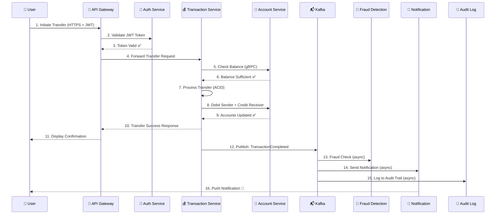
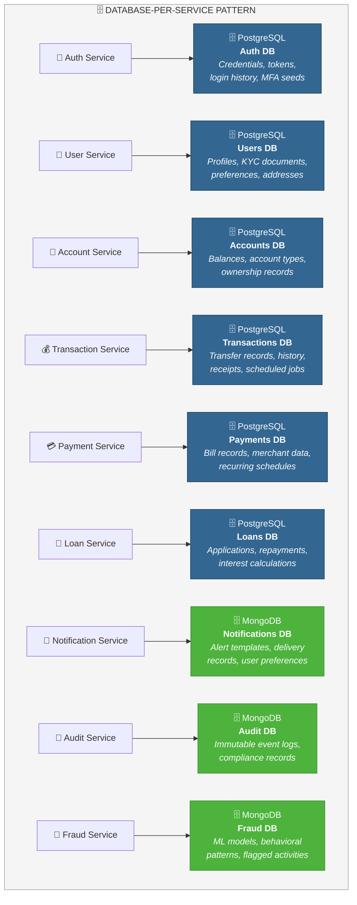
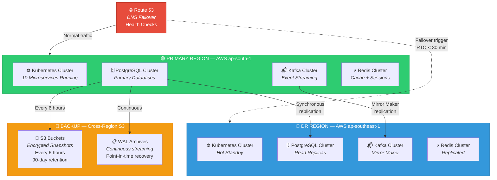
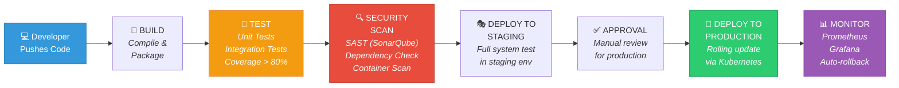
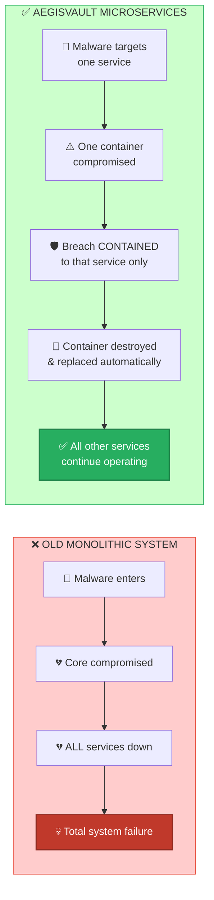

# 03. System Architecture Diagram

---

## 3.1 Architecture Overview

AegisVault is built on a **microservices-first architecture** organized into 9 distinct layers. Each layer serves a specific purpose, and every microservice operates independently with its own database, ensuring that the cascading failure that destroyed the legacy monolithic system in 2065 is architecturally impossible.

---

## 3.2 Layer-by-Layer Breakdown

| Layer | Purpose | Components | Why It's Essential |
|-------|---------|------------|--------------------|
| **👥 Client** | User interfaces for web and mobile | React/Next.js (Web), React Native (Mobile) | Users interact with the platform through responsive, accessible interfaces |
| **🛡️ Edge Security** | First line of defense — blocks threats before they reach the system | CloudFront CDN, AWS WAF, AWS Shield Advanced | DDoS attacks, bot traffic, and malicious requests are stopped at the perimeter |
| **🚪 API Gateway** | Single entry point — routes, authenticates, and rate-limits all traffic | Application Load Balancer, Kong/AWS API Gateway | Centralized security enforcement, request routing, and traffic management |
| **⚙️ Microservices** | Independent business logic — each service handles one domain | 10 isolated services (Auth, User, Account, Transaction, Payment, Loan, Fraud, Notification, Audit, Admin) | Fault isolation: if one service fails, the rest continue operating |
| **🗄️ Data** | Persistent storage — each service owns its database | PostgreSQL (6 DBs for financial data), MongoDB (3 DBs for logs/notifications/fraud), Redis (cache) | Database-per-service prevents a single DB compromise from affecting the entire system |
| **📨 Messaging** | Asynchronous inter-service communication | Apache Kafka (event streaming) | Services communicate without blocking; guaranteed delivery and event replay |
| **🏗️ Infrastructure** | Deployment, scaling, and orchestration | Docker, Kubernetes (EKS/GKE), GitHub Actions CI/CD, Terraform IaC | Consistent, automated, self-healing deployments |
| **📊 Observability** | Monitoring, alerting, and log management | Prometheus (metrics), Grafana (dashboards), ELK Stack (centralized logging) | Know when things go wrong and diagnose issues quickly |
| **🔒 Security Infra** | Secrets, access control, and encryption | HashiCorp Vault, IAM (RBAC), TLS 1.3 + mTLS | End-to-end protection at every layer |

---

## 3.3 Microservices Communication Patterns

Services communicate using two patterns, chosen based on whether immediate response is needed:

### Synchronous Communication (REST / gRPC)

**Used for:** Login authentication, balance inquiries, transaction initiation — operations where the user needs an immediate response.

### Asynchronous Communication (Event-Driven via Kafka)

**Used for:** Post-transaction processing, fraud analysis, notification dispatch, audit logging — operations where the primary action is complete and downstream services can process independently.

### Communication Pattern Summary

| Pattern | Protocol | When to Use | Example | Latency |
|---------|----------|-------------|---------|---------|
| **Synchronous** | REST (HTTPS) / gRPC | Immediate response needed | User login → Auth verifies credentials | < 200ms |
| **Asynchronous** | Kafka events | Response not immediately needed | Transaction done → Notify user + Check fraud + Log audit | Eventually consistent |

---

## 3.4 Data Flow: Complete Transaction Lifecycle

This diagram shows how a single fund transfer flows through the entire AegisVault system, demonstrating the security and isolation at every step:

### Key Security Points in the Data Flow:

| Step | Security Measure |
|------|-----------------|
| Step 1 | All communication over HTTPS with TLS 1.3 |
| Step 2-3 | JWT token validation — no anonymous requests allowed |
| Step 4 | API Gateway rate-limits requests (prevents abuse) |
| Step 5-6 | Service-to-service call via gRPC with mTLS (mutual authentication) |
| Step 7 | ACID-compliant transaction in PostgreSQL (atomicity guaranteed) |
| Step 12 | Event published to Kafka with encryption at rest |
| Step 15 | Audit log entry is immutable — tamper-proof compliance |

---

## 3.5 Database-Per-Service Architecture

Each microservice owns its database — no shared databases. This is the **critical architectural pattern** that prevents the cascading failure that destroyed the monolithic legacy system:

### Why Two Database Types?

| Database | Type | Used For | Why |
|----------|------|----------|-----|
| **PostgreSQL** | SQL (Relational) | Financial data — accounts, transactions, loans, payments, auth | **ACID compliance is mandatory** for banking. Every financial operation must be atomic, consistent, isolated, and durable. A transfer must either fully complete or not happen at all. |
| **MongoDB** | NoSQL (Document) | Non-financial data — logs, notifications, fraud patterns, ML models | Flexible schema handles varied log structures and rapidly evolving ML model data. Horizontal scaling for high-volume write operations (every action generates logs). |
| **Redis** | In-Memory Cache | Sessions, frequently accessed data, rate limiting counters | Sub-millisecond read times for session validation and hot data. Reduces database load by 60-80% for read-heavy operations. |

---

## 3.6 Disaster Recovery Architecture

| Metric | Target | Implementation |
|--------|--------|---------------|
| **RPO** | < 1 hour | Continuous WAL streaming + 6-hourly snapshots |
| **RTO** | < 30 minutes | Hot standby region + Route 53 DNS failover |
| **Uptime SLA** | 99.99% | Multi-region with automated health checks |
| **Backup Retention** | 90 days | Encrypted S3 snapshots with lifecycle policies |

---

## 3.7 CI/CD Pipeline

All code changes flow through an automated pipeline that ensures security and quality at every stage:

---

## 3.8 How This Architecture Prevents Future Cascading Failures

| Failure Scenario | Old Monolithic System | AegisVault (Microservices) |
|-----------------|----------------------|---------------------------|
| **Auth service breached** | Entire system compromised (shared database) | Only auth service affected; other services continue with cached sessions |
| **Database corrupted** | ALL data lost (single shared DB) | Only the affected service's data impacted; 8 other databases unaffected |
| **Network partition** | Complete system outage | Affected services degrade gracefully; circuit breakers prevent cascade |
| **DDoS attack** | All services overwhelmed | WAF + CDN absorb at edge; auto-scaling handles legitimate traffic spikes |
| **Region outage** | Total downtime until manual recovery | Automatic failover to DR region in < 30 minutes |
