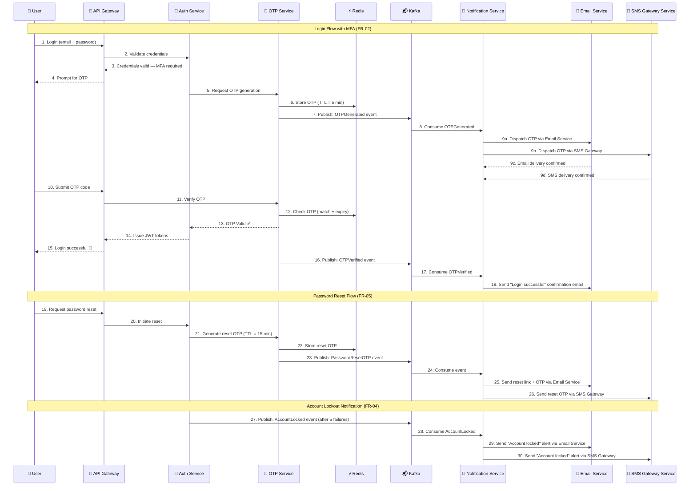
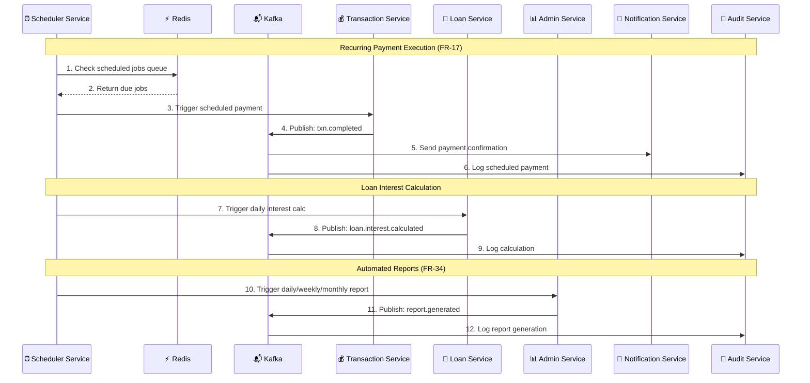
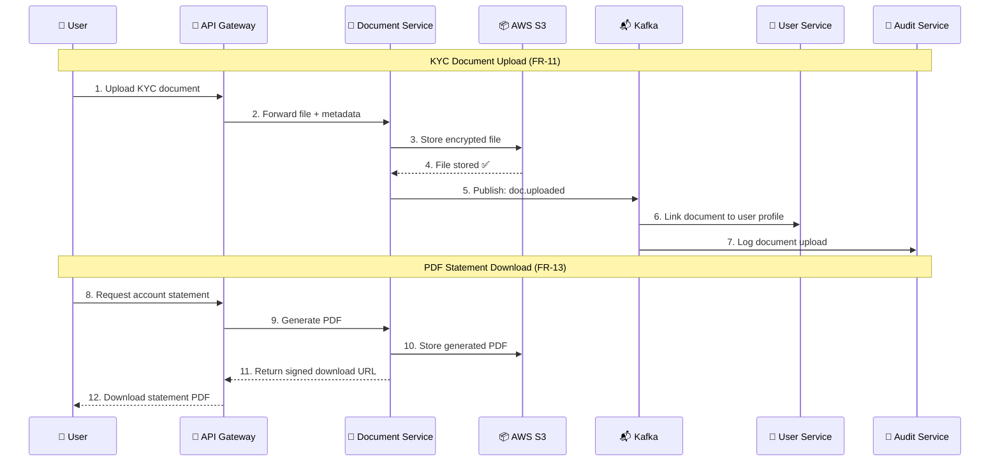
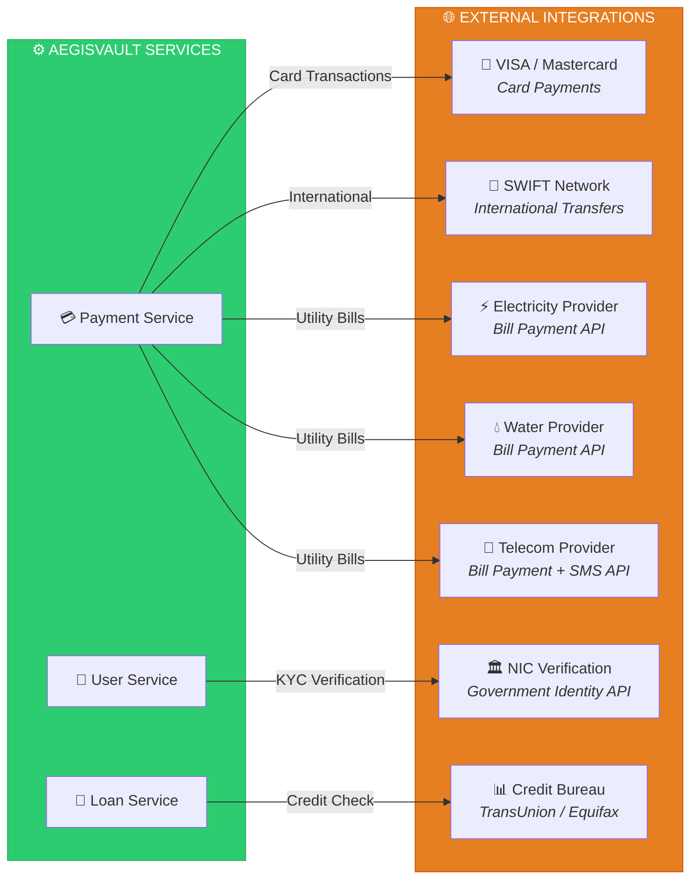

# AegisVault — System Architecture Diagram

> **Standalone reference file** — Contains the complete system architecture Mermaid diagram with all 10 layers, 15 microservices, and full event-driven messaging flows.

---

## Full System Architecture

```mermaid
---
config:
  layout: elk
---
graph TB
    subgraph CLIENTS["👥 CLIENT LAYER"]
        WEB["🌐 Web Application<br/><i>React / Next.js</i><br/>SSR + SPA"]
        MOB["📱 Mobile Application<br/><i>React Native</i><br/>iOS + Android"]
    end

    subgraph EDGE["🛡️ EDGE SECURITY LAYER"]
        CDN["📡 CDN<br/><i>AWS CloudFront</i><br/>Static content + SSL"]
        WAF["🛡️ WAF<br/><i>AWS WAF</i><br/>Web Application Firewall"]
        DDOS["🚫 DDoS Protection<br/><i>AWS Shield Advanced</i>"]
    end

    subgraph GATEWAY["🚪 API GATEWAY LAYER"]
        LB["⚖️ Application<br/>Load Balancer<br/><i>Auto-scaling groups</i>"]
        APIGW["🚪 API Gateway<br/><i>Kong / AWS API GW</i><br/>Rate Limiting · Auth<br/>Routing · Versioning"]
    end

    subgraph SERVICES["⚙️ MICROSERVICES LAYER — 15 Independent Services"]
        AUTH["🔐 Authentication<br/>Service<br/><i>OAuth 2.0 + JWT</i>"]
        OTPSVC["📲 OTP Service<br/><i>TOTP / SMS OTP</i><br/>MFA Verification"]
        USERSVC["👤 User Management<br/>Service<br/><i>Profiles + KYC</i>"]
        ACCSVC["🏦 Account<br/>Service<br/><i>Balances + Types</i>"]
        TXNSVC["💰 Transaction<br/>Service<br/><i>Transfers + History</i>"]
        PAYSVC["💳 Payment<br/>Service<br/><i>P2P + Bills + QR</i>"]
        LOANSVC["📄 Loan<br/>Service<br/><i>Applications + Tracking</i>"]
        FRAUDSVC["🤖 Fraud Detection<br/>Service<br/><i>AI/ML Engine</i>"]
        NOTIFSVC["🔔 Notification<br/>Service<br/><i>Push Notifications</i>"]
        EMAILSVC["📧 Email Service<br/><i>AWS SES / SMTP</i><br/>Transactional Emails"]
        SMSSVC["📱 SMS Gateway<br/>Service<br/><i>Twilio / AWS SNS</i>"]
        AUDITSVC["📝 Audit & Logging<br/>Service<br/><i>Immutable Hash-Chain</i>"]
        ADMINSVC["📊 Admin<br/>Service<br/><i>Dashboard + Reports</i>"]
        SCHEDSVC["⏰ Scheduler<br/>Service<br/><i>Cron Jobs + Recurring</i>"]
        DOCSVC["📁 Document<br/>Service<br/><i>KYC Upload + PDF Gen</i>"]
    end

    subgraph DATA["🗄️ DATA LAYER — Database-Per-Service Pattern"]
        PG_AUTH["🗄️ PostgreSQL<br/><i>Auth DB</i><br/>Credentials · Tokens"]
        PG_OTP["🗄️ PostgreSQL<br/><i>OTP DB</i><br/>OTP Records · Rate Limits"]
        PG_USER["🗄️ PostgreSQL<br/><i>Users DB</i><br/>Profiles · KYC"]
        PG_ACC["🗄️ PostgreSQL<br/><i>Accounts DB</i><br/>Balances · Types"]
        PG_TXN["🗄️ PostgreSQL<br/><i>Transactions DB</i><br/>Transfers · History"]
        PG_PAY["🗄️ PostgreSQL<br/><i>Payments DB</i><br/>Bills · Schedules"]
        PG_LOAN["🗄️ PostgreSQL<br/><i>Loans DB</i><br/>Applications · Repayments"]
        PG_ADMIN["🗄️ PostgreSQL<br/><i>Admin DB</i><br/>Settings · Roles · Reports"]
        MONGO["🗄️ MongoDB<br/><i>Notifications DB</i><br/>Alerts · Templates"]
        MONGO_AUDIT["🗄️ MongoDB<br/><i>Audit DB</i><br/>Hash-Chain Logs · Events"]
        MONGO_FRAUD["🗄️ MongoDB<br/><i>Fraud DB</i><br/>Patterns · ML Models"]
        MONGO_EMAIL["🗄️ MongoDB<br/><i>Email DB</i><br/>Templates · Delivery Logs"]
        REDIS["⚡ Redis<br/><i>Cache Layer</i><br/>Sessions · Hot Data<br/>Rate Limiting"]
        S3_DOCS["📦 AWS S3<br/><i>Document Store</i><br/>KYC Files · Statements<br/>Receipts"]
    end

    subgraph MESSAGING["📨 EVENT-DRIVEN MESSAGING LAYER"]
        KAFKA["📬 Apache Kafka<br/><i>Event Streaming Platform</i><br/>Async Communication<br/>Guaranteed Delivery"]
        DLQ["☠️ Dead-Letter Queue<br/><i>Failed Event Store</i><br/>Retry · Investigation"]
    end

    subgraph EXTERNAL["🌐 EXTERNAL INTEGRATION LAYER"]
        PAYNET["🏧 Payment Networks<br/><i>VISA · Mastercard · SWIFT</i>"]
        KYCAPI["🏛️ Government KYC<br/><i>NIC Verification API</i>"]
        CREDITAPI["📊 Credit Bureau<br/><i>Credit Score API</i>"]
        UTILAPI["🔌 Utility Providers<br/><i>Bill Payment APIs</i>"]
    end

    subgraph INFRA["🏗️ INFRASTRUCTURE LAYER"]
        DOCKER["🐳 Docker<br/><i>Containerization</i><br/>Service Isolation"]
        K8S["☸️ Kubernetes<br/><i>EKS / GKE</i><br/>Orchestration<br/>Auto-scaling<br/>Self-healing"]
        CICD["🔄 CI/CD Pipeline<br/><i>GitHub Actions</i><br/>Build · Test · Deploy"]
        TF["📐 Terraform<br/><i>Infrastructure as Code</i><br/>Reproducible · Versioned"]
        MIGRATE["🔀 Data Migration<br/><i>Legacy DB Bridge</i><br/>Encrypted Backup Import"]
    end

    subgraph OBSERVE["📊 OBSERVABILITY LAYER"]
        PROM["📈 Prometheus<br/><i>Metrics Collection</i><br/>CPU · Memory · Requests"]
        GRAF["📊 Grafana<br/><i>Dashboards</i><br/>Real-time Visualization"]
        ELK["📋 ELK Stack<br/><i>Centralized Logging</i><br/>Elasticsearch · Logstash<br/>Kibana"]
        JAEGER["🔍 Jaeger<br/><i>Distributed Tracing</i><br/>OpenTelemetry<br/>End-to-End Request Traces"]
    end

    subgraph SECURITY["🔒 SECURITY INFRASTRUCTURE LAYER"]
        VAULT["🔑 HashiCorp Vault<br/><i>Secrets Management</i><br/>API Keys · DB Passwords<br/>Certificates"]
        IAM["🛂 IAM<br/><i>Role-Based Access</i><br/>Least Privilege<br/>Policy Management"]
        TLS["🔐 TLS 1.3 + mTLS<br/><i>Encryption Everywhere</i><br/>In Transit · At Rest"]
        ISTIO["🕸️ Istio Service Mesh<br/><i>mTLS · Circuit Breaking</i><br/>Traffic Policies<br/>Zero-Trust Enforcement"]
    end

    %% ── Client → Edge ──
    WEB --> CDN
    MOB --> CDN
    CDN --> WAF
    WAF --> DDOS
    DDOS --> LB

    %% ── Gateway → Services ──
    LB --> APIGW
    APIGW --> AUTH
    APIGW --> OTPSVC
    APIGW --> USERSVC
    APIGW --> ACCSVC
    APIGW --> TXNSVC
    APIGW --> PAYSVC
    APIGW --> LOANSVC
    APIGW --> ADMINSVC
    APIGW --> DOCSVC

    %% ── Auth ↔ OTP (synchronous MFA verification) ──
    AUTH -->|"MFA Request"| OTPSVC

    %% ── Services → Databases (Database-Per-Service) ──
    AUTH --> PG_AUTH
    OTPSVC --> PG_OTP
    USERSVC --> PG_USER
    ACCSVC --> PG_ACC
    TXNSVC --> PG_TXN
    PAYSVC --> PG_PAY
    LOANSVC --> PG_LOAN
    ADMINSVC --> PG_ADMIN
    NOTIFSVC --> MONGO
    AUDITSVC --> MONGO_AUDIT
    FRAUDSVC --> MONGO_FRAUD
    EMAILSVC --> MONGO_EMAIL
    DOCSVC --> S3_DOCS

    %% ── Redis Cache Connections ──
    AUTH --> REDIS
    OTPSVC --> REDIS
    TXNSVC --> REDIS
    ACCSVC --> REDIS
    APIGW --> REDIS
    SCHEDSVC --> REDIS

    %% ── Kafka Event Streaming (Producers) ──
    TXNSVC --> KAFKA
    PAYSVC --> KAFKA
    ACCSVC --> KAFKA
    AUTH -->|"LoginEvent<br/>PasswordReset"| KAFKA
    OTPSVC -->|"OTPGenerated<br/>OTPVerified"| KAFKA
    FRAUDSVC -->|"FraudAlert"| KAFKA
    SCHEDSVC -->|"JobTriggered"| KAFKA
    LOANSVC -->|"LoanEvent"| KAFKA

    %% ── Kafka Event Streaming (Consumers) ──
    KAFKA --> FRAUDSVC
    KAFKA --> NOTIFSVC
    KAFKA --> AUDITSVC
    KAFKA --> EMAILSVC
    KAFKA --> SMSSVC
    KAFKA -.->|"Failed Events"| DLQ

    %% ── Notification delegates delivery ──
    NOTIFSVC -->|"Email Dispatch"| EMAILSVC
    NOTIFSVC -->|"SMS Dispatch"| SMSSVC

    %% ── Scheduler triggers ──
    SCHEDSVC -->|"Recurring Payments"| TXNSVC
    SCHEDSVC -->|"Interest Calc"| LOANSVC
    SCHEDSVC -->|"Report Gen"| ADMINSVC

    %% ── External integrations ──
    PAYSVC --> PAYNET
    USERSVC --> KYCAPI
    LOANSVC --> CREDITAPI
    PAYSVC --> UTILAPI

    %% ── Fraud → Account (freeze trigger) ──
    FRAUDSVC -.->|"Account Freeze"| ACCSVC

    %% ── Layer Styling ──
    style CLIENTS fill:#3498db,stroke:#2980b9,color:#fff
    style EDGE fill:#e74c3c,stroke:#c0392b,color:#fff
    style GATEWAY fill:#f39c12,stroke:#e67e22,color:#fff
    style SERVICES fill:#2ecc71,stroke:#27ae60,color:#fff
    style DATA fill:#9b59b6,stroke:#8e44ad,color:#fff
    style MESSAGING fill:#1abc9c,stroke:#16a085,color:#fff
    style EXTERNAL fill:#e67e22,stroke:#d35400,color:#fff
    style INFRA fill:#2496ed,stroke:#1a6fb5,color:#fff
    style OBSERVE fill:#00cec9,stroke:#00b894,color:#fff
    style SECURITY fill:#d63031,stroke:#c0392b,color:#fff
```

---

## OTP, Email & SMS — Detailed Flow

This diagram shows how OTP generation, verification, email delivery, and SMS delivery flow through the system to satisfy **FR-02** (mandatory MFA), **FR-04** (account lockout + email/SMS notification), **FR-05** (password reset via email/SMS OTP), and **FR-29** (multi-channel notifications).

---

## Scheduled Jobs & Recurring Tasks Flow

This diagram shows how the Scheduler Service orchestrates background operations required by **FR-17** (scheduled payments), **FR-34** (automated reports), and loan interest calculation jobs.

---

## Document Service Flow

This diagram shows KYC document upload (FR-11), PDF statement generation (FR-13), and digital receipt handling (FR-19).

---

## External Integration Layer — Third-Party APIs

This diagram shows how services connect to external systems for payment processing, KYC verification, credit scoring, and utility bill payments.

---

## Kafka Topics — Complete Event Catalog

The following Kafka topics support the messaging layer. Each topic is produced by a specific service and consumed by one or more downstream services.

### Core Financial Events

| Topic Name | Producer | Consumer(s) | Purpose |
|------------|----------|-------------|---------|
| `txn.completed` | Transaction Service | Fraud Detection, Notification, Audit | Fund transfer completed |
| `txn.failed` | Transaction Service | Notification, Audit | Transfer failed (insufficient balance, etc.) |
| `txn.scheduled` | Scheduler Service | Transaction Service, Audit | Scheduled payment triggered |
| `pay.completed` | Payment Service | Notification, Audit | Bill payment processed |
| `pay.external` | Payment Service | Audit | External payment network event |
| `acc.created` | Account Service | Notification, Audit | New account opened |
| `acc.updated` | Account Service | Audit | Account details modified |
| `acc.frozen` | Fraud Detection | Notification, Audit, Account Service | Suspicious account frozen |

### Authentication & Security Events

| Topic Name | Producer | Consumer(s) | Purpose |
|------------|----------|-------------|---------|
| `auth.login` | Auth Service | Audit, Fraud Detection | User login event (tracks device, IP, location) |
| `auth.failed` | Auth Service | Fraud Detection, Audit | Failed login attempt |
| `auth.locked` | Auth Service | Notification, Audit | Account locked after 5 failures |
| `otp.generated` | OTP Service | Notification (→ Email + SMS) | OTP created — triggers delivery |
| `otp.verified` | OTP Service | Notification, Audit | OTP successfully verified |
| `otp.expired` | OTP Service | Audit | OTP expired without verification |
| `password.reset` | Auth Service | Notification (→ Email + SMS), Audit | Password reset requested |

### Loan & Document Events

| Topic Name | Producer | Consumer(s) | Purpose |
|------------|----------|-------------|---------|
| `loan.applied` | Loan Service | Notification, Audit, Admin | Loan application submitted |
| `loan.approved` | Loan Service | Notification, Audit, Account | Loan approved — disburse funds |
| `loan.rejected` | Loan Service | Notification, Audit | Loan application rejected |
| `loan.interest.calculated` | Loan Service | Audit | Daily interest calculation |
| `doc.uploaded` | Document Service | User Service, Audit | KYC document uploaded |
| `doc.verified` | Admin Service | User Service, Notification, Audit | KYC document verified by admin |

### Notification & Delivery Events

| Topic Name | Producer | Consumer(s) | Purpose |
|------------|----------|-------------|---------|
| `fraud.alert` | Fraud Detection | Notification, Admin, Audit | Anomaly detected — high-risk event |
| `email.sent` | Email Service | Audit | Email delivery confirmation |
| `email.failed` | Email Service | Notification (retry), Audit | Email delivery failure |
| `sms.sent` | SMS Gateway | Audit | SMS delivery confirmation |
| `sms.failed` | SMS Gateway | Notification (retry), Audit | SMS delivery failure |

### Scheduler & Admin Events

| Topic Name | Producer | Consumer(s) | Purpose |
|------------|----------|-------------|---------|
| `schedule.triggered` | Scheduler Service | Target Service, Audit | Scheduled job executed |
| `report.generated` | Admin Service | Audit | Daily/weekly/monthly report created |

### Dead-Letter Queue (DLQ) Topics

| Topic Name | Source | Purpose |
|------------|--------|---------|
| `dlq.txn` | Transaction events | Failed transaction event processing — manual review |
| `dlq.notification` | Notification events | Failed notification delivery — retry with backoff |
| `dlq.email` | Email events | Failed email delivery — retry or suppress |
| `dlq.sms` | SMS events | Failed SMS delivery — retry or fallback to email |
| `dlq.audit` | Audit events | Failed audit logging — critical alert to admin |
| `dlq.fraud` | Fraud events | Failed fraud analysis — escalate immediately |

---

## Service Count Summary (Updated)

| Layer | Count | Services |
|-------|-------|----------|
| Client | 2 | Web App, Mobile App |
| Edge Security | 3 | CDN, WAF, DDoS Protection |
| API Gateway | 2 | Load Balancer, API Gateway |
| **Microservices** | **15** | Auth, OTP, User, Account, Transaction, Payment, Loan, Fraud, Notification, Email, **SMS Gateway**, Audit, Admin, **Scheduler**, **Document** |
| **Data** | **14** | PostgreSQL ×8, MongoDB ×4, Redis ×1, **S3** ×1 |
| **Messaging** | **2** | Apache Kafka (30+ topics), **Dead-Letter Queue** |
| **External Integrations** | **4** | Payment Networks, KYC API, Credit Bureau, Utility Providers |
| Infrastructure | **5** | Docker, Kubernetes, CI/CD, Terraform, **Data Migration** |
| Observability | **4** | Prometheus, Grafana, ELK Stack, **Jaeger** |
| Security Infra | **4** | Vault, IAM, TLS/mTLS, **Istio Service Mesh** |
| **Total Components** | **55** | — |
