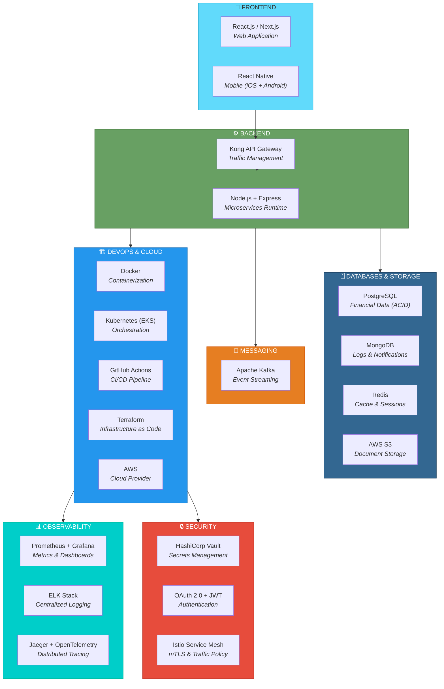
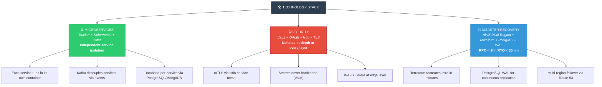

# 07. Technology Stack Selection

---

## Overview

The AegisVault technology stack has been carefully selected to support three non-negotiable architectural requirements mandated by the competition:

1. **Independent services architecture** (microservices) — each technology must enable service isolation and independent deployment
2. **Security-first design** — every tool must support the defense-in-depth strategy required after the 2065 cyberattack
3. **Disaster recovery** — the stack must enable multi-region failover, automated backups, and self-healing infrastructure

Every technology choice is **justified** below with a specific explanation of how it supports these requirements.

---

## 7.1 Technology Stack Diagram

---

## 7.2 Detailed Justification Table

### Frontend Layer

| Technology | Purpose | Justification |
|-----------|---------|---------------|
| **React.js / Next.js** | Web application framework | Component-based architecture enables reusable UI modules. Next.js provides **Server-Side Rendering (SSR)** for faster initial page loads (supporting NFR-21: page load < 3s) and improved SEO. Massive ecosystem with battle-tested libraries for form validation, state management, and accessibility (WCAG 2.1 AA compliance). |
| **React Native** | Cross-platform mobile application | Enables **code sharing** between web (React) and mobile (React Native), reducing development time by ~40%. Single codebase produces both iOS and Android apps. Supports native biometric authentication APIs required for FR-03. |

### Backend Layer

| Technology | Purpose | Justification |
|-----------|---------|---------------|
| **Node.js + Express** | Microservices runtime | **Non-blocking, asynchronous I/O** is ideal for high-concurrency banking workloads (NFR-19: 10,000+ concurrent users). Lightweight process model enables efficient microservice deployment — each service runs as an independent Node.js process. npm ecosystem provides proven libraries for JWT handling, input validation, and rate limiting. TypeScript support adds compile-time type safety for financial logic. |
| **Kong API Gateway** | API management and routing | Enterprise-grade API gateway with **built-in rate limiting** (NFR-06), authentication, request routing, and DDoS protection. Plugin architecture allows custom security policies. Supports the **zero-trust model** (NFR-03) by enforcing authentication at the gateway level before requests reach microservices. |

### Database Layer

| Technology | Purpose | Justification |
|-----------|---------|---------------|
| **PostgreSQL** | Primary database for financial data | **ACID compliance is mandatory** for banking transactions (FR-15). PostgreSQL provides strong data integrity with support for transactions, foreign keys, and constraints. Advanced features include **Write-Ahead Logging (WAL)** for continuous replication (supporting NFR-12: RPO < 1hr) and native support for **row-level security** and **encryption at rest**. Used for 8 service databases (Auth, Users, Accounts, Transactions, Payments, Loans, OTP, Admin). |
| **MongoDB** | NoSQL database for non-financial data | **Flexible schema** handles varied log structures, ML model data, and notification templates that don't require strict relational constraints. Excellent **horizontal scaling** for high-volume write operations — every user action generates audit logs (NFR-10). Used for 4 service databases (Notifications, Audit, Fraud Detection, Email). |
| **Redis** | In-memory cache and session store | **Sub-millisecond read latency** for session validation (NFR-18: API response < 200ms). Reduces PostgreSQL read load by **60-80%** for frequently accessed data (account balances, rate limiting counters). TTL-based key expiration perfectly suits JWT session management and scheduled job queues. |
| **AWS S3** | Object storage | Cost-effective, infinitely scalable storage for binary files. Server-side AES-256 encryption. Required for FR-11 (KYC upload), FR-13 (PDF statements), and FR-19 (digital receipts) via the Document Service. |

### Messaging Layer

| Technology | Purpose | Justification |
|-----------|---------|---------------|
| **Apache Kafka** | Event streaming and async communication | **High-throughput, fault-tolerant event streaming** enables the asynchronous communication pattern between microservices (e.g., Transaction Service → Fraud Detection → Notification → Audit). Kafka's **guaranteed delivery** and **event replay** capability ensure no transaction event is ever lost. Supports the microservices architecture by decoupling services — they communicate through events rather than direct calls, preventing cascading failures. |

### DevOps & Cloud Layer

| Technology | Purpose | Justification |
|-----------|---------|---------------|
| **Docker** | Containerization | Packages each microservice with all dependencies into an **isolated, portable container**. Ensures consistent behavior across development, staging, and production environments. Container isolation directly supports the **independent services** mandate — a compromised container cannot access other services' file systems. |
| **Kubernetes (AWS EKS)** | Container orchestration | Provides **auto-scaling** (NFR-23), **self-healing** (restarts failed containers automatically), **rolling updates** (NFR-27: zero-downtime deployments), and **service discovery**. Horizontal Pod Autoscaler dynamically adjusts resources based on load. Directly supports NFR-15 (99.99% uptime) through automated health checks and pod replacement. |
| **GitHub Actions** | CI/CD pipeline | **Free, integrated CI/CD** that automates the entire build → test → security scan → deploy pipeline. Native integration with the GitHub repository enables pull-request-based workflows with mandatory code review and automated testing before merge. Supports security scanning integration (SAST, dependency checks) as part of every deployment. |
| **Terraform** | Infrastructure as Code (IaC) | **Cloud-agnostic IaC** enables version-controlled, reproducible infrastructure. All AWS resources (EKS clusters, RDS instances, S3 buckets, Route 53) are defined in code and can be recreated identically in minutes — critical for disaster recovery (NFR-13: RTO < 30 min). Supports NFR-26 (100% IaC coverage). |
| **AWS (Amazon Web Services)** | Cloud provider | **Largest global infrastructure** with 30+ regions for multi-region disaster recovery (NFR-14). Managed services reduce operational overhead: EKS (Kubernetes), RDS (PostgreSQL), ElastiCache (Redis), MSK (Kafka). AWS compliance certifications include **PCI DSS, SOC 1/2/3, ISO 27001** — critical for banking (NFR-07). AWS Shield Advanced provides enterprise-grade DDoS protection. |

### Observability Layer

| Technology | Purpose | Justification |
|-----------|---------|---------------|
| **Prometheus + Grafana** | Metrics collection and dashboards | Prometheus is the **industry standard** for Kubernetes-native metrics collection. Pull-based model automatically discovers services. Grafana provides **real-time visualization dashboards** (NFR-30) with alerting capabilities (NFR-31). Both are open-source, reducing licensing costs. |
| **ELK Stack** (Elasticsearch, Logstash, Kibana) | Centralized logging | Aggregates logs from all 15 microservices into a **single searchable platform** (NFR-29). Logstash parses and transforms structured JSON logs. Elasticsearch provides **full-text search** across billions of log entries. Kibana enables visual log analysis and anomaly detection. Essential for post-incident forensics. |
| **Jaeger (OpenTelemetry)** | Distributed tracing | Traces a single request as it travels across all 15 microservices using correlation IDs (NFR-32). Crucial for debugging latency issues, identifying bottlenecks, and auditing the exact path of financial transactions. |

### Security Layer

| Technology | Purpose | Justification |
|-----------|---------|---------------|
| **HashiCorp Vault** | Secrets management | Securely stores and manages **API keys, database passwords, TLS certificates, and encryption keys** — no secrets are ever hardcoded in source code or configuration files. Supports automatic **secrets rotation** on configurable schedules. Provides a centralized audit trail of all secrets access. |
| **OAuth 2.0 + JWT** | Authentication and authorization | **Industry-standard** authentication protocol used by all major financial institutions. JWT tokens are **stateless** — enabling horizontal scaling without sticky sessions. Fine-grained **Role-Based Access Control (RBAC)** through JWT claims. Short-lived access tokens (15 min) minimize the risk window of token theft (NFR-09). |
| **Istio Service Mesh** | Service-to-service security | Automatically injects **sidecar proxies** that enforce mTLS between all microservices (NFR-04) without application code changes. Provides **traffic policies**, **circuit breaking** (prevents cascading failures), and **observability** for inter-service communication. Directly supports the zero-trust architecture (NFR-03). |

---

## 7.3 How the Stack Supports Key Requirements

---

## 7.4 Stack Summary

| Layer | Technology | Key Reason |
|-------|-----------|------------|
| Frontend Web | React.js / Next.js | SSR + component architecture + WCAG accessibility |
| Frontend Mobile | React Native | Cross-platform + code sharing with React web |
| Backend Runtime | Node.js + Express | Async I/O for high concurrency + TypeScript safety |
| API Gateway | Kong | Rate limiting + auth + routing + zero-trust enforcement |
| SQL Database | PostgreSQL | ACID compliance mandatory for financial transactions |
| NoSQL Database | MongoDB | Flexible schema for logs + horizontal scaling |
| Cache | Redis | Sub-millisecond reads + session management |
| Event Streaming | Apache Kafka | Guaranteed delivery + service decoupling |
| Containers | Docker | Service isolation + portable deployments |
| Orchestration | Kubernetes (EKS) | Auto-scaling + self-healing + zero-downtime updates |
| CI/CD | GitHub Actions | Automated build-test-scan-deploy pipeline |
| IaC | Terraform | Reproducible infrastructure + DR readiness |
| Cloud | AWS | PCI DSS certified + global multi-region infrastructure |
| Metrics | Prometheus + Grafana | Real-time monitoring + alerting |
| Logging | ELK Stack | Centralized logs + forensic analysis |
| Secrets | HashiCorp Vault | Secure secrets management + rotation |
| Auth Protocol | OAuth 2.0 + JWT | Stateless tokens + RBAC + industry standard |
| Service Mesh | Istio | Automatic mTLS + circuit breaking + zero-trust |
