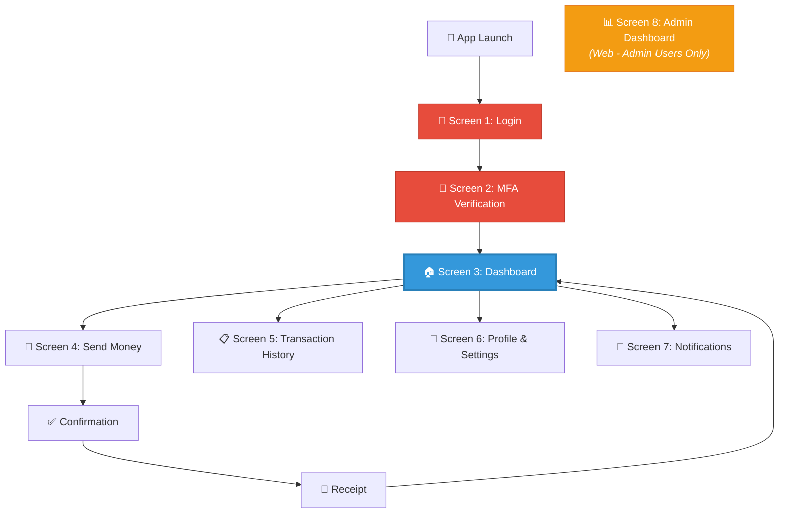

# 04. Wireframes Design

---

## Overview

The following high-fidelity wireframes represent the planned user interface for the **AegisVault** digital banking platform. The design follows modern fintech UX best practices with a focus on **trust, clarity, security, and accessibility** — critical for a platform that must rebuild public confidence after the 2065 cyberattack.

### Design Principles Applied

| Principle | Implementation |
|-----------|---------------|
| **Trust** | Dark blue color palette (associated with security and professionalism), lock icons, encryption badges, "Secured by TLS 1.3" labels |
| **Clarity** | Large, readable balance displays, clear transaction labels, intuitive navigation |
| **Simplicity** | Minimal steps for common tasks (send money in 3 taps), clean uncluttered layouts |
| **Security Indicators** | Visible MFA prompts, device verification alerts, "Verified" badges, encryption badges |
| **Accessibility** | High contrast dark mode, large touch targets (44x44px minimum), clear typography |

### User Flow

---

## Screen 1: Login / Registration

The entry point for all users. Supports traditional credential-based login and biometric authentication (fingerprint/face recognition) for returning users.

**Key UX Decisions:**
- MFA is mandatory — login always proceeds to verification (Screen 2)
- Biometric option prominently displayed to encourage faster, more secure login
- Security badge visible to reassure users about encryption
- Clean, professional design establishes trust from the first interaction

---

## Screen 2: MFA Verification

Multi-factor authentication screen requiring a 6-digit OTP sent to the user's registered phone number. This screen appears after every login to enforce FR-02 (mandatory MFA).

**Key UX Decisions:**
- Individual digit boxes for clear OTP entry
- Countdown timer for resend functionality
- Alternative verification method (biometrics) offered
- Shield icon reinforces the security-focused design

---

## Screen 3: Dashboard / Home

The primary screen users see after authentication. Displays real-time account balance (FR-08), quick action buttons for common tasks, and recent transaction activity.

**Key UX Decisions:**
- Balance displayed prominently in large text (clarity for all ages)
- Quick actions (Send, Receive, Pay Bills, QR) minimize navigation depth
- Recent transactions provide immediate financial awareness
- Notification bell with unread indicator for security alerts
- Bottom navigation for consistent app-wide navigation

---

## Screen 4: Send Money / Transfer

Core transaction screen for fund transfers (FR-14). Designed for speed — users can complete a transfer in 3 steps: select recipient → enter amount → confirm.

**Key UX Decisions:**
- Recent recipients shown for quick repeat transfers
- Large amount input with clear currency prefix
- Transfer summary (fee + total) shown before confirmation
- Encryption badge visible during financial operations
- "From Account" selector for multi-account users (FR-10)

---

## Screen 5: Transaction History

Complete transaction record with filtering and search capabilities (FR-09). Users can filter by type, search by keyword, and view transactions grouped by date.

**Key UX Decisions:**
- Filter chips (All, Credits, Debits, Bills) for quick filtering
- Search bar for finding specific transactions
- Color coding: green for credits (+), red for debits (-)
- Category icons for visual recognition
- Grouped by date for chronological clarity

---

## Screen 6: Profile & Settings

User profile management with KYC verification status, security settings, and preferences (FR-11, FR-12).

**Key UX Decisions:**
- KYC verification status prominently displayed ("Verified" badge)
- Security settings easily accessible with MFA status indicator
- Language selection supports multi-language requirement (NFR-34: Sinhala, Tamil, English)
- Clear logout button for session management
- Settings organized in logical groups with icons

---

## Screen 7: Notifications

Multi-channel notification center showing transaction alerts, security events, and system notifications (FR-29, FR-30).

**Key UX Decisions:**
- Filter tabs (All, Transactions, Security, System) for categorization
- Unread indicators (colored dots) for attention priority
- Security alerts highlighted with red icons for urgency
- "Mark all read" for bulk management
- Timestamps for event tracking

---

## Screen 8: Admin Dashboard (Web Application)

System administration panel for monitoring platform health, managing users, and reviewing fraud alerts (FR-32, FR-33, FR-35). This is a web-based interface designed for desktop use by system administrators.

**Key UX Decisions:**
- Key metrics at a glance: active users, transaction volume, uptime, fraud alerts
- Real-time charts for transaction volume and service health
- Recent alerts table for immediate incident awareness
- Sidebar navigation for admin-specific functions (Users, Transactions, System Health, Fraud Alerts, Audit Logs)
- 99.99% uptime metric visible — directly reflects NFR-15

---

## Screen Summary

| # | Screen | Platform | User Type | Key FRs Addressed |
|---|--------|----------|-----------|-------------------|
| 1 | Login / Registration | Mobile | All users | FR-01, FR-02, FR-03, FR-05 |
| 2 | MFA Verification | Mobile | All users | FR-02, FR-03 |
| 3 | Dashboard / Home | Mobile | Customers | FR-08, FR-09, FR-20 |
| 4 | Send Money / Transfer | Mobile | Customers | FR-10, FR-14, FR-15, FR-19 |
| 5 | Transaction History | Mobile | Customers | FR-09, FR-13 |
| 6 | Profile & Settings | Mobile | Customers | FR-11, FR-12, FR-30 |
| 7 | Notifications | Mobile | Customers | FR-20, FR-28, FR-29, FR-30, FR-31 |
| 8 | Admin Dashboard | Web (Desktop) | Administrators | FR-32, FR-33, FR-34, FR-35 |

---

## Design Tool & Access

> **Design File Link:** *[Include your Figma/Canva link here when available]*
> 
> **Note:** The wireframes above are high-fidelity mockups representing the planned visual design. For the final submission, embed these screenshots in the Word document AND include a working link to the design file.
