# 🏦 AegisVault — Phase 2 Complete Implementation Blueprint

> [!IMPORTANT]
> **Mission:** Build a working, secure digital banking web application using **real microservices architecture** in 5 days.
> **Deadline:** July 31, 2026 · **Team:** 3 Developers

---

## 📐 1. The Big Picture — How Everything Connects

This is the complete system. Every box is a real, running piece of software. Every arrow is a real network connection.

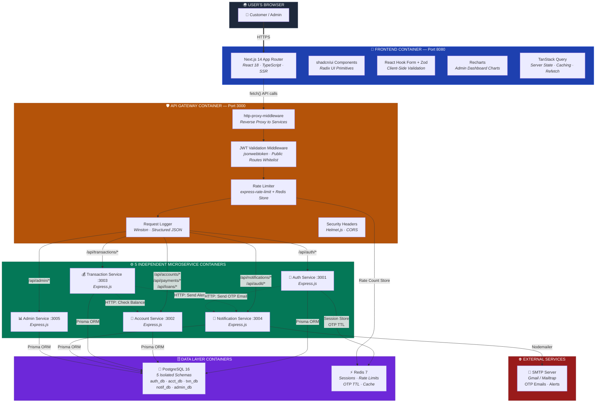

---

## 🔧 2. Complete Tech Stack — What Does What & How It Connects

### Technology Connection Map

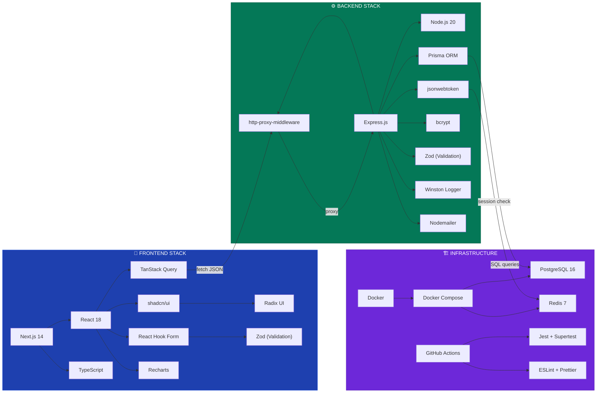

### Every Technology Explained

#### 🎨 Frontend Layer

| Technology | Role | Connects To | Why We Use It |
|:---|:---|:---|:---|
| **Next.js 14** | Web framework (App Router + SSR) | Express API Gateway via `fetch()` | Server-side rendering for fast page loads; file-based routing saves time |
| **TypeScript** | Type-safe JavaScript | Everything in `/client` | Catches bugs at compile time; essential for financial data handling |
| **shadcn/ui** | UI component library | Radix UI primitives underneath | Pre-built buttons, forms, tables, dialogs — copy-paste into our project |
| **Radix UI** | Accessible UI primitives | Used by shadcn/ui internally | Keyboard navigation, screen reader support (WCAG 2.1 compliance) |
| **React Hook Form** | Form state management | Zod for validation rules | Handles complex banking forms (transfers, registration) efficiently |
| **Zod** | Schema validation | React Hook Form + Express routes | Same validation rules on frontend AND backend — single source of truth |
| **TanStack Query** | Server state manager | API Gateway via fetch | Auto-caching, refetching, loading/error states for API data |
| **Recharts** | Chart library | Admin Dashboard page | Line charts (transaction volume), bar charts (daily stats), pie charts |

#### ⚙️ Backend Layer

| Technology | Role | Connects To | Why We Use It |
|:---|:---|:---|:---|
| **Express.js** | HTTP server framework | PostgreSQL (via Prisma), Redis, other services (via HTTP) | Lightweight, minimal, perfect for microservices |
| **Node.js 20** | JavaScript runtime | Runs Express servers | Async I/O handles many concurrent banking requests |
| **Prisma ORM** | Database access layer | PostgreSQL | Type-safe queries, auto migrations, prevents SQL injection |
| **jsonwebtoken (JWT)** | Auth token library | Redis (blacklist check), API Gateway (validation) | Stateless authentication — no session DB lookup needed per request |
| **bcrypt** | Password hashing | PostgreSQL (stores hashed passwords) | Industry-standard, salted hashing with cost factor 12 |
| **Zod** | Request body validation | Express route handlers | Validates and sanitizes every incoming API request |
| **Winston** | Structured logging | Console + log files | JSON-formatted logs for debugging and audit compliance |
| **Nodemailer** | Email sending | Gmail SMTP / Mailtrap | Sends OTP codes and transaction alert emails |
| **http-proxy-middleware** | Reverse proxy | Routes requests to microservices | API Gateway forwards `/api/auth/*` → Auth Service, etc. |
| **express-rate-limit** | Rate limiting | Redis (stores request counts) | Prevents brute-force attacks (100 req/min authenticated, 20 unauthenticated) |
| **Helmet.js** | Security headers | Express response headers | Sets CSP, X-Frame-Options, HSTS — blocks common web attacks |
| **CORS** | Cross-origin policy | Express middleware | Allows Next.js frontend (port 8080) to call API Gateway (port 3000) |

#### 🏗️ Infrastructure Layer

| Technology | Role | Connects To | Why We Use It |
|:---|:---|:---|:---|
| **Docker** | Containerization | Wraps each service in an isolated container | True microservice isolation — each service is independently deployable |
| **Docker Compose** | Multi-container orchestrator | Manages all 8 containers (5 services + gateway + PostgreSQL + Redis) | Single `docker compose up` starts the entire platform |
| **PostgreSQL 16** | Relational database | All 5 microservices (via Prisma) | ACID compliance mandatory for financial transactions |
| **Redis 7** | In-memory cache/store | Auth Service (sessions), API Gateway (rate limits), OTP TTL storage | Sub-millisecond reads; auto-expires OTPs after 5 minutes |
| **GitHub Actions** | CI/CD pipeline | Runs Jest tests, ESLint, Docker build on every push | Automated quality gates — code doesn't merge if tests fail |
| **Jest + Supertest** | Testing framework | Express services | Unit tests (business logic) + API integration tests (HTTP endpoints) |
| **ESLint + Prettier** | Code quality | All JavaScript/TypeScript files | Consistent code style across 3 developers |

---

## 🔐 3. Authentication System — Full Flow

Authentication is worth **15% of the grade** and touches multiple services. Here's the complete flow:

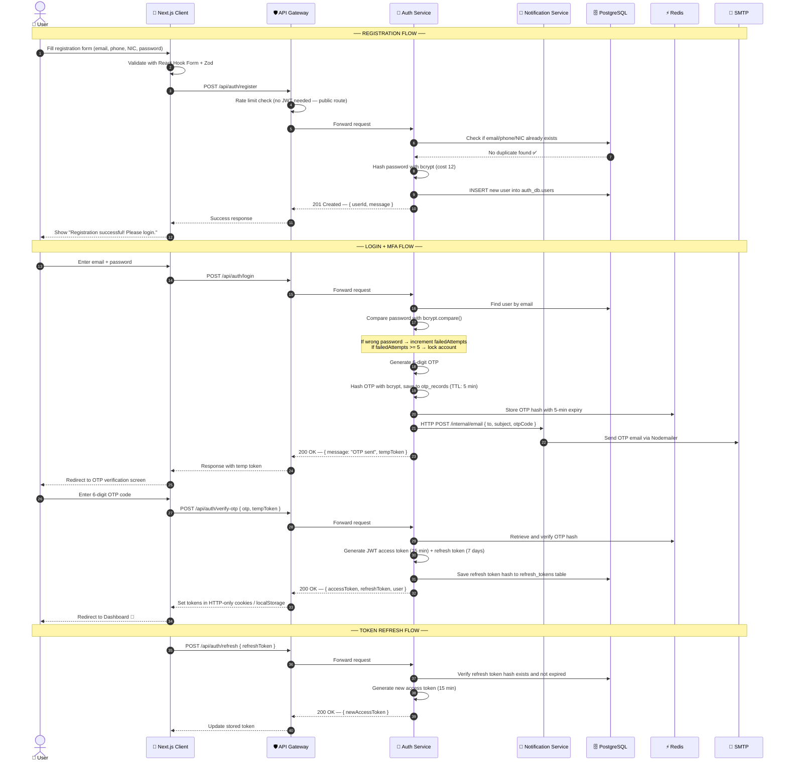

### JWT Token Structure

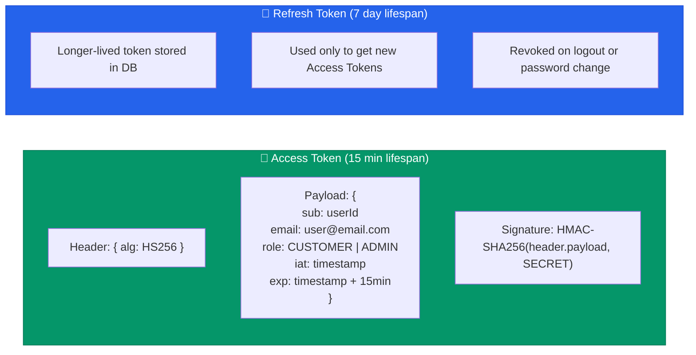

---

## 💰 4. Core Banking — ACID Fund Transfer Flow

This is the most critical feature — it must be **atomically safe**. If any step fails, the entire transfer rolls back.

```mermaid
sequenceDiagram
    autonumber
    actor U as 👤 Customer
    participant FE as 🎨 Next.js
    participant GW as 🛡️ Gateway
    participant TXN as 💰 Transaction Svc
    participant ACCT as 🏦 Account Svc
    participant NOTIF as 🔔 Notification Svc
    participant DB as 🗄️ PostgreSQL

    U->>FE: Click "Send LKR 50,000 to Account 9876"
    FE->>FE: Validate amount (Zod: positive number, max 10M)
    FE->>GW: POST /api/transactions/transfer<br/>{ fromAccountId, toAccountId, amount }
    GW->>GW: ✅ JWT valid · ✅ Rate limit OK · 📝 Log request
    GW->>TXN: Forward transfer request

    Note over TXN: STEP 1: Verify sender account
    TXN->>ACCT: HTTP GET /api/accounts/{fromId}/balance
    ACCT->>DB: SELECT balance FROM acct_db.accounts WHERE id = fromId
    ACCT-->>TXN: { balance: 150000, status: ACTIVE }

    Note over TXN: STEP 2: Fraud detection (rule-based)
    TXN->>TXN: Check rules:<br/>• Amount > 500,000? → FLAG<br/>• > 3 transfers in 10 min? → FLAG<br/>• New recipient + amount > 100,000? → FLAG
    
    alt Fraud Detected 🚨
        TXN->>DB: INSERT fraud_alert (txn_db.fraud_alerts)
        TXN->>NOTIF: HTTP POST /internal/notify { type: SECURITY }
        TXN-->>GW: 403 — Transaction flagged for review
        GW-->>FE: Show fraud warning
    end

    Note over TXN,DB: STEP 3: ACID Transaction (ALL or NOTHING)
    TXN->>ACCT: HTTP POST /api/accounts/execute-transfer<br/>{ fromId, toId, amount }
    
    rect rgb(20, 83, 45)
        Note over ACCT,DB: BEGIN SQL TRANSACTION
        ACCT->>DB: UPDATE acct_db.accounts<br/>SET balance = balance - 50000<br/>WHERE id = fromId AND balance >= 50000
        Note over ACCT,DB: ↑ If balance insufficient → ROLLBACK
        ACCT->>DB: UPDATE acct_db.accounts<br/>SET balance = balance + 50000<br/>WHERE id = toId
        Note over ACCT,DB: COMMIT SQL TRANSACTION ✅
    end

    ACCT-->>TXN: Transfer executed ✅

    Note over TXN: STEP 4: Record and notify
    TXN->>DB: INSERT transaction record (txn_db.transactions)
    TXN-->>GW: 201 Created — { transactionId, referenceNumber, receipt }
    GW-->>FE: Show success confirmation

    par Asynchronous Post-Processing
        TXN--)NOTIF: HTTP POST /internal/notify<br/>{ userId: sender, message: "Sent LKR 50,000" }
        TXN--)NOTIF: HTTP POST /internal/notify<br/>{ userId: receiver, message: "Received LKR 50,000" }
        TXN--)NOTIF: HTTP POST /internal/audit<br/>{ action: TRANSFER, details: {...} }
    end

    NOTIF->>DB: INSERT notification (notif_db.notifications)
    NOTIF->>DB: INSERT audit_log with hash chain (notif_db.audit_logs)
```

---

## 🔗 5. How Microservices Talk to Each Other

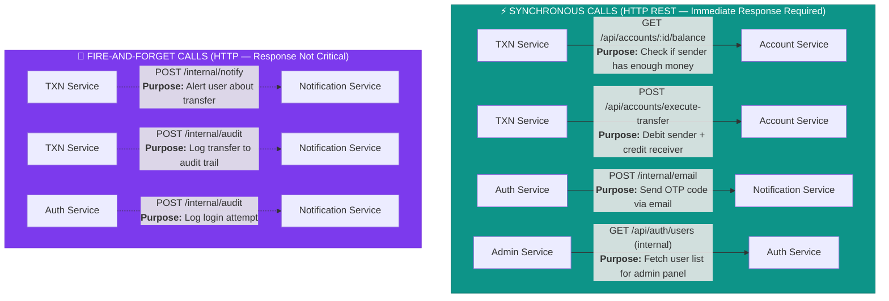

> [!NOTE]
> **Synchronous calls** are used when the caller NEEDS the response to continue (e.g., checking balance before transferring). **Fire-and-forget calls** are used when the caller doesn't need to wait (e.g., sending an email notification — the transfer already succeeded).

---

## 🐳 6. Docker Container Networking

Every service runs in its own isolated Docker container. Docker Compose creates a shared virtual network so containers can reach each other by **service name**.

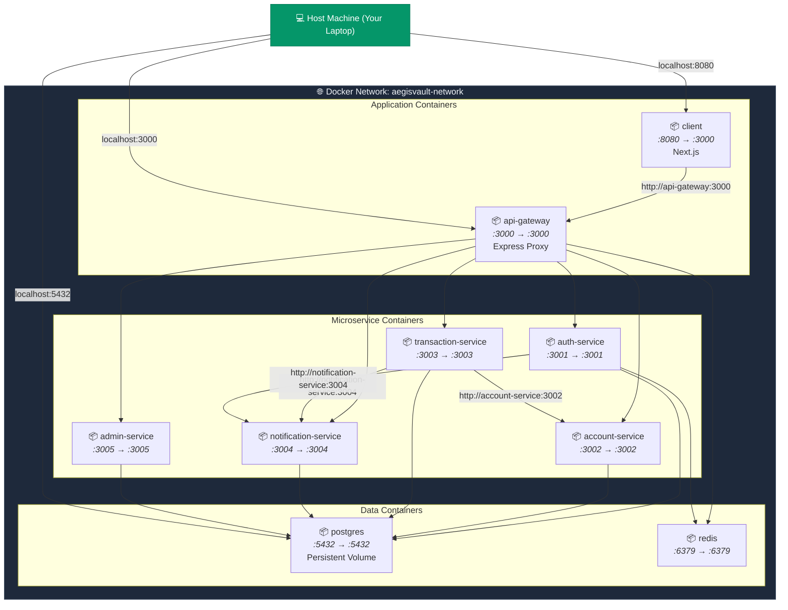

### How Container Names Map to URLs

```javascript
// INSIDE Docker containers, use SERVICE NAMES:
fetch('http://account-service:3002/api/accounts/123/balance')
fetch('http://notification-service:3004/internal/notify')
fetch('http://auth-service:3001/api/auth/verify')

// OUTSIDE Docker (your browser / Postman), use LOCALHOST:
fetch('http://localhost:3000/api/accounts/123/balance')  // Goes through API Gateway
fetch('http://localhost:8080')                            // Next.js frontend
```

---

## 🗄️ 7. Database Architecture — Schema-per-Service

Each microservice owns its database schema. No service can read another service's tables directly — they must go through HTTP APIs. This is the core microservices data isolation principle.

```mermaid
graph TB
    subgraph PG["🐘 PostgreSQL 16 — Single Instance, 5 Schemas"]
        subgraph AUTH_SCHEMA["📁 auth_schema"]
            U["users<br/><i>id · email · phone · nic<br/>passwordHash · role<br/>isVerified · isLocked<br/>failedAttempts · kycStatus</i>"]
            RT["refresh_tokens<br/><i>id · userId · tokenHash<br/>deviceInfo · expiresAt</i>"]
            OTP["otp_records<br/><i>id · userId · otpHash<br/>type · expiresAt · isUsed</i>"]
            U --> RT
            U --> OTP
        end

        subgraph ACCT_SCHEMA["📁 acct_schema"]
            ACC["accounts<br/><i>id · userId · accountNumber<br/>accountType · balance · currency<br/>status (ACTIVE/FROZEN/CLOSED)</i>"]
            LOAN["loans<br/><i>id · userId · accountId · amount<br/>interestRate · termMonths<br/>monthlyPayment · status</i>"]
            ACC --> LOAN
        end

        subgraph TXN_SCHEMA["📁 txn_schema"]
            TX["transactions<br/><i>id · fromAccountId · toAccountId<br/>amount · currency · type<br/>status · referenceNumber<br/>fraudFlag · description</i>"]
            FA["fraud_alerts<br/><i>id · transactionId<br/>ruleTriggered · riskScore<br/>status (FLAGGED/CLEARED)</i>"]
            TX --> FA
        end

        subgraph NOTIF_SCHEMA["📁 notif_schema"]
            NF["notifications<br/><i>id · userId · title · message<br/>type · channel · isRead</i>"]
            AL["audit_logs<br/><i>id · userId · action · resource<br/>ipAddress · details(JSON)<br/>hash · previousHash ← IMMUTABLE</i>"]
        end

        subgraph ADMIN_SCHEMA["📁 admin_schema"]
            SM["system_metrics<br/><i>id · metricName<br/>metricValue · recordedAt</i>"]
            AA["admin_actions<br/><i>id · adminUserId · action<br/>targetUserId · reason</i>"]
        end
    end

    AUTH_SVC["🔐 Auth Service"] --> AUTH_SCHEMA
    ACCT_SVC["🏦 Account Service"] --> ACCT_SCHEMA
    TXN_SVC["💰 Transaction Service"] --> TXN_SCHEMA
    NOTIF_SVC["🔔 Notification Service"] --> NOTIF_SCHEMA
    ADMIN_SVC["📊 Admin Service"] --> ADMIN_SCHEMA

    style AUTH_SCHEMA fill:#dc2626,stroke:#b91c1c,color:#fff
    style ACCT_SCHEMA fill:#2563eb,stroke:#1d4ed8,color:#fff
    style TXN_SCHEMA fill:#d97706,stroke:#b45309,color:#fff
    style NOTIF_SCHEMA fill:#7c3aed,stroke:#6d28d9,color:#fff
    style ADMIN_SCHEMA fill:#059669,stroke:#047857,color:#fff
```

### How Data Flows Between Services (No Direct DB Access!)

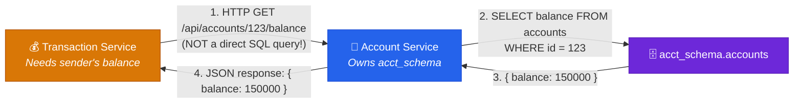

> [!WARNING]
> **Transaction Service NEVER queries `acct_schema.accounts` directly.** It always goes through Account Service's HTTP API. This is the foundation of microservices — data ownership and isolation.

---

## 🛣️ 8. Complete API Endpoint Map

### 🔐 Auth Service (Port 3001)

```mermaid
graph LR
    subgraph AUTH_API["🔐 Auth Service API — Port 3001"]
        R1["POST /api/auth/register<br/><i>Create new user account</i>"]
        R2["POST /api/auth/login<br/><i>Validate credentials → Send OTP</i>"]
        R3["POST /api/auth/verify-otp<br/><i>Verify OTP → Return JWT tokens</i>"]
        R4["POST /api/auth/refresh<br/><i>Refresh expired access token</i>"]
        R5["POST /api/auth/forgot-password<br/><i>Send password reset OTP</i>"]
        R6["POST /api/auth/reset-password<br/><i>Reset password with OTP</i>"]
        R7["GET /api/users/profile<br/><i>Get current user profile</i>"]
        R8["PUT /api/users/profile<br/><i>Update profile info</i>"]
        R9["POST /api/users/kyc<br/><i>Upload KYC documents</i>"]
        R10["GET /health<br/><i>Service health check</i>"]
    end
    style AUTH_API fill:#dc2626,stroke:#b91c1c,color:#fff
```

### 🏦 Account Service (Port 3002)

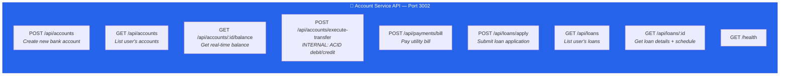

### 💰 Transaction Service (Port 3003)

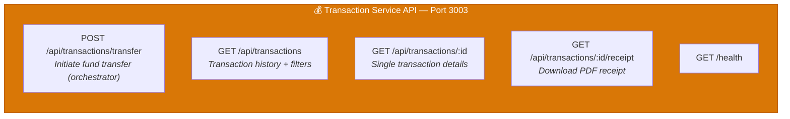

### 🔔 Notification Service (Port 3004)

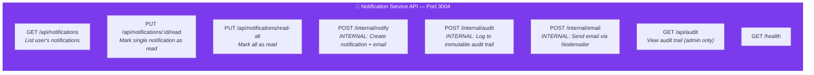

### 📊 Admin Service (Port 3005)

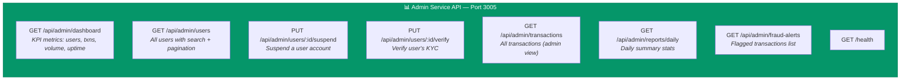

---

## 🛡️ 9. Security Architecture

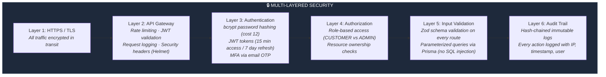

### Hash-Chained Audit Trail (How It Works)

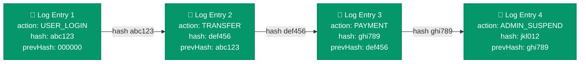

> Each new audit log entry's `hash` = `SHA256(previousHash + action + userId + timestamp + details)`. If anyone tampers with an older entry, **every subsequent hash breaks** — making tampering detectable. This is the "Blockchain Audit Trail" from our Phase 1 proposal, implemented simply.

---

## 🔄 10. CI/CD Pipeline Flow

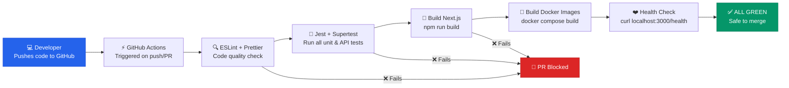

---

## 🖥️ 11. Frontend Screens & Navigation

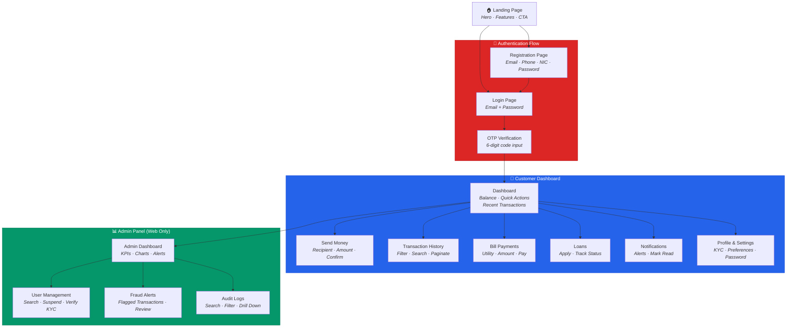

---

## 📊 12. Evaluation Criteria — How Every Criteria is Covered

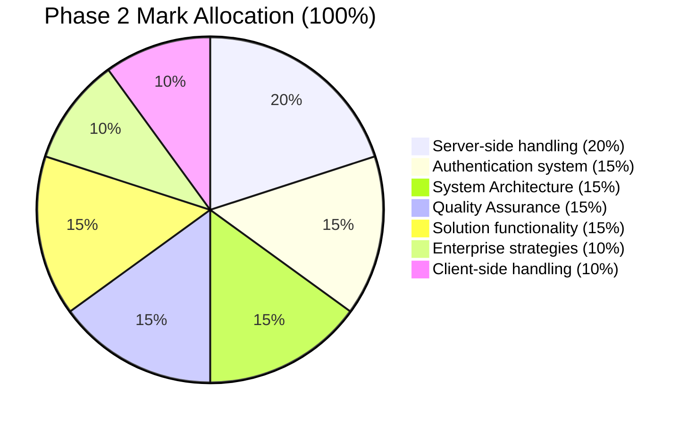

| Criteria | Weight | What We Build | Confidence |
|:---|:---:|:---|:---:|
| **Server-side handling** | **20%** | 5 Express microservices with Prisma ORM, ACID fund transfers, inter-service HTTP, Zod validation, error handling middleware, structured request/response patterns | 🟢 |
| **Authentication system** | **15%** | JWT (access 15min + refresh 7d), bcrypt cost-12 hashing, email OTP MFA, account lockout after 5 failures, session management via Redis, role-based authorization | 🟢 |
| **System Architecture** | **15%** | 5 real Docker containers (genuinely independent), API Gateway, schema-per-service DB isolation, inter-service REST, reverse proxy routing, health checks | 🟢 |
| **Quality Assurance** | **15%** | Jest unit tests per service, Supertest API integration tests, React Testing Library frontend tests, GitHub Actions CI pipeline (lint + test + build) | 🟢 |
| **Solution functionality** | **15%** | Auth, MFA, dashboard, fund transfers, bill payments, loan applications, transaction history, notifications, admin panel, fraud alerts | 🟢 |
| **Enterprise strategies** | **10%** | Docker Compose orchestration, Winston structured JSON logging, health check endpoints, rate limiting with Redis, immutable hash-chained audit trail, Swagger API docs, Helmet security headers | 🟢 |
| **Client-side handling** | **10%** | Next.js 14 SSR, shadcn/ui accessible components, React Hook Form + Zod client validation, TanStack Query (caching + loading states), responsive layout, error boundaries, loading skeletons | 🟢 |

---

## 📅 13. 5-Day Visual Roadmap

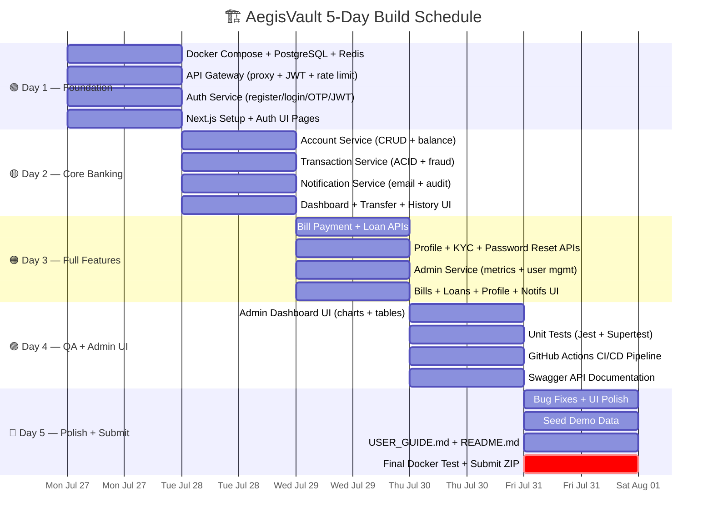

---

## ⚡ 14. Quick Reference — Express.js Patterns

> [!TIP]
> Every Express microservice follows the exact same structure. Learn it once, use it 5 times.

```javascript
// ═══════════════════════════════════════════
// PATTERN 1: Service Entry Point (index.js)
// ═══════════════════════════════════════════
const express = require('express');
const cors = require('cors');
const helmet = require('helmet');
const app = express();

app.use(cors());           // Allow cross-origin requests
app.use(helmet());         // Security headers
app.use(express.json());   // Parse JSON request bodies

// Mount domain routes
app.use('/api/auth', require('./routes/auth.routes'));
app.use('/api/users', require('./routes/user.routes'));

// Health check (required for Docker + Kubernetes)
app.get('/health', (req, res) => res.json({ status: 'healthy', service: 'auth-service' }));

// Global error handler (MUST be last middleware)
app.use((err, req, res, next) => {
  console.error(`[ERROR] ${err.message}`, { stack: err.stack });
  res.status(err.status || 500).json({ success: false, error: err.message });
});

const PORT = process.env.PORT || 3001;
app.listen(PORT, () => console.log(`✅ Auth Service running on port ${PORT}`));
```

```javascript
// ═══════════════════════════════════════════
// PATTERN 2: Route File (routes/auth.routes.js)
// ═══════════════════════════════════════════
const router = require('express').Router();
const ctrl = require('../controllers/auth.controller');

router.post('/register', ctrl.register);
router.post('/login', ctrl.login);
router.post('/verify-otp', ctrl.verifyOtp);
router.post('/refresh', ctrl.refreshToken);

module.exports = router;
```

```javascript
// ═══════════════════════════════════════════
// PATTERN 3: Controller (controllers/auth.controller.js)
// ═══════════════════════════════════════════
const bcrypt = require('bcrypt');
const jwt = require('jsonwebtoken');
const prisma = require('../lib/prisma');  // Shared Prisma client instance

exports.register = async (req, res, next) => {
  try {
    const { email, phone, nic, password, firstName, lastName } = req.body;

    // 1. Check duplicates
    const exists = await prisma.user.findFirst({
      where: { OR: [{ email }, { phone }, { nic }] }
    });
    if (exists) return res.status(409).json({ error: 'User already exists' });

    // 2. Hash password
    const passwordHash = await bcrypt.hash(password, 12);

    // 3. Create user
    const user = await prisma.user.create({
      data: { email, phone, nic, passwordHash, firstName, lastName }
    });

    res.status(201).json({ success: true, userId: user.id });
  } catch (err) {
    next(err);  // → Global error handler
  }
};

exports.login = async (req, res, next) => {
  try {
    const { email, password } = req.body;
    const user = await prisma.user.findUnique({ where: { email } });
    
    if (!user) return res.status(401).json({ error: 'Invalid credentials' });
    if (user.isLocked) return res.status(423).json({ error: 'Account locked' });

    const valid = await bcrypt.compare(password, user.passwordHash);
    if (!valid) {
      // Increment failed attempts
      await prisma.user.update({
        where: { id: user.id },
        data: { 
          failedAttempts: { increment: 1 },
          isLocked: user.failedAttempts >= 4  // Lock on 5th failure
        }
      });
      return res.status(401).json({ error: 'Invalid credentials' });
    }

    // Reset failed attempts on success
    await prisma.user.update({
      where: { id: user.id },
      data: { failedAttempts: 0 }
    });

    // Generate and send OTP (calls notification service)
    // ... OTP logic here ...

    res.json({ message: 'OTP sent to your email', tempToken: '...' });
  } catch (err) {
    next(err);
  }
};
```

```javascript
// ═══════════════════════════════════════════
// PATTERN 4: Calling Another Microservice
// ═══════════════════════════════════════════
// In transaction-service, calling account-service:
const checkBalance = async (accountId) => {
  const response = await fetch(
    `http://account-service:3002/api/accounts/${accountId}/balance`
  );
  if (!response.ok) throw new Error('Account service unavailable');
  return response.json();  // { balance: 150000, status: 'ACTIVE' }
};
```

---

## 🐳 15. Quick Reference — Docker

```dockerfile
# ═══════════════════════════════════════════
# Standard Dockerfile (reuse for all services)
# ═══════════════════════════════════════════
FROM node:20-alpine
WORKDIR /app
COPY package*.json ./
RUN npm ci --only=production
COPY . .
RUN npx prisma generate
EXPOSE 3001
CMD ["node", "src/index.js"]
```

```yaml
# ═══════════════════════════════════════════
# docker-compose.yml (orchestrates everything)
# ═══════════════════════════════════════════
services:
  postgres:
    image: postgres:16-alpine
    environment:
      POSTGRES_DB: aegisvault
      POSTGRES_USER: aegis_admin
      POSTGRES_PASSWORD: ${DB_PASSWORD:-securep@ss123}
    ports: ["5432:5432"]
    volumes: ["pgdata:/var/lib/postgresql/data"]
    healthcheck:
      test: ["CMD-SHELL", "pg_isready -U aegis_admin"]
      interval: 5s
      retries: 5

  redis:
    image: redis:7-alpine
    ports: ["6379:6379"]

  api-gateway:
    build: ./services/api-gateway
    ports: ["3000:3000"]
    environment:
      - JWT_SECRET=${JWT_SECRET:-your-super-secret-key}
      - REDIS_URL=redis://redis:6379
    depends_on: [redis, auth-service, account-service,
                 transaction-service, notification-service, admin-service]

  auth-service:
    build: ./services/auth-service
    ports: ["3001:3001"]
    environment:
      - DATABASE_URL=postgresql://aegis_admin:${DB_PASSWORD:-securep@ss123}@postgres:5432/aegisvault?schema=auth_db
      - REDIS_URL=redis://redis:6379
      - JWT_SECRET=${JWT_SECRET:-your-super-secret-key}
      - NOTIFICATION_SERVICE_URL=http://notification-service:3004
    depends_on:
      postgres: { condition: service_healthy }
      redis: { condition: service_started }

  account-service:
    build: ./services/account-service
    ports: ["3002:3002"]
    environment:
      - DATABASE_URL=postgresql://aegis_admin:${DB_PASSWORD:-securep@ss123}@postgres:5432/aegisvault?schema=acct_db
    depends_on:
      postgres: { condition: service_healthy }

  transaction-service:
    build: ./services/transaction-service
    ports: ["3003:3003"]
    environment:
      - DATABASE_URL=postgresql://aegis_admin:${DB_PASSWORD:-securep@ss123}@postgres:5432/aegisvault?schema=txn_db
      - ACCOUNT_SERVICE_URL=http://account-service:3002
      - NOTIFICATION_SERVICE_URL=http://notification-service:3004
    depends_on:
      postgres: { condition: service_healthy }

  notification-service:
    build: ./services/notification-service
    ports: ["3004:3004"]
    environment:
      - DATABASE_URL=postgresql://aegis_admin:${DB_PASSWORD:-securep@ss123}@postgres:5432/aegisvault?schema=notif_db
      - SMTP_HOST=${SMTP_HOST:-smtp.gmail.com}
      - SMTP_USER=${SMTP_USER}
      - SMTP_PASS=${SMTP_PASS}
    depends_on:
      postgres: { condition: service_healthy }

  admin-service:
    build: ./services/admin-service
    ports: ["3005:3005"]
    environment:
      - DATABASE_URL=postgresql://aegis_admin:${DB_PASSWORD:-securep@ss123}@postgres:5432/aegisvault?schema=admin_db
      - AUTH_SERVICE_URL=http://auth-service:3001
    depends_on:
      postgres: { condition: service_healthy }

  client:
    build: ./client
    ports: ["8080:3000"]
    environment:
      - NEXT_PUBLIC_API_URL=http://localhost:3000
    depends_on: [api-gateway]

volumes:
  pgdata:
```

### Essential Commands

| Command | What It Does |
|:---|:---|
| `docker compose up --build` | Build all images and start all 8 containers |
| `docker compose up -d` | Start in background (detached) mode |
| `docker compose down` | Stop and remove all containers |
| `docker compose down -v` | Stop + delete database volume (fresh start) |
| `docker compose logs -f transaction-service` | Live tail logs of one service |
| `docker compose ps` | List running containers and their ports |
| `docker compose restart auth-service` | Restart just one service |

---

## 🚀 Ready?

> [!IMPORTANT]
> **This plan covers every piece of the system — how it connects, why each technology exists, and what data flows where.** Once you approve, I'll generate the actual project code scaffold so you can start building immediately.
