# 🎯 Duothan 6.0 — Phase 1 RECON: Master Learning Guide

> [!IMPORTANT]
> **Deadline: 22 July 2026, 11:59 PM** — You have ~4.5 days from today (18 July).
> This is a **PLANNING & DESIGN** phase. NO coding required. You submit ONE `.docx` file with 7 deliverables.

---

## 📌 The Big Picture — What Phase 1 Actually Is

Before diving into concepts, let's understand what you're doing and why:

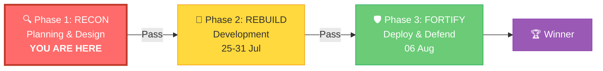

### The Scenario in Simple Terms
> Year 2065. A super malware destroyed all banking systems worldwide. Customer data is safe (backed up), but the old systems are infected and unusable. **Your job: Design a completely NEW banking platform from scratch** that is secure, scalable, and can never be taken down the same way again.

---

## 🗺️ Phase 1 Approach — How to Start & Continue

### The Path: Start-to-Finish Workflow

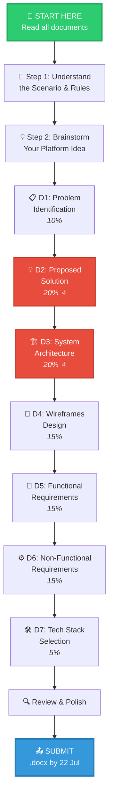

### Daily Action Plan (18 Jul → 22 Jul)

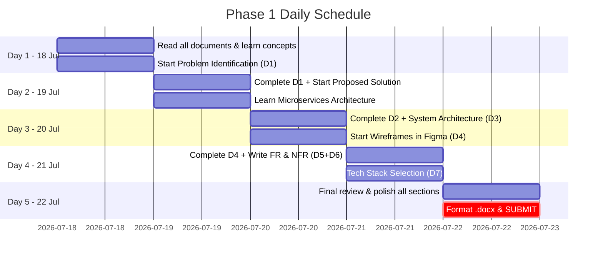

---

## 📚 THEORY DEEP-DIVES — Everything You Need to Know

---

# 🔴 THEORY 1: Problem Identification (Deliverable 01 — 10%)

## What is Problem Identification?

Problem Identification is the process of **analyzing a situation, understanding what went wrong, who is affected, and defining a clear, solvable problem statement.** It's the foundation — if your problem is vague, your solution will be vague.

### The Framework: 4-Part Problem Analysis

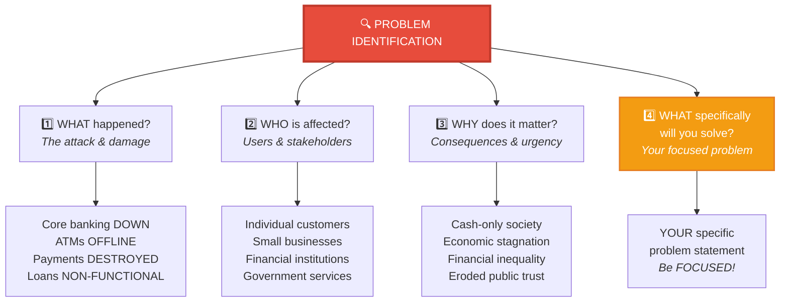

### Key Concepts to Understand:

#### 1. Cascading Failure
> When one part of a connected system fails and causes other parts to fail in a chain reaction.

**Example in the scenario:** The malware didn't just hit one system — it hit the core banking system, which then caused ATMs to go offline, which caused digital payments to fail, which caused loan systems to crash. This is because the OLD system was **monolithic** (one big connected block).

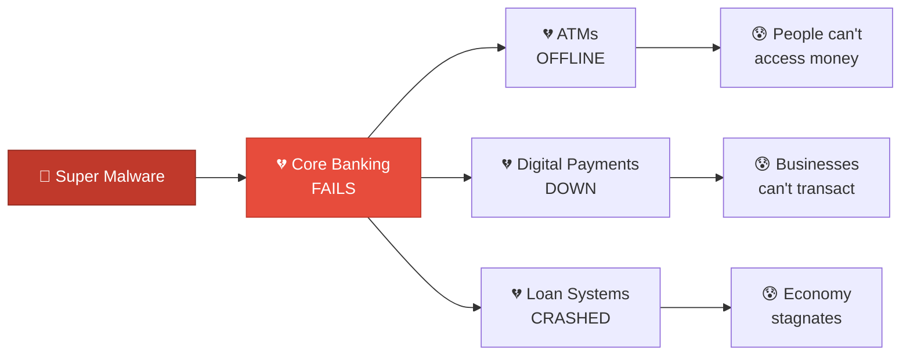

> **Why this matters for your document:** You must explain that the OLD system failed because it was monolithic — one point of failure took everything down. This sets up WHY your solution needs microservices.

#### 2. Monolithic vs. Microservices (Why the old system failed)

| Aspect | Monolithic (Old System) | Microservices (Your New System) |
|--------|------------------------|-------------------------------|
| **Structure** | One big application | Many small independent services |
| **Failure** | One bug = entire system crashes | One service fails, others continue |
| **Scaling** | Scale everything or nothing | Scale only what needs scaling |
| **Security** | One breach = access to everything | Breach is contained to one service |
| **Updates** | Must redeploy entire app | Update one service independently |

#### 3. Stakeholder Analysis

Stakeholders are everyone affected by or involved with the system. For your banking platform:

| Stakeholder | Impact | Need |
|------------|--------|------|
| **Individual Customers** | Can't access savings, make payments | Secure, easy access to money |
| **Small Business Owners** | Can't process transactions, pay employees | Digital payment processing |
| **Financial Institutions** | Lost infrastructure, lost trust | Resilient, modern platform |
| **Government** | Economic slowdown, inequality | Stable financial ecosystem |
| **Vulnerable Populations** | Disproportionately harmed by cash-only | Inclusive, accessible banking |

### How to Write Your Problem Identification

**Template Structure:**
1. **The Core Crisis** (1 paragraph) — What happened globally
2. **Socio-Economic Impact** (3-4 bullet points with explanations) — Real-world consequences
3. **The Specific Problem You Will Solve** (1-2 paragraphs) — Your focused problem statement
4. **Affected Users** (list with descriptions) — Who benefits from your solution

> [!TIP]
> Look at your existing [problem_identification.md](file:///c:/Users/ADMIN/Desktop/Duthon_6.0_BigBug/problem_identification.md) — you already have a strong draft! It covers all 4 parts well. Just expand the affected users section with more detail.

---

# 🔴 THEORY 2: Proposed Solution (Deliverable 02 — 20% ⭐)

## What Makes a Strong Proposed Solution?

Your solution must **directly address** the problem you identified. It needs to be specific, practical, and demonstrate modern technology understanding.

### Solution Design Framework

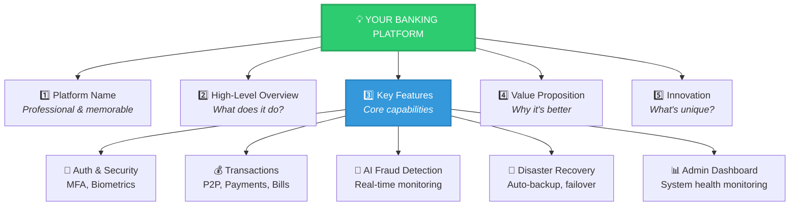

### Key Concepts You Must Understand:

#### 1. Multi-Factor Authentication (MFA)
> Using **two or more** verification methods to prove identity.

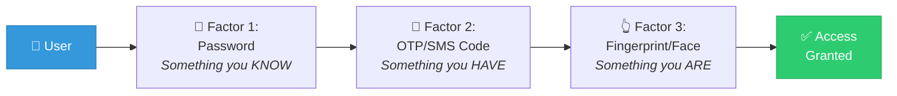

**Why for banking:** After a massive cyber attack, people need to TRUST the new system. MFA ensures even if a password is stolen, the account stays secure.

#### 2. Zero-Trust Security Model
> **"Never trust, always verify"** — Every request is treated as potentially hostile, regardless of where it comes from.

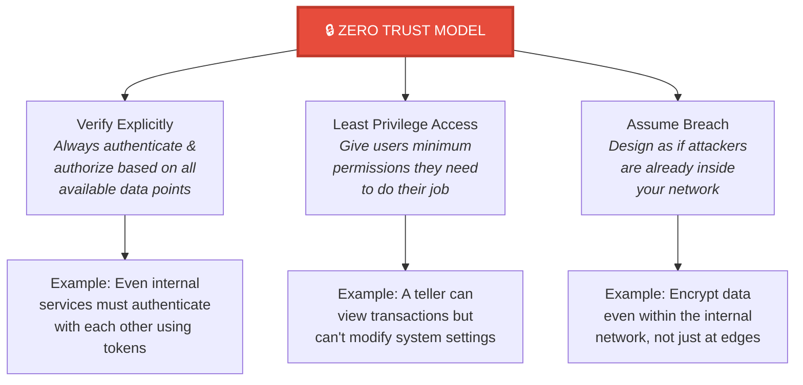

#### 3. AI/ML-Based Fraud Detection
> Using artificial intelligence to detect unusual patterns in real-time.

**How it works (simplified):**
1. The AI learns what "normal" transaction behavior looks like
2. It monitors every transaction in real-time
3. If a transaction is "abnormal" (e.g., huge transfer at 3 AM to a new country), it flags it
4. The system can auto-freeze, notify the user, or require additional verification

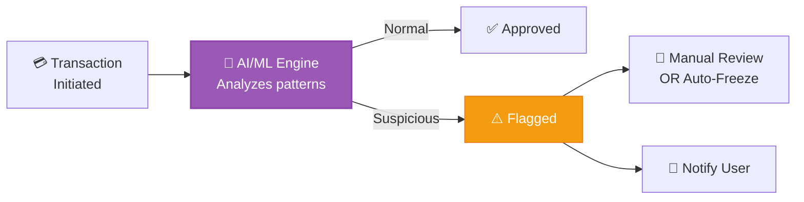

#### 4. Disaster Recovery Concepts

| Term | Meaning | Example |
|------|---------|---------|
| **RPO** (Recovery Point Objective) | How much data loss is acceptable | RPO = 1 hour means you lose max 1 hour of data |
| **RTO** (Recovery Time Objective) | How fast must the system recover | RTO = 30 min means system is back in 30 minutes |
| **Failover** | Automatic switch to backup system | If primary server dies, traffic routes to backup |
| **Multi-region** | Running copies in multiple locations | If AWS US-East goes down, US-West takes over |
| **Backup Strategy** | How and when data is saved | Full backup daily + incremental every hour |

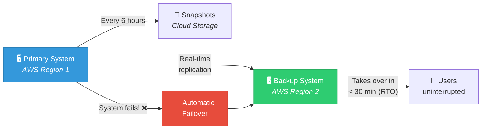

### How to Write Your Proposed Solution

**Template Structure:**
1. **Platform Name** — Something like "NexusBank", "VaultPay", "FinShield"
2. **Executive Summary** (2-3 paragraphs) — What it does at a high level
3. **Core Features** (8-10 features with descriptions) — What the platform offers
4. **How It Solves the Problem** — Direct link back to Deliverable 01
5. **Security & Resilience** — How it prevents future attacks
6. **Innovation** — What makes it special (AI, blockchain, zero-trust, etc.)

---

# 🔴 THEORY 3: Microservices Architecture (Deliverable 03 — 20% ⭐)

## This is THE Most Important Concept for Phase 1

The competition **mandates** "independent services" architecture. This deliverable carries 20% weight. Let's deeply understand it.

### What Are Microservices?

> Microservices is an architectural style where a large application is built as a **collection of small, independent services**, each running its own process, managing its own database, and communicating through well-defined APIs.

### Monolithic vs. Microservices — Visual Comparison

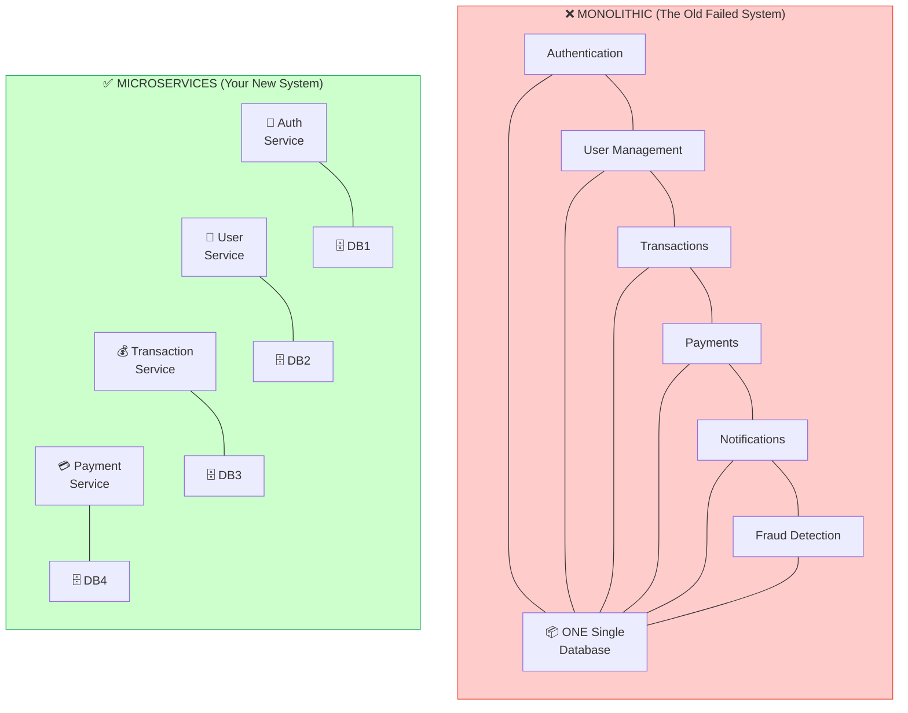

### The Core Microservices Patterns You MUST Know

#### Pattern 1: API Gateway

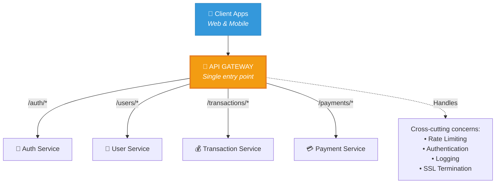

> **What is an API Gateway?** It's the "front door" of your system. Every request from users goes through it first. It routes requests to the right microservice and handles common tasks like authentication, rate limiting, and logging.
>
> **Real-world analogy:** Think of a hotel reception desk — all guests go there first, and the receptionist directs them to the right department (housekeeping, dining, concierge).

#### Pattern 2: Database-Per-Service

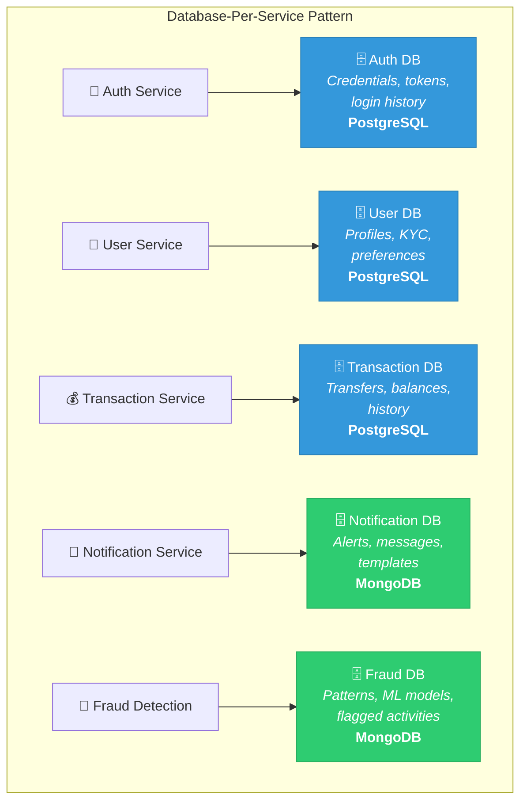

> **Why separate databases?** If one database is compromised, only that one service is affected. Also, different data types benefit from different database types:
> - **PostgreSQL (SQL)** → For financial data that needs strict consistency (ACID)
> - **MongoDB (NoSQL)** → For flexible data like logs, notifications

#### Pattern 3: Inter-Service Communication

Services need to talk to each other. There are two main ways:

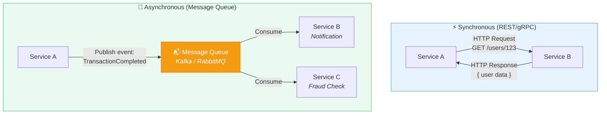

| Type | How It Works | When to Use | Example |
|------|-------------|-------------|---------|
| **Synchronous (REST)** | Service A calls Service B and WAITS for response | When you need immediate answer | User login → Auth service verifies |
| **Asynchronous (Message Queue)** | Service A publishes event, doesn't wait | When result isn't needed immediately | Transaction done → Notify user (can be slightly delayed) |

#### Pattern 4: Circuit Breaker

> **What?** A pattern that prevents cascading failures. If a service is down, stop trying to call it and fail gracefully instead of hanging.

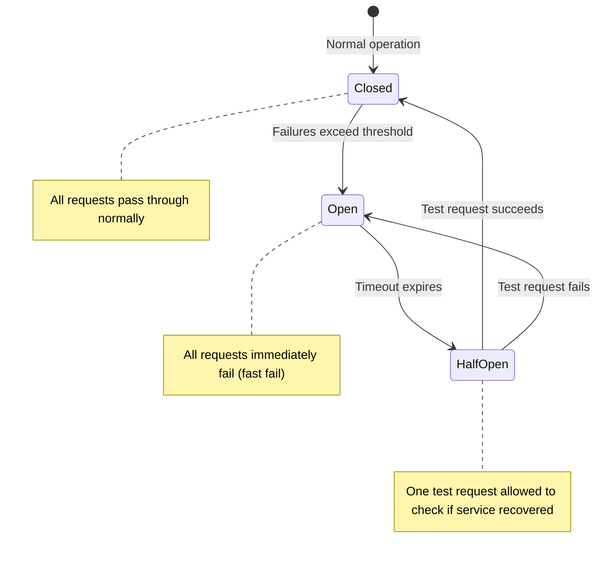

> **Real-world analogy:** Like an electrical circuit breaker in your house — if there's a power surge, the breaker trips to protect your appliances. Once the problem is fixed, you reset it.

### Complete System Architecture — What Your Diagram Should Look Like

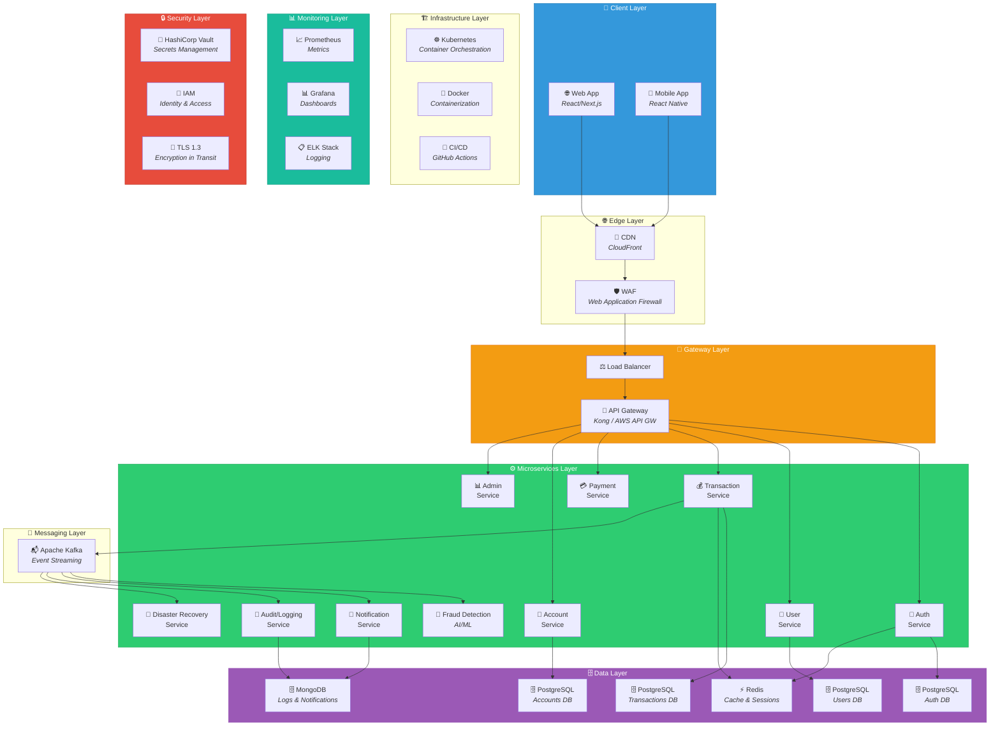

### Understanding Each Layer

| Layer | Purpose | Components | Why It's Needed |
|-------|---------|------------|-----------------|
| **Client** | User interfaces | Web app, Mobile app | Users interact with the platform |
| **Edge** | First line of defense | CDN, WAF | Block attacks before they reach your servers |
| **Gateway** | Traffic management | Load Balancer, API Gateway | Distribute load, route requests, rate limit |
| **Services** | Business logic | 10 microservices | Each handles one specific domain |
| **Data** | Persistent storage | PostgreSQL, MongoDB, Redis | Store and retrieve data reliably |
| **Messaging** | Async communication | Kafka | Services communicate without blocking |
| **Infrastructure** | Deployment | Docker, Kubernetes, CI/CD | Consistent, scalable deployment |
| **Monitoring** | Observability | Prometheus, Grafana, ELK | Know when things go wrong |
| **Security** | Protection | Vault, IAM, TLS | Protect at every layer |

---

# 🔴 THEORY 4: UX/UI & Wireframes (Deliverable 04 — 15%)

### What Are Wireframes?

Wireframes are **visual blueprints** of your application's screens. Think of them as the architectural floor plan of a building — they show layout, structure, and flow before the actual construction.

### Fidelity Levels

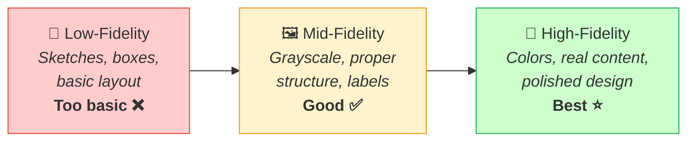

### Banking App UI Design Principles

| Principle | Why | How |
|-----------|-----|-----|
| **Trust** | Users give you their MONEY | Use blues, greens, whites. Show lock icons. |
| **Clarity** | Financial info must be crystal clear | Large fonts for balances, clear labels |
| **Simplicity** | Users of ALL ages need to use it | Minimal clicks to do common tasks |
| **Security Indicators** | Reassure users after a cyber attack | Encryption badges, "Secured by..." labels |
| **Accessibility** | Inclusive banking for everyone | High contrast, large touch targets, multilingual |

### Required Screens (User Flow)

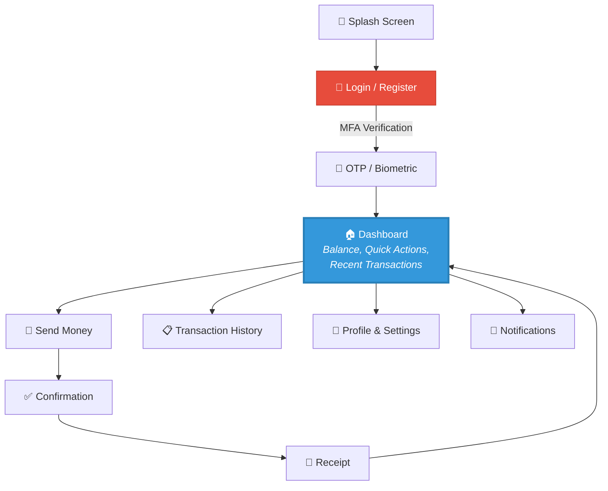

### Tool Recommendation: Figma (Free)

1. Go to [figma.com](https://figma.com) and create a free account
2. Create a new design file
3. Use frames for each screen (use phone frame: 390 × 844)
4. Design at least 6-7 screens
5. **Embed screenshots** in your Word doc AND include the Figma link

---

# 🔴 THEORY 5: Requirements Engineering (Deliverables 05 & 06 — 30% combined!)

### Functional Requirements (FR) — What the system DOES

> A functional requirement describes a **specific behavior or function** of the system.

**Writing Format:** `"The system shall..."` or `"As a [user], I can..."`

### How to Think About Functional Requirements

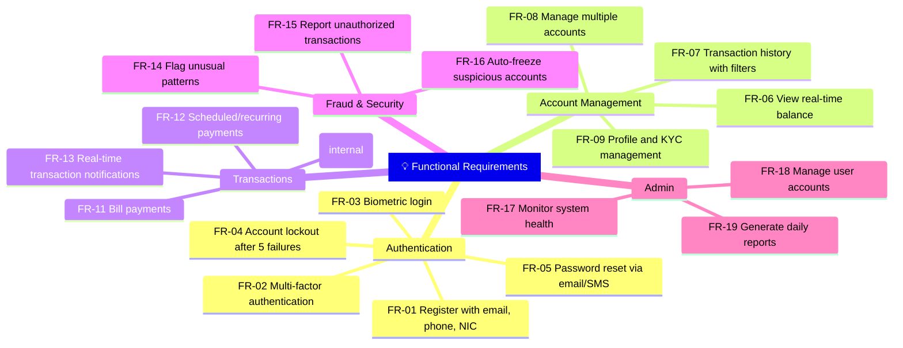

### Non-Functional Requirements (NFR) — HOW the system performs

> [!WARNING]
> The competition document says NFRs **heavily weigh security, disaster recovery, cloud performance, and reliability.** This is your chance to score BIG on a section that many teams underestimate!

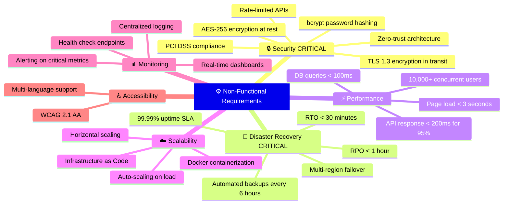

### Key Concept: ACID Properties (Critical for Banking!)

```mermaid
graph TD
    ACID["🏦 ACID Properties<br/><i>Why banking databases<br/>MUST use SQL (PostgreSQL)</i>"] --> A["<b>A</b>tomicity<br/><i>All or nothing.<br/>Transfer either completes<br/>fully or not at all.</i>"]
    ACID --> C["<b>C</b>onsistency<br/><i>Database always moves<br/>from one valid state<br/>to another.</i>"]
    ACID --> I["<b>I</b>solation<br/><i>Concurrent transactions<br/>don't interfere with<br/>each other.</i>"]
    ACID --> D["<b>D</b>urability<br/><i>Once committed, data<br/>survives crashes and<br/>power failures.</i>"]
    
    A --> EX1["Example: If transferring<br/>Rs.1000 from A to B,<br/>both debit AND credit<br/>must happen, or neither."]
    
    style ACID fill:#e74c3c,stroke:#c0392b,color:#fff,stroke-width:3px
```

### NFR Key Concept: CAP Theorem

> In a distributed system, you can only guarantee **two out of three**: Consistency, Availability, Partition Tolerance.

```mermaid
graph TD
    CAP["CAP Theorem"] --> C2["<b>C</b>onsistency<br/><i>Every read gets the<br/>most recent write</i>"]
    CAP --> A2["<b>A</b>vailability<br/><i>Every request gets<br/>a response</i>"]
    CAP --> P2["<b>P</b>artition Tolerance<br/><i>System works despite<br/>network failures</i>"]
    
    C2 -.->|"For banking, choose"| CP["CP: Consistency +<br/>Partition Tolerance<br/><i>Better for financial data</i>"]
    A2 -.->|"For read-heavy services"| AP["AP: Availability +<br/>Partition Tolerance<br/><i>Better for notifications</i>"]
    
    style CAP fill:#9b59b6,stroke:#8e44ad,color:#fff,stroke-width:3px
    style CP fill:#2ecc71,stroke:#27ae60,color:#fff
```

> **For banking:** Choose **CP** (Consistency + Partition Tolerance) for financial transactions. You'd rather the system be briefly unavailable than show incorrect balances!

---

# 🔴 THEORY 6: Technology Stack (Deliverable 07 — 5%)

### Understanding the Full Stack

```mermaid
graph TD
    subgraph FRONTEND["🎨 Frontend (What users see)"]
        REACT["React.js / Next.js"]
        RN["React Native<br/><i>Mobile</i>"]
    end
    
    subgraph BACKEND["⚙️ Backend (Business logic)"]
        NODE["Node.js + Express<br/>OR Spring Boot (Java)"]
    end
    
    subgraph DATABASE["🗄️ Databases (Data storage)"]
        PG["PostgreSQL<br/><i>Financial data (ACID)</i>"]
        MG["MongoDB<br/><i>Logs, notifications</i>"]
        RD["Redis<br/><i>Caching, sessions</i>"]
    end
    
    subgraph COMM["📨 Communication"]
        KF["Apache Kafka<br/><i>Async messaging</i>"]
        KONG["Kong / AWS API GW<br/><i>API Gateway</i>"]
    end
    
    subgraph DEVOPS["🏗️ DevOps & Cloud"]
        DCK["Docker<br/><i>Containerization</i>"]
        K8["Kubernetes (EKS/GKE)<br/><i>Orchestration</i>"]
        GHA["GitHub Actions<br/><i>CI/CD</i>"]
        TF["Terraform<br/><i>Infrastructure as Code</i>"]
        AWS["AWS / GCP<br/><i>Cloud Provider</i>"]
    end
    
    subgraph OBSERVE["📊 Observability"]
        PROME["Prometheus<br/><i>Metrics</i>"]
        GRAFA["Grafana<br/><i>Dashboards</i>"]
        ELKS["ELK Stack<br/><i>Logging</i>"]
    end
    
    subgraph SEC["🔒 Security"]
        VAULTT["HashiCorp Vault<br/><i>Secrets</i>"]
        OAUTH["OAuth 2.0 + JWT<br/><i>Authentication</i>"]
    end
    
    FRONTEND --> COMM
    COMM --> BACKEND
    BACKEND --> DATABASE
    BACKEND --> COMM
    BACKEND --> DEVOPS
    DEVOPS --> OBSERVE
    DEVOPS --> SEC
    
    style FRONTEND fill:#61dafb,stroke:#21a1c4,color:#333
    style BACKEND fill:#68a063,stroke:#3c6e35,color:#fff
    style DATABASE fill:#336791,stroke:#1a3d5c,color:#fff
    style DEVOPS fill:#2496ed,stroke:#1a6fb5,color:#fff
    style SEC fill:#e74c3c,stroke:#c0392b,color:#fff
```

### Why Each Technology? (Justification Table)

| Layer | Technology | Justification |
|-------|-----------|---------------|
| **Frontend** | React.js / Next.js | Component-based, massive ecosystem, SSR for SEO, ideal for complex UIs |
| **Mobile** | React Native | Code sharing with React web, cross-platform iOS/Android |
| **Backend** | Node.js + Express | High performance async I/O, ideal for microservices, huge npm ecosystem |
| **API Gateway** | Kong / AWS API GW | Rate limiting, auth, request routing, DDoS protection built-in |
| **SQL Database** | PostgreSQL | ACID compliance mandatory for financial transactions, strong data integrity |
| **NoSQL Database** | MongoDB | Flexible schema for logs/notifications, horizontal scaling |
| **Cache** | Redis | Sub-millisecond reads, session management, reduces database load |
| **Message Queue** | Apache Kafka | High-throughput event streaming, guaranteed delivery, replay capability |
| **Containers** | Docker | Consistent environments, isolation between services, portable |
| **Orchestration** | Kubernetes (EKS/GKE) | Auto-scaling, self-healing, rolling updates, service discovery |
| **CI/CD** | GitHub Actions | Free, integrated with code repository, automates build-test-deploy |
| **Cloud** | AWS / GCP | Global infrastructure, managed services, compliance certifications |
| **IaC** | Terraform | Cloud-agnostic, version-controlled infrastructure, reproducible |
| **Monitoring** | Prometheus + Grafana | Industry standard, real-time metrics, beautiful dashboards |
| **Logging** | ELK Stack | Centralized logs from all microservices, powerful search |
| **Secrets** | HashiCorp Vault | Secure API keys, DB passwords, certificates — never hardcode secrets |
| **Auth** | OAuth 2.0 + JWT | Industry standard, stateless tokens, fine-grained permissions |

> [!TIP]
> **Key point for writing:** Don't just LIST technologies — **JUSTIFY every choice.** Explain HOW it supports microservices, security, and disaster recovery.

---

# 🎯 STRATEGIC ACTION PLAN

## Priority Matrix — Where to Spend Your Time

```mermaid
pie title Mark Distribution - Where to Focus
    "Proposed Solution (20%)" : 20
    "System Architecture (20%)" : 20
    "Functional Requirements (15%)" : 15
    "Non-Functional Requirements (15%)" : 15
    "Wireframes Design (15%)" : 15
    "Problem Identification (10%)" : 10
    "Technology Stack (5%)" : 5
```

## Winning Strategy

```mermaid
graph TD
    WIN["🏆 HOW TO WIN"] --> S1["1️⃣ Security is KING<br/><i>Theme is about a cyberattack<br/>Every section should emphasize security</i>"]
    WIN --> S2["2️⃣ Architecture is Foundation<br/><i>20% of marks<br/>Must be clean microservices</i>"]
    WIN --> S3["3️⃣ NFRs Are Underrated<br/><i>Most teams write generic NFRs<br/>Be specific with measurable values</i>"]
    WIN --> S4["4️⃣ Connect Everything<br/><i>Problem → Solution → Architecture<br/>Everything should flow logically</i>"]
    WIN --> S5["5️⃣ Professional Presentation<br/><i>Clean Word doc, numbered sections<br/>Consistent formatting</i>"]
    
    style WIN fill:#f39c12,stroke:#e67e22,color:#fff,stroke-width:3px
    style S1 fill:#e74c3c,stroke:#c0392b,color:#fff
    style S2 fill:#e74c3c,stroke:#c0392b,color:#fff
```

---

## 📋 Hour-by-Hour Action Plan

### 🔴 Day 1 — Today (18 Jul): LEARN + START

| Time Block | Task | What to Do |
|-----------|------|------------|
| **Evening 1h** | 📖 Read & Understand | Read all competition docs (you've done this ✅) |
| **1h** | 📚 Learn Microservices | Watch "Microservices Explained" by TechWorld with Nana (YouTube, ~15 min), read this guide's Theory 3 |
| **1h** | 📝 Draft D1 | Write Problem Identification using Template in Theory 1 (you already have a draft!) |
| **30 min** | 💡 Brainstorm | Name your platform, brainstorm key features |

### 🟡 Day 2 — (19 Jul): SOLUTION + ARCHITECTURE

| Time Block | Task | What to Do |
|-----------|------|------------|
| **2h** | 💡 Write D2 | Complete Proposed Solution using Theory 2's template |
| **1h** | 📚 Learn System Design | Watch ByteByteGo system design video (YouTube), understand layers |
| **2h** | 🏗️ Create D3 | Draw architecture diagram in Draw.io using Theory 3's reference diagram |

### 🟢 Day 3 — (20 Jul): WIREFRAMES + REQUIREMENTS

| Time Block | Task | What to Do |
|-----------|------|------------|
| **30 min** | 📚 Learn Figma | Watch "Figma for Beginners" (YouTube, ~20 min) |
| **3h** | 🎨 Create D4 | Design 6-7 screens in Figma following Theory 4's user flow |
| **2h** | 📝 Write D5 | Write Functional Requirements using Theory 5's mindmap as reference |

### 🔵 Day 4 — (21 Jul): NFRs + TECH STACK + POLISH

| Time Block | Task | What to Do |
|-----------|------|------------|
| **2h** | ⚙️ Write D6 | Write Non-Functional Requirements (focus on Security & DR!) |
| **1h** | 🛠️ Write D7 | Technology Stack with justifications using Theory 6's table |
| **2h** | ✨ Polish | Review all sections, ensure flow, fix formatting |

### 🟣 Day 5 — (22 Jul): FINAL REVIEW + SUBMIT

| Time Block | Task | What to Do |
|-----------|------|------------|
| **2h** | 🔍 Final Review | Read entire document end-to-end, check consistency |
| **1h** | 📄 Format .docx | Final formatting in Microsoft Word |
| **30 min** | 📤 Submit | Upload to duothan.ieeensbm.org/submission **BEFORE 11:59 PM** |

---

## 💡 My Suggestions

### 1. Team Work Division
If you have 2-4 team members, divide like this:

| Person | Responsibilities |
|--------|-----------------|
| **Person 1** | D1 (Problem) + D2 (Solution) + D5 (Functional Req) |
| **Person 2** | D3 (Architecture Diagram) + D7 (Tech Stack) |
| **Person 3** | D4 (Wireframes in Figma) |
| **Person 4** | D6 (Non-Functional Req) + Final document compilation |

### 2. Secret Weapons to Stand Out
- Use **data/statistics** in your Problem Identification (even hypothetical for 2065)
- Include a **threat model** in your solution showing attack vectors and defenses
- Add a **data flow diagram** alongside your architecture
- Design an **admin dashboard** wireframe (optional but impressive)
- Mention **PCI DSS compliance** in your NFRs — it's a banking security standard
- Add a **CI/CD pipeline diagram** showing your development workflow

### 3. Common Mistakes to Avoid
- ❌ Don't submit a monolithic architecture — it's microservices or nothing
- ❌ Don't write vague NFRs like "the system should be fast" — use measurable values
- ❌ Don't just list technologies — justify every choice
- ❌ Don't forget to embed wireframe screenshots AND include the Figma link
- ❌ Don't submit PDF — it MUST be .docx
- ❌ Don't neglect disaster recovery — the entire theme is about recovering from an attack

### 4. Quick YouTube Learning Playlist (Phase 1 Priority)
1. 🎥 **"Microservices Explained"** by TechWorld with Nana (~15 min)
2. 🎥 **"System Design for Beginners"** by Gaurav Sen (~20 min)
3. 🎥 **"API Gateway explained"** by ByteByteGo (~10 min)
4. 🎥 **"Figma Tutorial for Beginners"** by DesignCourse (~30 min)
5. 🎥 **"What is Zero Trust Security?"** by IBM Technology (~10 min)
6. 🎥 **"CAP Theorem Explained"** by Hussein Nasser (~15 min)

---

> [!NOTE]
> **This guide covers Phase 1 in depth.** Once you clear Phase 1, I'll create similar detailed guides for Phase 2 (REBUILD — Development) and Phase 3 (FORTIFY — Deployment & Defense). Focus all energy on Phase 1 now!

> [!CAUTION]
> **Deadline reminder: 22 July 2026, 11:59 PM.** Start working NOW. The competition started today at 6:00 AM!
