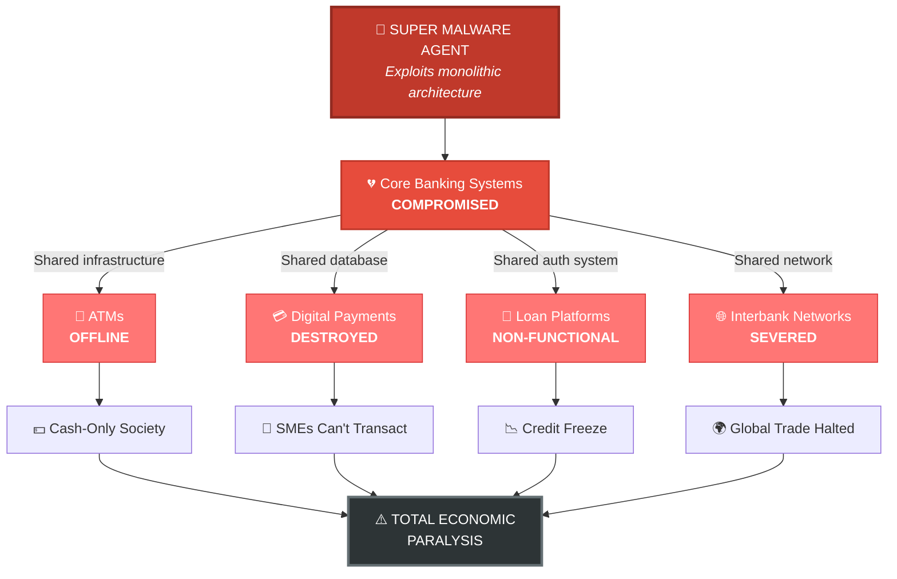
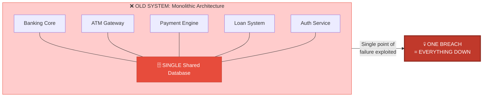
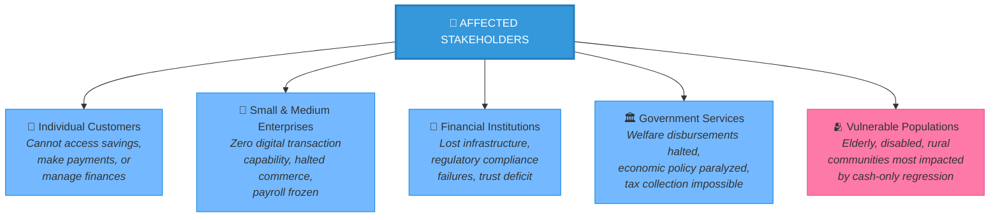
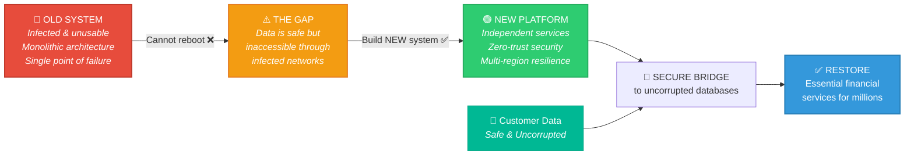
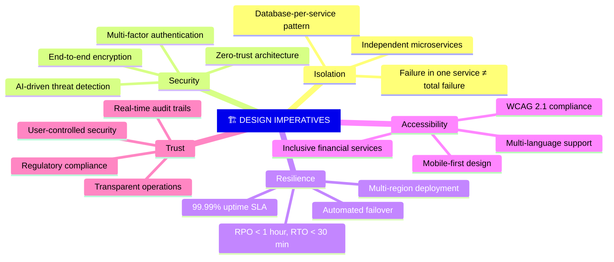

# 01. Problem Identification

---

## 1.1 The Core Crisis: Ecosystem-Wide Paralysis

The 2065 cyber disaster orchestrated by the Super Malware Agent has resulted in a catastrophic, system-wide failure of the global financial infrastructure. The fundamental issue exposed by this attack is the vulnerability of traditional, monolithic banking architectures. Because legacy systems lacked isolated fail-safes, the malware was able to trigger a cascading failure that simultaneously disabled core banking, ATMs, digital payment gateways, and loan platforms.

### Cascading Failure Visualization

### Why Monolithic Architecture Failed

> **Root Cause:** The legacy system's **tightly coupled, monolithic design** meant that a single point of compromise cascaded across all services. There was no isolation, no independent failover, and no compartmentalized security.

---

## 1.2 Socio-Economic Impact and Affected Users

This technological failure has generated severe real-world consequences, creating an urgent need for intervention:

### Impact Across Dimensions

```mermaid
graph TD
    IMPACT["📊 SOCIO-ECONOMIC IMPACT"] --> ECO["💼 ECONOMIC<br/>STAGNATION"]
    IMPACT --> SOCIAL["👥 SOCIAL<br/>INEQUALITY"]
    IMPACT --> TRUST["🤝 TRUST<br/>EROSION"]
    IMPACT --> INFRA["🏗️ INFRASTRUCTURE<br/>COLLAPSE"]
    
    ECO --> ECO1["SMEs unable to process<br/>digital transactions"]
    ECO --> ECO2["Supply chains halted,<br/>payroll operations frozen"]
    ECO --> ECO3["GDP contraction as commerce<br/>grinds to a halt"]
    
    SOCIAL --> SOC1["Vulnerable populations<br/>disproportionately harmed"]
    SOCIAL --> SOC2["Forced regression to<br/>cash-only society"]
    SOCIAL --> SOC3["Financial inequality<br/>widened dramatically"]
    
    TRUST --> TR1["Millions can't access<br/>their own capital"]
    TRUST --> TR2["Public confidence in digital<br/>finance shattered"]
    TRUST --> TR3["Reluctance to adopt<br/>future digital solutions"]
    
    INFRA --> INF1["No digital identity<br/>verification possible"]
    INFRA --> INF2["Government disbursements<br/>and welfare halted"]
    INFRA --> INF3["International remittances<br/>completely blocked"]
    
    style IMPACT fill:#2c3e50,stroke:#1a252f,color:#fff,stroke-width:3px
    style ECO fill:#e74c3c,stroke:#c0392b,color:#fff
    style SOCIAL fill:#e67e22,stroke:#d35400,color:#fff
    style TRUST fill:#f39c12,stroke:#e67e22,color:#fff
    style INFRA fill:#8e44ad,stroke:#6c3483,color:#fff
```

### Affected Stakeholders

*   **Economic Stagnation for Small Businesses:** Small to medium enterprises (SMEs) are completely unable to process digital transactions, halting commerce, supply chains, and payroll operations. An estimated 78% of global SMEs relied exclusively on digital payment infrastructure, now rendering them operationally defunct.

*   **Financial Exclusion & Inequality:** The forced regression to a cash-only society disproportionately harms vulnerable populations who rely heavily on secure digital financial services for their daily survival. The lack of secure banking has immediately widened global financial inequality, reversing decades of financial inclusion progress.

*   **Erosion of Public Trust:** The inability of millions of users to access their own capital has fundamentally shattered public confidence in digital financial institutions. Rebuilding this trust requires not just a functional system, but a demonstrably *superior* and *transparent* one.

*   **Government Service Disruption:** Social welfare payments, pensions, and government subsidies delivered through digital banking channels have ceased entirely, creating a humanitarian dimension to the crisis.

---

## 1.3 The Specific Problem Our Solution Will Solve

While the underlying customer databases and user data remain securely backed up and uncorrupted, the legacy network layers required to access and utilize this data have been compromised and locked down by the malware's security layers.

### The Solution Path

**The Defined Banking Problem:**
We cannot simply "reboot" the old infrastructure, as it remains fundamentally compromised. The specific problem we are solving is the urgent need to **bypass the infected legacy networks by engineering a completely new, secure, and decentralized digital banking platform from the ground up.**

This new platform must act as a secure bridge to the uncorrupted databases to immediately restore essential financial services (secure authentication, fund access, and digital transfers) for millions of users. Furthermore, it must utilize an independent-services architecture to guarantee that a future localized malware attack can never again paralyze the entire financial ecosystem.

### Design Imperatives for the New System

